# Console E2E test report — 2026-10-06

Every page, component and interactive behaviour of the darkrouter admin console was exercised in a real browser (Playwright/Chromium) against a locally running build of commit `e173520`. Each finding below was reproduced at least twice and carries screenshot evidence, a root cause traced to source, and a proposed fix. **No product code was changed** — this is a report.

## Setup

- **Build under test:** `npm run build` (console embedded) + `go build ./cmd/darkrouter`, run directly with a fresh database, proxy on `:8090`, admin on `:8091`. The console was claimed through its own claim screen.
- **Upstreams:** the sandbox has no general internet, so two mock OpenAI-compatible servers ([`harness/mock-upstream.mjs`](harness/mock-upstream.mjs)) were added *through the UI* as the LM Studio (`:1234`, healthy, plus always-500 / always-429 / slow models) and vLLM (`:8000`, every second request 500) local runtimes.
- **Traffic:** [`harness/traffic.sh`](harness/traffic.sh) — plain and streamed chat, slow, 500, 429, unknown model, embeddings, and the Anthropic `/v1/messages` dialect — plus alias traffic for failover.
- **Viewports:** 1440×900, 768×1024, 375×812; light and dark.
- **Out of scope / environment noise:** failures caused purely by the sandbox having no internet (models.dev sync, the four auto-added keyless providers being unreachable) are not reported as bugs — only how the UI *presents* them.

## Summary

| Area | Critical | High | Medium | Low | Cosmetic | Total |
|---|---:|---:|---:|---:|---:|---:|
| [Claim screen & empty state](#claim-screen--empty-state) | · | · | 1 | 2 | · | 3 |
| [Auth & app shell](#auth--app-shell) | · | 1 | 4 | 7 | 3 | 15 |
| [Overview, Requests, Usage](#overview-requests-usage) | · | 4 | 7 | 14 | 2 | 27 |
| [Providers & Models](#providers--models) | · | 1 | 8 | 10 | 2 | 21 |
| [Routing & aliases](#routing--aliases) | · | 2 | 5 | 4 | · | 11 |
| [Playground & Connect](#playground--connect) | · | 2 | 8 | 7 | 1 | 18 |
| [Settings & accounts](#settings--accounts) | · | · | 4 | 5 | · | 9 |
| **Total** | **0** | **10** | **37** | **49** | **8** | **104** |

Duplicates are kept in their own area (each was found independently) and cross-linked; counting each root cause once, the total is about 101.

## Fix first

- **[SHELL-01](#shell-01-command-palette-never-matches-a-real-request-id-so-jump-to-a-request-id-does-not-work)** — Command palette never matches a real request id, so "jump to a request id" does not work
- **[OPERATE-01](#operate-01-requests-model-filter-matches-only-the-final-served-model-so-the-model-shown-in-the-table-cannot-be-filtered-on)** — Requests "Model" filter matches only the final (served) model, so the model shown in the table cannot be filtered on
- **[OPERATE-02](#operate-02-requests-provider-filter-excludes-every-request-that-failed-at-that-provider)** — Requests "Provider" filter excludes every request that failed at that provider
- **[OPERATE-03](#operate-03-opening-or-closing-a-trace-remounts-the-whole-requests-screen--loaded-pages-sort-hidden-columns-scroll-and-keyboard-focus-are-lost)** — Opening or closing a trace remounts the whole Requests screen — loaded pages, sort, hidden columns, scroll and keyboard focus are lost
- **[OPERATE-25](#operate-25-every-usage--requests-click-through-fails-with-since_ms-must-be-an-integer)** — Every Usage → Requests click-through fails with "since_ms must be an integer"
- **[PROVIDERS-01](#providers-01-every-lm-studio-chat-model-is-labelled-embedding-and-every-model-carries-all-of-its-presets-surfaces)** — Every LM Studio chat model is labelled "embedding" (and every model carries all of its preset's surfaces)
- **[ROUTING-01](#routing-01-keyless-providers-lmstudio-vllm-all-keyless-presets-are-drawn-as-unusable-every-healthy-target-shows-amber-no-credentials-or-cooling-and-rule-3s-priority-list-leaves-them-out)** — Keyless providers (lmstudio, vllm, all keyless presets) are drawn as unusable: every healthy target shows amber "no credentials" or "cooling", and rule 3's priority list leaves them out
- **[ROUTING-02](#routing-02-an-alias-whose-fallback-is-another-model-on-the-same-provider-never-fails-over-on-a-5xx-yet-the-routing-preview-and-graph-say-it-will)** — An alias whose fallback is another model on the same provider never fails over on a 5xx, yet the Routing preview and graph say it will
- **[PLAYGROUND-01](#playground-01-chat-transcript-does-not-follow-new-replies-once-it-is-taller-than-the-viewport)** — Chat transcript does not follow new replies once it is taller than the viewport
- **[PLAYGROUND-02](#playground-02-creating-the-first-client-token-silently-locks-every-client-out-of-the-gateway-revoking-it-does-not-undo-that-and-the-screen-still-says-no-client-token-exists-yet)** — Creating the first client token silently locks every client out of the gateway; revoking it does not undo that, and the screen still says "No client token exists yet"

## Cross-cutting themes

Several findings in different areas have one root cause. Fixing these once removes a cluster of findings:

1. **Keyless providers are judged by their credential count.** The backend routes to `auth_style: none` providers with zero credentials (`internal/provider/sqlsource.go:89`, `!auth.IsKeyless`), but the console copies only the first half of that rule. As a result:
   - Routing draws every LM Studio/vLLM target amber "no credentials" and leaves them out of the priority list (ROUTING-01).
   - Overview labels them "no credentials" (OPERATE-07).
   - Providers offers "Add credentials" on them (PROVIDERS-12) and probes report "Credential accepted" (PROVIDERS-13).

   The fix is a single `isKeyless()` predicate (one already exists in `features/providers/provider-state.ts`) applied in `chain-health.ts`, `strategy-card.tsx`, `flow-graph.tsx` and the provider detail page.
2. **Escape inside a combobox or select closes the surrounding dialog** and discards everything typed (ROUTING-03, PLAYGROUND-03). darkraise-ui's `DismissableLayer` listens for Escape on `document` in the capture phase, before the combobox handles it. Guard it in `onEscapeKeyDown` on every `DialogContent` that hosts a `ModelCombobox`/`Select`, or fix it once in darkraise-ui.
3. **There is no unsaved-changes guard anywhere.** Alias drafts (ROUTING-08) and setting edits (SETTINGS-02) vanish on navigation or reload. A shared `useUnsavedChangesGuard(dirty)` built on TanStack Router's `useBlocker` plus `beforeunload` covers both.
4. **Usage and Requests disagree on what a filter means.** Usage counts attempts per provider and model, but Requests filters on the final served model or provider (OPERATE-01/02). Separately, the Usage → Requests link is broken outright (OPERATE-25).
5. **The 30-day views read an hourly rollup while the live tiles read a 5-minute window.** The same traffic appears as "0 requests" on one panel and as failovers on another (OPERATE-04, OPERATE-08, PROVIDERS-04). Either union the not-yet-rolled-up hour into the 30d queries or label the lag.
6. **Raw server text reaches the operator.** This covers Go parse errors (SETTINGS-06), lower-case server messages used as UI copy (COORD-01, ROUTING-11), and internal keys (OPERATE-12, OPERATE-14). Map known error codes to console copy at the call site.
7. **Narrow viewports are under-tested.** Wide tables, graphs and tab strips overflow or shrink at 768/375 (OPERATE-06, ROUTING-05, PROVIDERS-08/09, PLAYGROUND-10/13/17, SETTINGS-05), and the phone header drops the palette and theme entry points (SHELL-06). A Playwright viewport smoke test that asserts `scrollWidth <= clientWidth` on every route would catch the whole class.
8. **The filled success badge is white on bright green (about 2.2:1).** It fails contrast in the trace drawer (OPERATE-24) and on every "hot" chip on Settings (visible in `settings-01-restart-warning-after-revert.png`). Fix the badge variant once.
9. **Typography floor (CLAUDE.md).** One violation in the console source: the inline pixel font size in `provider-icon.tsx` (SHELL-09). Two darkraise-ui components still render 12px text inside the app (SHELL-08).

## Claim screen & empty state

_Scope: First-run claim screen, account rules, Overview empty state._

### COORD-02: The server's "12 characters" minimum counts bytes, so the API accepts a 4-character password
- Severity: Medium (security policy)
- Where: `internal/admin/setupapi.go:29` (`len(password) < minPasswordChars`) and `internal/admin/sessionapi.go:123` (change password). Applies to every path that sets a password.
- Steps: 1. As an admin, `POST /api/users {"username":"qa-coord-cjk","password":"密码密码","role":"member"}`. 2. `POST /api/auth/login` with that password.
- Expected: The account is refused, because the stated rule is "at least 12 characters" (UI copy and `MIN_PASSWORD` comment).
- Actual: The create returns 201 and the login returns 200. `密码密码` is 4 characters and 12 UTF-8 bytes. The console's own check counts UTF-16 code units, so it is *stricter* than the server. The two sides disagree, and the server (the authority) is the weaker one. (The test account was deleted afterwards.)
- Evidence: `coord-02-four-char-password-accepted.png`, the recorded request/response pair.
- Root cause: `len(string)` in Go is a byte count. bcrypt's 72-*byte* ceiling is correctly a byte count, but the floor is meant to be characters.
- Proposed fix: Keep the byte ceiling and count runes for the floor, in both places (or in one shared helper):
  ```go
  if utf8.RuneCountInString(password) < minPasswordChars { ... }
  if len(password) > maxPasswordBytes { ... }
  ```
  Make the client count code points too (`[...password].length`) so the two agree on astral characters.

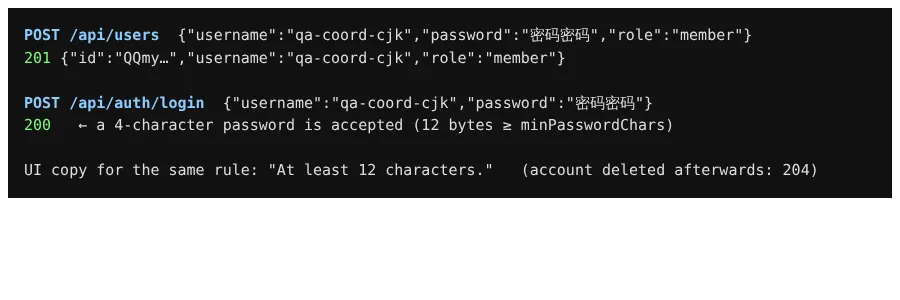

### COORD-01: A username over 64 characters is rejected as "a username is required"
- Related: Same root cause as SETTINGS-04 (account creation).
- Severity: Low
- Where: Claim screen (`web/src/features/shell/first-run.tsx`) and account creation, `internal/admin/setupapi.go:26-27`
- Steps: 1. Open an unclaimed console. 2. Enter a 65-character username and a valid matching password. 3. Click "Claim console".
- Expected: A message that says the username is too long, and ideally a `maxLength` on the field so the limit can't be passed at all.
- Actual: `a username is required` shows under a field that plainly has a username in it. The field is also flagged invalid and its text is selected.
- Evidence: `coord-01-long-username-required.png`: the field is full of `a`s and the alert below says a username is required.
- Root cause: `validateCredentials` returns the same message for `username == ""` and for `len([]rune(username)) > maxUsernameChars`. The input has no `maxLength`.
- Proposed fix: Split the check:
  ```go
  if username == "" { return "", "a username is required", false }
  if len([]rune(username)) > maxUsernameChars {
      return "", fmt.Sprintf("the username must be at most %d characters", maxUsernameChars), false
  }
  ```
  Then add `maxLength={64}` to `#setup-username` and to the accounts-card username input. A shared `MAX_USERNAME` in `web/src/lib/password-rules.ts` would sit beside `MIN_PASSWORD`.

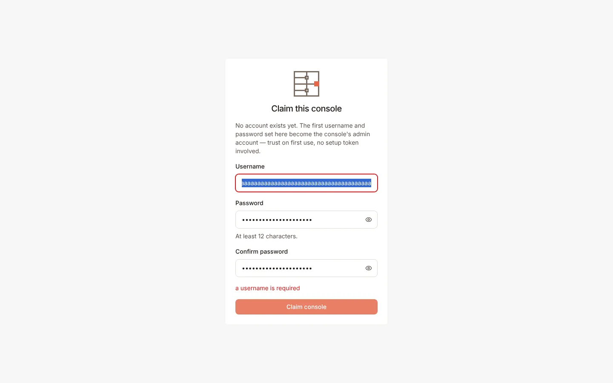

### COORD-03: With no traffic, latency reads "0 ms" and error rate "0.0%" instead of "no data"
- Severity: Low
- Where: Overview stat tiles, `web/src/features/overview/overview-screen.tsx:234-235, 304-330`. `durationParts` is in `web/src/lib/format.ts:38`.
- Steps: 1. Fresh install, or no requests in the last 5 minutes. 2. Open Overview.
- Expected: Tiles with no samples say so. The spend tile already does this ("—").
- Actual: `p50 0 ms · p95 0 ms` and `0.0%` error rate. Both read as excellent measurements, but nothing was measured.
- Evidence: `coord-03-empty-latency-zero.png`. The spend tile shows "—" while the latency tile shows `0 ms` for the same empty window.
- Root cause: The tiles format whatever number the API returns, and the API returns `0` for an empty window.
- Proposed fix: When `o.requests_per_min === 0` (or better, when the API exposes a live-window `samples`/`requests` count of 0), render `"—"` for latency and error rate the way `spendReading` does. Add a note such as "no requests in the last 5 min".

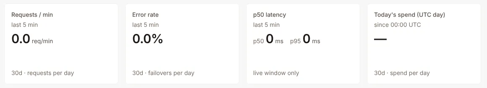

<details><summary>Tested and working — Claim screen & empty state</summary>

- Claim screen: the submit button is disabled until every field is filled. The client catches a short password ("must be at least 12 characters") and a mismatch ("do not match"). The reveal toggle switches the input type and has the accessible name "Show password". The server refuses a whitespace-only username. A successful claim logs in automatically and lands on Overview.
- Adding the LM Studio and vLLM local runtimes through Providers → Local → "Add provider" → Test connection ("answered with N models") → Add runtime. The flow redirects to the provider detail page.
- Gateway: chat (plain and stream), `provider/model` addressing, embeddings, the Anthropic `/v1/messages` dialect against an OpenAI-compatible upstream, 404 for an unknown model, and 502 for upstream 500 and 429.

</details>

## Auth & app shell

_Scope: Login, logout, session expiry, sidebar, header, command palette, theme customizer, 404, focus._

### SHELL-01: Command palette never matches a real request id, so "jump to a request id" does not work
- Severity: High
- Where: Command palette (Ctrl/Cmd+K), `web/src/features/shell/command-palette.tsx:22`
- Steps: 1. Copy any request id from Requests (or `GET /api/requests?limit=1`), for example `01M47PJFXTQNG6Z3WZ39X4QZM2`. 2. Press Ctrl+K and paste the id.
- Expected: A "Request" group with "Open trace 01M47…", which opens `/requests/<id>`.
- Actual: "Nothing matches." Pressing Enter does nothing. The id itself is valid: `/requests/01M47PJFXTQNG6Z3WZ39X4QZM2` opens the trace when typed into the URL bar (shell-01b).
- Evidence: `shell-01-palette-request-id.png` shows a real id in the palette and "Nothing matches.". `shell-01b-requests-deeplink-works.png` shows the same id opening its trace through the URL.
- Root cause: `REQUEST_ID = /^[0-9a-f]{8,}$/i` assumes hex ids. The gateway mints request ids as ULIDs (`internal/exec/surface.go:492` and `internal/exec/count.go:36`, `ulid.MustNew(...).String()`). ULIDs are 26 Crockford base-32 characters, and almost every one contains a letter from G–Z, so the regex rejects nearly all real ids. The unit test (`command-palette.test.tsx:82`) only checks a hex string, so it passes anyway.
- Proposed fix: Match the format the server actually produces, `const REQUEST_ID = /^[0-9A-HJKMNP-TV-Z]{26}$/i`, and add a test that uses a real ULID such as `01M47PJFXTQNG6Z3WZ39X4QZM2`. If short prefixes should still work, the server needs a prefix lookup; otherwise drop the `{8,}` idea.

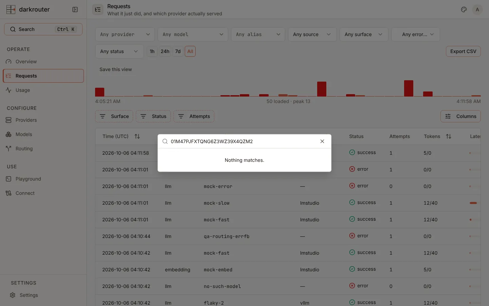

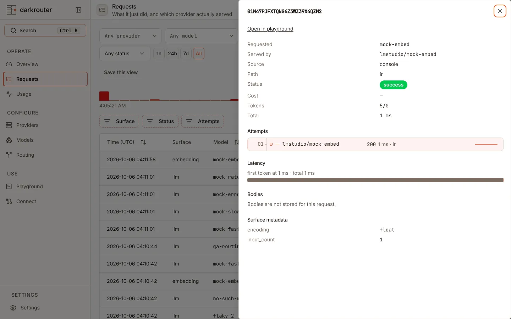

### SHELL-02: Account menu items do nothing from the keyboard (Change password, Settings, Log out)
- Severity: Medium (a11y blocker: at desktop width a keyboard-only operator cannot log out)
- Where: Header account menu, `web/src/features/shell/app-shell.tsx:293`, `:297`, `:302`
- Steps: 1. Tab to the avatar ("Account menu") and press Enter. 2. Use ArrowDown to highlight "Log out" (or "Settings" or "Change password"). 3. Press Enter (or Space).
- Expected: The item runs. Log out ends the session, Settings navigates and Change password opens its dialog. Clicking each item with the mouse does work.
- Actual: Nothing happens. The menu stays open with the item highlighted, the URL doesn't change, no dialog opens and `/api/auth/status` still reports `authenticated: true`. I checked this in four separate runs.
- Evidence: `shell-02a-account-menu-keyboard-logout-highlighted.png` shows "Log out" highlighted by keyboard before Enter. `shell-02b-after-enter-nothing-happened.png` shows the identical state after Enter: still open, still signed in.
- Root cause: The items pass `onClick`. In darkraise-ui 6.7.0, `DropdownMenuItem` (`node_modules/darkraise-ui/dist/chunk-HJQUJ6FJ.js:357+`) calls `onClick` only from the pointer `onClick`. Its Enter/Space handler calls `triggerSelect`, which calls `onSelect` and never `onClick`. The Playground's conversation menu uses `onSelect` (`conversation-header.tsx:145`), and Enter works there. I verified that.
- Proposed fix: In `AccountMenu`, use `onSelect={onChangePassword}`, `onSelect={onSettings}` and `onSelect={onLogout}` instead of `onClick`. Pointer clicks also go through `triggerSelect` → `onSelect`, so one handler covers both.

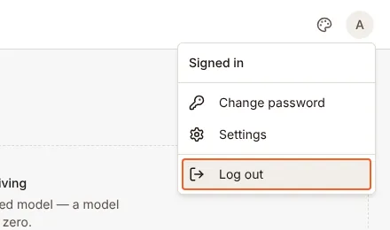


### SHELL-03: Mobile navigation drawer stays open after choosing a destination (and stays under the Change password dialog)
- Severity: Medium
- Where: Header "Open menu" drawer below `md`, `web/src/features/shell/app-shell.tsx:132` (`<MobileDrawer …>`)
- Steps: 1. Open the console at 375×812. 2. Tap the menu button. 3. Tap "Models" (or any destination).
- Expected: The drawer closes and the Models screen is visible.
- Actual: The route changes underneath (URL `/models`, title "Models · Darkrouter", Models highlighted in the drawer) but the drawer stays open and covers the screen. The user has to close it with ✕ or Escape after every navigation. Tapping "Change password" in the drawer stacks the password dialog on top of the still-open drawer (two `role=dialog` at once).
- Evidence: `shell-03-drawer-stays-open.png` shows the drawer still covering the page after tapping Models, with Models highlighted as the current page.
- Root cause: darkraise's `MobileDrawer` is an uncontrolled `Sheet` with no `open` prop and no close-on-navigate. The library's own layouts don't need one, but this hand-composed shell never closes it.
- Proposed fix: Remount it per route so it starts closed: `<MobileDrawer key={pathname} …/>`, with `pathname` from `useRouterState` passed into `AppShell`. Wrap the two account buttons in `SheetClose asChild` (exported from darkraise-ui) so the drawer closes before the dialog opens or the logout runs.

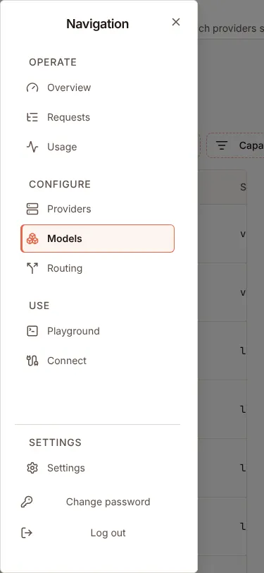

### SHELL-06: At phone width there is no way to open the command palette or the theme customizer
- Severity: Medium
- Where: Shell below 640px, `web/src/styles/globals.css:83-93` (`.app-header-actions { display:none }`) and `web/src/features/shell/app-shell.tsx:132-155` (drawer footer)
- Steps: 1. Open the console at 375×812. 2. Look at the header, then open the menu.
- Expected: Both features remain reachable on a phone. The shell comment says that below `sm` "the drawer carries" the header's actions.
- Actual: The header shows only "Open menu". The rail's Search button is hidden along with the rail, and the drawer offers Change password and Log out but no Search and no Customize theme. Ctrl/Cmd+K needs a hardware keyboard, so a touch user cannot reach the palette at all, and mode, accent and surface cannot be changed at this width.
- Evidence: `shell-06b-phone-header-only-menu.png` shows the header with only the menu button. `shell-06a-phone-drawer-no-search-or-theme.png` shows the full drawer contents with no Search and no theme entry.
- Root cause: The `sm:hidden` drawer block (`app-drawer-account`) moved only the account actions. `ThemeSwitcher` and the Search trigger were not carried over.
- Proposed fix: In the `MobileDrawer` `header` slot (or the `app-drawer-account` block), add a Search button that calls `onSearch` (closing the drawer first, see SHELL-03) and a `<ThemeSwitcher />` (or a "Customize theme" row that opens it).

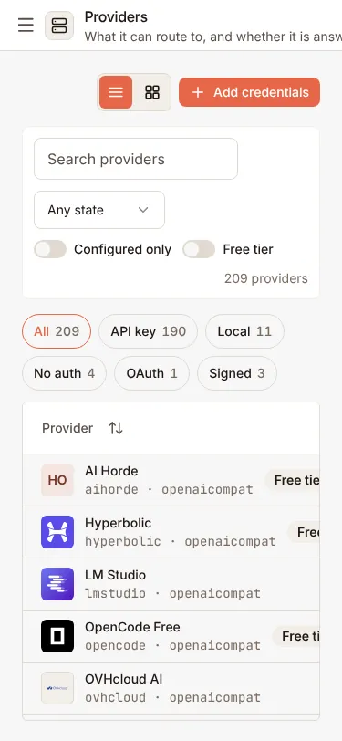

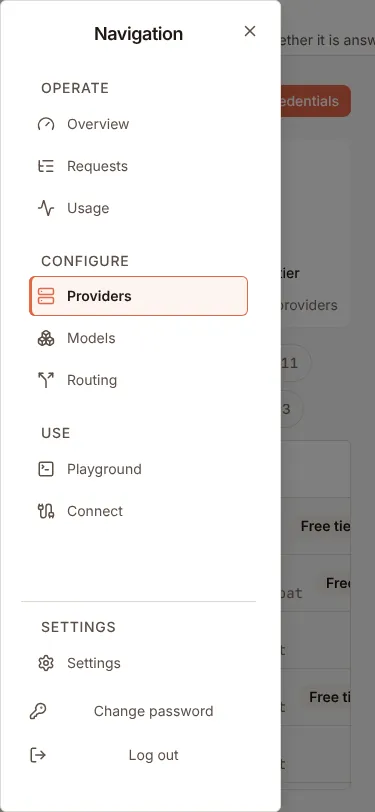

### SHELL-07: A malformed `/api/providers` response crashes the whole shell (rail and header gone), not just the screen, and "Try again" cannot recover
- Severity: Medium
- Where: `web/src/lib/router.tsx:104` (`<CommandPalette>` rendered in `RootShell`, outside `ScreenBoundary`) and `web/src/features/shell/command-palette.tsx:53`, `:114`
- Steps: 1. Make `/api/providers` answer `{"providers": 5}` (I simulated an older or broken gateway with Playwright `page.route`). 2. Open `/providers`. 3. After un-mocking, click "Try again" or use back/forward.
- Expected: Per the `ScreenBoundary` contract ("The rail is how an operator gets to a screen that still works, so it has to survive"), only the Providers panel shows "This screen could not render", and the rail stays.
- Actual: The entire page becomes the root error component: no rail, no header, nothing to navigate with. The message is `(a.providers ?? []).filter is not a function`, which is `paletteMatches`. The palette was never opened. "Try again" re-renders from the same cached query and fails identically (0 refetches), so only a full reload recovers. For comparison, a malformed `/api/usage` response is contained correctly: the rail survives and only the panel errors (shell-07b).
- Evidence: `shell-07a-palette-crash-takes-down-shell.png` shows the whole window replaced by the error with no rail. `shell-07b-screen-crash-contained-for-comparison.png` shows the intended contained behaviour on Usage.
- Root cause: `CommandPalette` computes `paletteMatches()` on every render, even while closed, from whatever the shared `["providers"]` cache holds. It lives in `RootShell`, so a throw there escapes every `ScreenBoundary` and reaches the router's root `defaultErrorComponent`. `?? []` guards against `undefined` but not against a non-array. The comment at `:109-112` names this exact risk.
- Proposed fix: (a) Only compute while open: `const found = open ? paletteMatches(...) : EMPTY`. (b) Harden `paletteMatches` with `Array.isArray(data.providers) ? … : []`, the same for models, and `m.providers ?? []`. (c) Wrap `<CommandPalette>` in its own `<ScreenBoundary>` in `router.tsx` so a palette bug can never take the rail down.

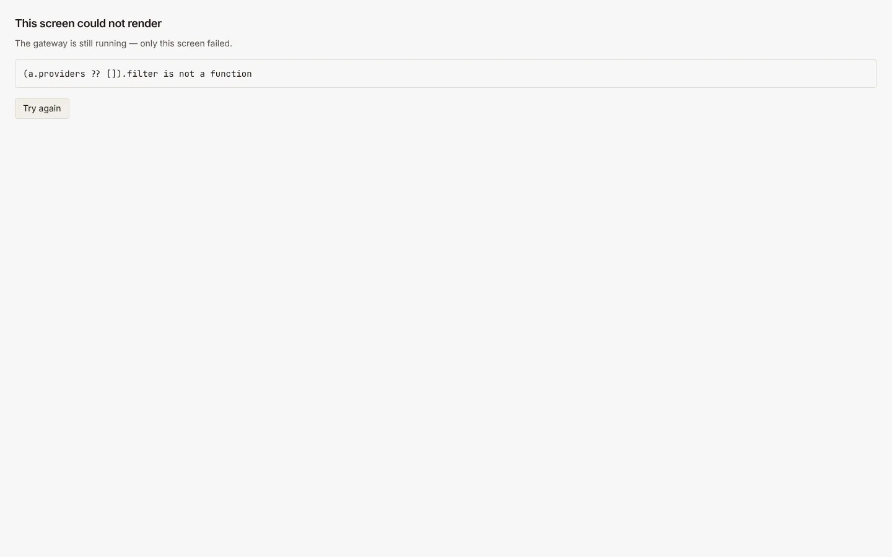

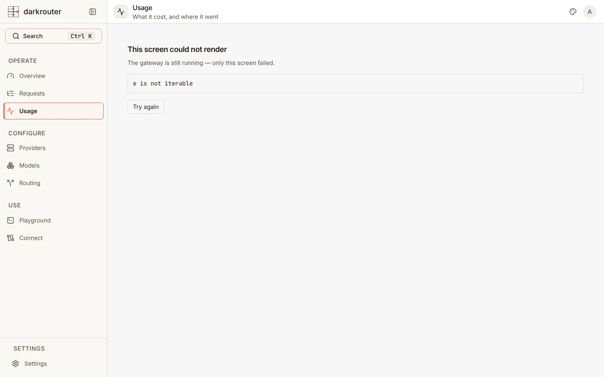

### SHELL-04: On the 404 page the header loses its identity and the theme/account buttons jump to the left edge
- Severity: Low
- Where: Not-found route (`/does-not-exist`), `web/src/styles/globals.css:44-47` together with `web/src/features/shell/page-identity.tsx` (`PageIdentityBar` returns `null`)
- Steps: 1. Open `/does-not-exist` at 1440.
- Expected: The header looks the same as on every other page, with actions at the right and some page name. The tab title names the state (e.g. "Not found · Darkrouter").
- Actual: The palette and avatar buttons sit at x=272, right beside the rail (on every other page they are at x=1348). The header has no title or `h1`, and the tab title is just "Darkrouter".
- Evidence: `shell-04-404-header-actions-left.png`. The magenta box marks the header actions pinned to the left.
- Root cause: `globals.css` makes `.dr-layout-header-end` span the bar (`flex: 1 1 auto; margin-left: 0`) and relies on the identity's `mr-auto` to push the actions right. `identityFor()` returns `undefined` for an unknown path, so nothing pushes them.
- Proposed fix: Give the actions their own push: `.app-header-actions { margin-left: auto; }` in `globals.css`. Optionally have `PageIdentityBar`/`pageTitle()` fall back to a "Not found" identity when a route doesn't match.

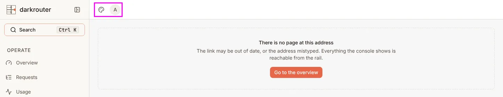

### SHELL-08: Two darkraise components still render at 12px, below the 14px floor (theme customizer labels, palette group headings)
- Severity: Low (CLAUDE.md typography rule 1)
- Where: Theme customizer popover (`.dr-theme-switcher-section-label`: "Mode", "Accent Color", "Surface Color") and the command palette group headings (`[cmdk-group-heading]`: "Go to", "Providers", "Aliases", "Models", "Request"). Library sources: `darkraise-ui/dist/styles.css:9236` and `:2147` (`[&_[cmdk-group-heading]]:text-xs`). The app-side fix belongs in `web/src/styles/globals.css:76-81`.
- Steps: 1. Click "Customize theme". 2. Press Ctrl+K. 3. Read computed `font-size`.
- Expected: Nothing under 14px (`text-sm`), per CLAUDE.md. `globals.css:49-81` already lifts three library components (badge, rail group label, search shortcut) to `var(--text-sm)` for exactly this reason.
- Actual: The customizer section labels are 12px against 16px body text, and the palette group headings are 12px against 14px items. A scan of every page plus the popovers found no other text under 14px.
- Evidence: `shell-08a-theme-labels-12px.png` (labels outlined in magenta) and `shell-08b-palette-headings-12px.png` ("Go to" heading outlined).
- Root cause: Library defaults are `text-xs`, and the floor override in `globals.css` lists only three selectors.
- Proposed fix: Extend the existing override in `globals.css`:
  ```css
  .dr-badge[data-size="sm"], .dr-badge[data-size="md"],
  .dr-sidebar-nav-group-label, .dr-search-command-shortcut,
  .dr-theme-switcher-section-label,
  .dr-command-group [cmdk-group-heading] {
    font-size: var(--text-sm);
  }
  ```

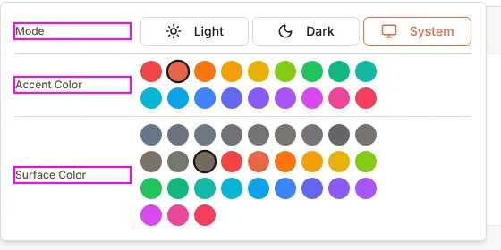

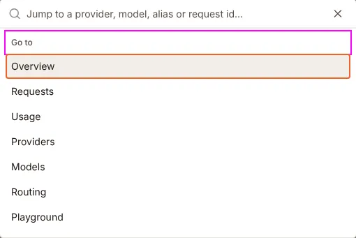

### SHELL-09: Provider monogram uses an inline pixel font size, which renders at 11px in the "Add a local runtime" dialog
- Severity: Low (CLAUDE.md typography rules 1 and 2)
- Where: `web/src/features/providers/provider-icon.tsx:110` (`fontSize: Math.round(size * 0.4)`). Rendered via `add-local-dialog.tsx:171,205` (size 28 → 11px), `provider-card.tsx:48` and `providers-screen.tsx:257` (size 36 → 14px), and `provider-detail.tsx:119,402` (size 44 → 18px).
- Steps: 1. Providers → "Local" chip. 2. On llama.cpp (or MLX LM, or Text Generation WebUI), click Add. 3. Inspect the "LC" monogram.
- Expected: A predefined scale step (`text-sm` minimum) that follows the font-size axis.
- Actual: `style="font-size: 11px"`. That is below the floor, a custom size, and fixed in pixels, so it ignores the font-size axis. The grep turned up no other `text-xs`, `text-[Npx]` or pixel `font-size` in `web/src`, and the `.css` files all use `var(--text-*)`.
- Evidence: `shell-09-monogram-11px.png`. The magenta-outlined "LC" tile next to "llama.cpp" is visibly smaller than every label around it.
- Root cause: The size is computed from the tile size in pixels rather than chosen from the scale.
- Proposed fix: Drop `fontSize` from the inline style and pick a class: `size >= 40 ? "text-lg" : "text-sm"` (two-letter monograms fit a 28px tile at `text-sm`; tighten letter-spacing if needed). Never compute it in px.

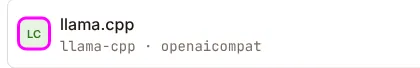

### SHELL-11: Focus is not moved to the content on route change (the library's route-focus was dropped when the shell was recomposed)
- Severity: Low (a11y)
- Where: `web/src/features/shell/app-shell.tsx` (`AppShell` never calls `useRouteFocus`)
- Steps: 1. Tab to "Requests" in the rail and press Enter (or pick a destination in the palette).
- Expected: As in darkraise's own `SidebarLayout`/`TopNavLayout` (which call `useRouteFocus()`, `chunk-T3C6KMBR.js:446-467, 711`), focus moves to `#main-content` so screen-reader and keyboard users land in the new screen.
- Actual: Focus stays on the rail link (`A:Requests`). After a palette jump it lands on the rail's Search button. A screen reader announces nothing about the new page.
- Evidence: `shell-11-focus-stays-on-rail.png`. The Requests screen has loaded, but the focus ring is still on the rail's "Requests" link.
- Root cause: The comment at `app-shell.tsx:28-36` explains why the shell is hand-built from primitives. The `useRouteFocus()` call the library layouts make was not carried over.
- Proposed fix: `import { useRouteFocus } from "darkraise-ui/layout"` and call `useRouteFocus()` at the top of `AppShell` (the target is already `id="main-content" tabIndex={-1}`).

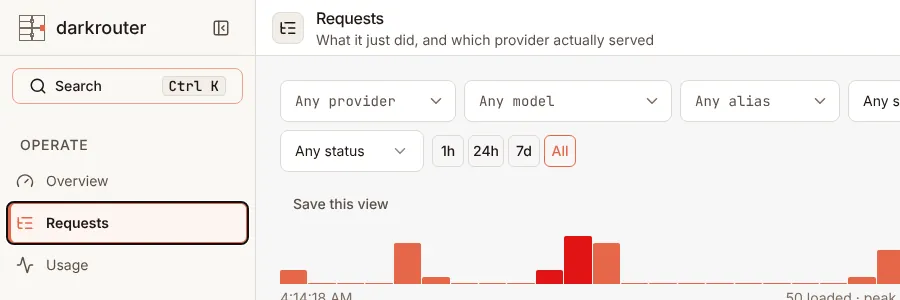

### SHELL-12: An expired session drops silently to a blank login form, and the tab keeps the old page title
- Severity: Low
- Where: `web/src/app.tsx:56-66,86-93` (revoked → `LoginScreen`) and `web/src/routes/login.tsx` (never sets `document.title`)
- Steps: 1. Log in in a fresh context. 2. Delete the `darkrouter_session` cookie (simulating expiry or revocation elsewhere). 3. Click "Requests" in the rail.
- Expected: The login screen, with a short explanation (e.g. "Your session has ended — sign in again"), and the tab titled for the sign-in screen.
- Actual: An empty login form with no message. The tab still reads "Requests · Darkrouter" (URL `/requests`), so a background tab looks like a working Requests page. Re-login itself is clean: it returns to `/requests`.
- Evidence: `shell-12-expired-session-silent-login.png`. The overlay prints `document.title` and the location at the moment the login form is shown.
- Root cause: `onUnauthorized` sets `revoked` and swaps in `LoginScreen` without passing a reason. `usePageTitle` only runs inside `RootShell`, which unmounts with the router, so the last title sticks.
- Proposed fix: Pass `reason="expired"` to `LoginScreen` when `revoked` is true and render it in a `role="status"` line above the form. In `LoginScreen`, add `useEffect(() => { document.title = "Sign in · Darkrouter" }, [])`.

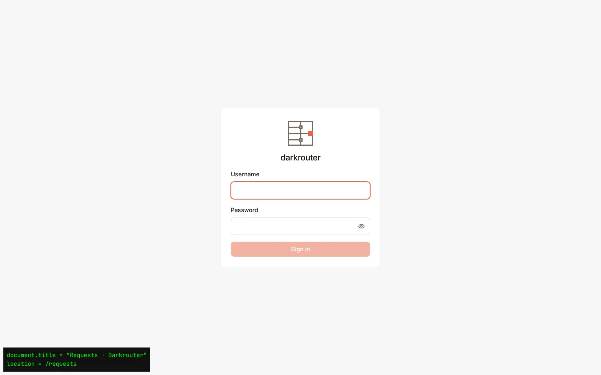

### SHELL-13: The rate-limited (429) login message says "try again later" and drops the server's Retry-After; both fields are also marked invalid
- Severity: Low
- Where: `web/src/routes/login.tsx:44-48`. The server sends `Retry-After` (`internal/admin/authapi.go:20-27`). `web/src/lib/api.ts:123/197` builds `ApiError` without headers.
- Steps: 1. Get a 429 from `/api/auth/login`. The real limiter allows a burst of 10 and then 5/min per IP. To spare the shared limiter I reproduced the response with `page.route`, using the server's exact body and `Retry-After: 42`. 2. Submit.
- Expected: Something like "Too many sign-in attempts. Try again in 42 s." The password should not be flagged as wrong, since it may be correct.
- Actual: "too many login attempts; try again later" (raw server string, lower-case). Both inputs get `aria-invalid="true"` (red border), and the password is selected for retyping as if it were wrong. An operator retrying early just gets another 429.
- Evidence: `shell-13-429-no-wait-time.png` shows the red password field and the "try again later" text with no wait time.
- Root cause: `ApiError` carries only status, message and body, so `Retry-After` is lost. `submit()` treats every failure the same as a wrong credential (aria-invalid plus select).
- Proposed fix: Carry `retryAfter = Number(res.headers.get("Retry-After"))` on `ApiError` for 429. In `login.tsx`, handle `status === 429` separately: show `Too many sign-in attempts — try again in ${n} s`, leave `aria-invalid` unset, and optionally disable Sign in until the wait passes.

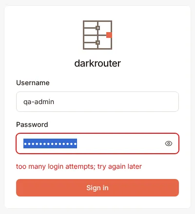

### SHELL-14: Theme customizer colour swatches don't expose which one is selected to assistive tech
- Severity: Low (a11y)
- Where: "Customize theme" popover, darkraise-ui `ThemeSwitcher` (`.dr-theme-switcher-swatch`), used at `web/src/features/shell/app-shell.tsx:161`
- Steps: 1. Open Customize theme. 2. Inspect the accessibility tree of the Accent Color and Surface Color rows.
- Expected: The selected swatch is announced as selected (e.g. `aria-pressed="true"` or radio semantics, as the Mode row already uses `role=radio` with `aria-checked`).
- Actual: Every swatch is a plain `button "coral"`. The selected one differs only by `data-active="true"` and a visual ring, so a screen-reader user can't tell the current accent or surface.
- Evidence: `shell-14-swatch-selected-not-exposed.png`. The overlay shows the a11y tree (plain buttons) and the selected swatch's markup (only `data-active`).
- Root cause: The library's swatch markup has no ARIA state.
- Proposed fix: Fix it upstream in darkraise-ui (`aria-pressed={active}` on the swatch, or `role="radiogroup"`/`role="radio"` like the Mode row) and pick it up on the next verified bump (CLAUDE.md pins 6.7.0). Until then, the app could set `aria-pressed` from `data-active` with a small effect on the popover.

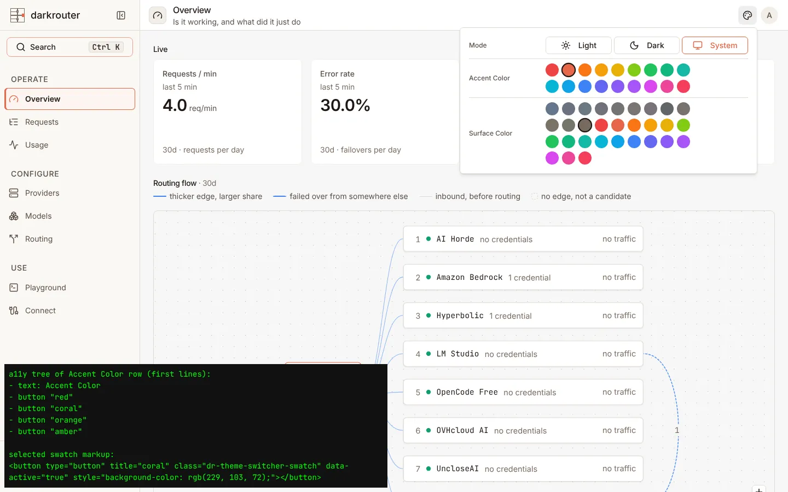

### SHELL-05: "Change password" and "Log out" in the mobile drawer are centred and out of line with the nav items
- Severity: Cosmetic
- Where: Mobile drawer footer, `web/src/features/shell/app-shell.tsx:142-153` (`<button className="dr-sidebar-nav-item dr-sidebar-nav-link">`)
- Steps: 1. Open the console at 375 wide. 2. Open the menu and look at the bottom.
- Expected: Icon and label are left-aligned like "Settings" directly above (icon x=37, label x=67).
- Actual: The icon sits at x=29 (8px further left) and the label text is centred in its row ("Change password" and "Log out" float in the middle).
- Evidence: `shell-05-drawer-account-misaligned.png` (magenta box).
- Root cause: The nav-link styles were written for `<a>`. A `<button>` keeps the UA `text-align: center` (computed `ta=center`), and `.app-drawer-account` sits outside the `.dr-sidebar-nav` wrapper, so it misses that wrapper's `px-2`.
- Proposed fix: In `globals.css`, add `.app-drawer-account { padding-inline: 0.5rem } .app-drawer-account > button { text-align: start; width: 100%; }`, or render the two buttons inside the same `nav` wrapper as Settings.

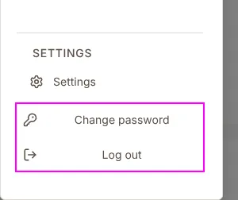

### SHELL-10: The pinned Settings item is indented 12px more than every other rail item, and its active pill is narrower
- Severity: Cosmetic
- Where: Sidebar footer, `web/src/features/shell/app-shell.tsx:126` (`RailNav` inside `.dr-sidebar-layout-aside-section[data-position=footer]`)
- Steps: 1. Open `/settings` at 1440 with the rail expanded.
- Expected: "SETTINGS"/Settings aligned with "USE"/Connect above (item x=8, width 239).
- Actual: Settings item x=20, width 215. The group label and active pill are visibly inset relative to every other group.
- Evidence: `shell-10-settings-footer-indent.png`. Compare the magenta boxes (Connect vs Settings) and the blue dashed labels (USE vs SETTINGS).
- Root cause: The library's aside-section applies `px-3 py-3` (`darkraise-ui/dist/styles.css:8193`), and `RailNav`'s `.dr-sidebar-nav` applies its own `px-2`. The scrolling nav section has no horizontal padding, so only the footer gets both.
- Proposed fix: In `globals.css`, add `.dr-sidebar-layout-aside:not([data-collapsed="true"]) .dr-sidebar-layout-aside-section[data-position="footer"] { padding-inline: 0; }`.

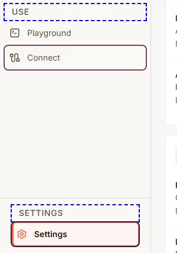

### SHELL-15: The OVHcloud provider logo is an unreadable wordmark that nearly disappears in dark mode
- Related: Duplicate of PROVIDERS-20.
- Severity: Cosmetic
- Where: Providers list, overview flow and anywhere `ProviderIcon` renders preset `ovhcloud`. `web/src/features/providers/provider-assets.ts:59` (`"ovhcloud": { file: "ovhcloud.svg" }`, not `mono`) and `web/public/providers/ovhcloud.svg` (a 300×55 full wordmark with fixed fill `#2744a0`).
- Steps: 1. Open `/providers` in dark mode (colour scheme dark, or Customize theme → Dark). 2. Look at the OVHcloud AI row.
- Expected: A recognisable mark with contrast against the tile in both modes.
- Actual: The whole "OVHcloud" wordmark is squeezed into a ~24px-wide tile, so it is illegible even in light mode. In dark mode it is navy on a near-black tile and practically invisible.
- Evidence: `shell-15-ovh-logo-dark.png` (3× crop, dark) and `shell-15b-ovh-logo-light.png` (3× crop, light).
- Root cause: The asset is a wide wordmark rather than a square glyph, and it is neither `mono` (so the dark-mode `invert(1)` in `provider-icon.css:28` does not apply) nor given a light backing.
- Proposed fix: Replace `ovhcloud.svg` with OVH's square logomark only (the two-shape glyph at the start of the SVG). If it stays single-colour, set `mono: true` (or use `currentColor`) so the dark-mode treatment applies. Failing both, drop the asset and let the monogram render.


<details><summary>Tested and working — Auth & app shell</summary>

- **Login:** Sign in is disabled until both fields are filled, and Enter on empty fields does nothing. Autofocus on username. Tab order: username → password → reveal → Sign in. Wrong password and unknown username both give the same `role=alert` "invalid username or password", with the password selected for retyping. A 73-byte password gives "password must be at most 72 bytes". A 502 shows "Bad Gateway". The reveal toggle switches type password↔text with correct `aria-label`/`aria-pressed`. Login from a deep link (`/providers?x=1`) returns to it. I made 3 refused attempts in total and 5 successful logins, all in fresh contexts.
- **Logout:** Logging out via the avatar menu with the mouse (fresh context) and via the drawer at 375 (fresh context) both return to login, and `/api/auth/status` reports `authenticated:false`. The session cookie is HttpOnly, SameSite=Lax and 30-day.
- **Session expiry:** After the cookie is cleared, the next request lands cleanly on login, apart from SHELL-12. Re-login returns to the same route.
- **Sidebar:** All 9 destinations navigate. The active state is correct, including subtree matching (`/providers/lmstudio` keeps Providers lit, Overview is exact-only). Collapse/expand works: the collapsed rail is 64px, links get `aria-label`, tooltips appear on hover, and in the collapsed brand slot the mark swaps to the toggle on hover/focus. The skip link appears on first Tab (after its transition) and moves focus to `#main-content`. The rail stays expanded at 768. At 375 the drawer opens, has an accessible name ("Open menu" trigger, "Navigation" title), traps focus, closes on Escape and returns focus to the trigger.
- **Header:** The identity title and subtitle are correct on every route. Browser tab titles follow `Section · Darkrouter` on every route, including detail pages and `/settings/`.
- **Command palette:** It opens with Ctrl+K and with the Search button, and Ctrl+K toggles it closed. Escape closes it and clears the query. Arrow-key navigation and Enter work. All 9 "Go to" commands navigate correctly. Provider (vllm → `/providers/vllm`), model (mock-fast → `/models?model=mock-fast`) and alias (→ `/routing?alias=…`) jumps work. The empty state "Nothing matches." appears. A hex-shaped string shows "Open trace …", but see SHELL-01.
- **Theme:** Mode Light/Dark/System, accent (18 swatches) and surface (30 swatches) all apply immediately and persist across reload (`mode`, `theme-accent`, `theme-surface-color` in localStorage). Clearing storage restores the defaults (coral/sepia/system). Hidden axes are stripped on load: a stored `theme-font-size=extra-large` is removed, so the font-size axis cannot currently be chosen by an operator.
- **Font size:** I forced `data-font-size="extra-large"` on all 10 screens at 1440. There was no horizontal page overflow and no clipped shell chrome. Some select labels truncate to "Any…" on Requests, but that is page-level and the axis is hidden. I visited every page in dark mode: no invisible shell elements and no contrast problems in the chrome. The one dark-mode problem found was SHELL-15.
- **404 and errors:** `/does-not-exist` and `/Providers` show the not-found empty state with a working "Go to the overview" link (header issue: SHELL-04). `/providers/does-not-exist` shows "No provider named …". `/requests/<unknown>` opens the drawer with "No request with that id". `ScreenBoundary` contains a malformed `/api/usage` correctly.
- **History:** Back/forward through 6 routes restores URL, title, identity and active item. Deep-link reload preserves query state (`/models?model=…`, `/routing?alias=…`).
- **Focus and console:** Focus is visible on all header and rail controls. No console errors on any page during normal use. The only 4xx were the expected 404 for an unknown trace id, plus 401s after a deliberate logout or expiry.
- **Typography grep:** Over `web/src` (`text-xs`, `text-[Npx]`, `text-[length:…]`, `font-size:` in CSS, inline `fontSize`) the only violation is SHELL-09. Every CSS `font-size` uses `var(--text-*)`. I excluded the brand SVGs in `public/providers/*.svg`, which contain `font-size` attributes inside image assets, since they are images and not UI text.

</details>

## Overview, Requests, Usage

_Scope: Stat tiles, routing flow graph, failovers, request table/filters/saved views/trace drawer/export, usage charts._

### OPERATE-01: Requests "Model" filter matches only the final (served) model, so the model shown in the table cannot be filtered on
- Severity: High
- Where: Requests screen, model filter. Root cause `internal/store/requests_store.go:103` (`{"r.final_model", q.Model}`) vs. the table column `web/src/features/requests/requests-columns.tsx:46-49` (`modelLabel` shows `row.model` = requested model); candidates offered by `web/src/features/requests/requests-screen.tsx:296-299`.
- Steps: 1. Run `traffic.sh 1`. 2. Open /requests; a `mock-error` row (also `no-such-model`, `mock-ratelimit`, every failed `flaky-1`) is in the table. 3. Type `mock-error` in "Filter by model" (it is offered as a suggestion) and pick it. 4. Also try `/requests?model=lmstudio%2Fmock-fast` (the suggestion list offers every `provider/model` form, and `lmstudio/mock-fast` is literally what the client sent).
- Expected: the rows whose Model cell reads `mock-error` (or `lmstudio/mock-fast`) are listed.
- Actual: "No results found" in both cases. API confirms: `GET /api/requests?model=mock-error` → `{"requests":[]}`, `?model=no-such-model` → `[]`, `?model=lmstudio/mock-fast` → `[]`, while `?model=mock-fast` returns rows. Every failed request has no final model, so failures — the rows an operator most wants to isolate — can never be found by model; requests sent as `provider/model` or via an alias are also unfindable by what the client sent.
- Evidence: `operate-01a-unfiltered.png` — highlighted `mock-error` row in the unfiltered table; `operate-01b-model-filter.png` — same model typed into the filter → "No results found".
- Root cause: the API's `model` parameter filters `r.final_model`, but the UI shows and suggests the requested model (`row.model`, plus `provider/model` forms from the catalogue).
- Proposed fix: filter on what the column shows. In `requests_store.go` match either column: `where = append(where, "(r.requested_model = ? OR r.final_model = ?)")` for `q.Model` (keep the Hash order in `cursor.go` unchanged), or add a separate `requested_model` param and send that from the UI. Either way the suggestions and the filter must agree.

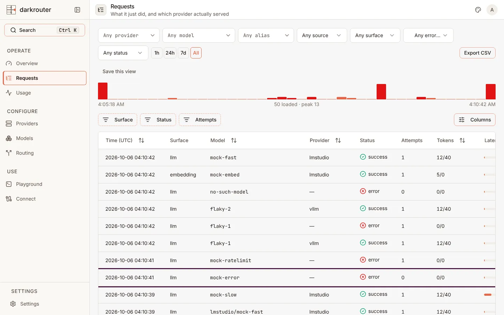

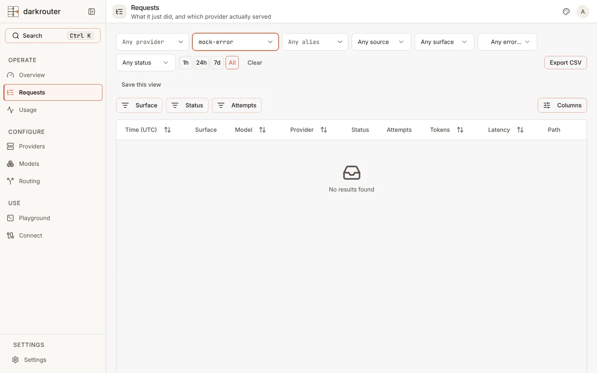

### OPERATE-02: Requests "Provider" filter excludes every request that failed at that provider
- Severity: High
- Where: Requests screen, provider filter. `web/src/features/requests/requests-screen.tsx:315-324` sends `provider`, which `internal/store/requests_store.go:102` matches against `r.final_provider_id` only. The API already has `attempted_provider` (`internal/admin/requests.go:31`, `requests_store.go:115-121`) but nothing in `web/` uses it.
- Steps: 1. Run `traffic.sh 1` (lmstudio answers `mock-ratelimit` with 429, `mock-error` with 500). 2. Open `/requests?provider=lmstudio&status=error` (pick lmstudio in "Filter by provider", "error" in Status).
- Expected: the lmstudio 429/500 failures are listed — "show me this provider's errors" is the core triage question.
- Actual: "No results found". Failed rows show Provider "—" and are invisible to the filter. `GET /api/requests?attempted_provider=lmstudio&status=error` returns them (mock-ratelimit, qa-routing-errfb …). Same for vllm's flaky-1 500s.
- Evidence: `operate-02-provider-error.png` — provider=lmstudio + status=error → "No results found".
- Root cause: UI uses the final-provider filter for a control labelled "Filter by provider".
- Proposed fix: in `requests-screen.tsx` map the provider control to `attempted_provider` (add it to `FIELDS`, keep reading a legacy `provider` param for old links), or rename the control "Served by" and add a second "Attempted at" control. Also use `attempted_provider` for the Usage → Requests provider click-through (`usage-screen.tsx:170-181`), since the rollup credits attempts per provider.

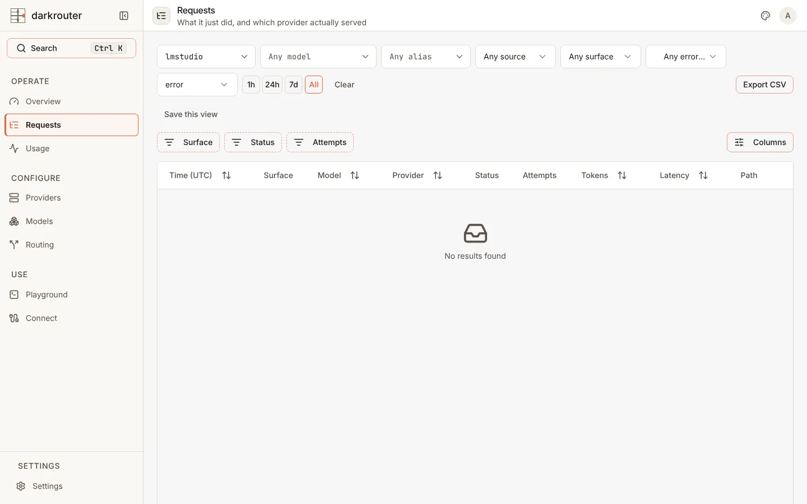

### OPERATE-03: Opening or closing a trace remounts the whole Requests screen — loaded pages, sort, hidden columns, scroll and keyboard focus are lost
- Severity: High
- Where: `web/src/lib/router.tsx:123` (`<ScreenBoundary key={pathname}>`) combined with two separate routes rendering `RequestsScreen` (`router.tsx:193` `/requests` and `:206` `/requests/$id`).
- Steps: 1. /requests, click "Load more" twice (caption: "109 loaded"). 2. Sort by Latency, hide "Surface" via Columns. 3. Click "Open" on any row, then press Escape.
- Expected: back to the same 109 rows, same sort, Surface still hidden, focus returned to the Open button.
- Actual: "50 loaded", default time sort, Surface column back, scroll at top. With keyboard: focus Open → Enter → Escape leaves `document.activeElement` = `<body>`; the next Tab lands on "Skip to content". Every trace inspection throws away the operator's place in the log.
- Evidence: `operate-03a-before-open.png` (caption "109 loaded", header without Surface, rows sorted by latency asc) vs `operate-03b-after-close.png` (caption "50 loaded", Surface back, time order) — both outlined in magenta.
- Root cause: the pathname changes `/requests` ↔ `/requests/<id>`, so the key on `ScreenBoundary` changes and React unmounts/remounts `RequestsScreen` (all `useState` — `older`, `held`, `cursor` — and DataTable's internal sort/visibility state are discarded).
- Proposed fix: key the boundary on the section, not the full path, e.g. `key={pathname.startsWith("/requests") ? "/requests" : pathname}` (or make `/requests/$id` a child route of `/requests` with `<Outlet/>` for the drawer). Then Radix's Sheet restores focus to the trigger on close by itself.

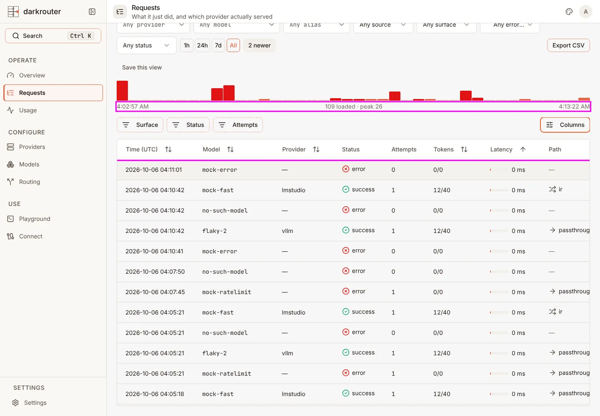

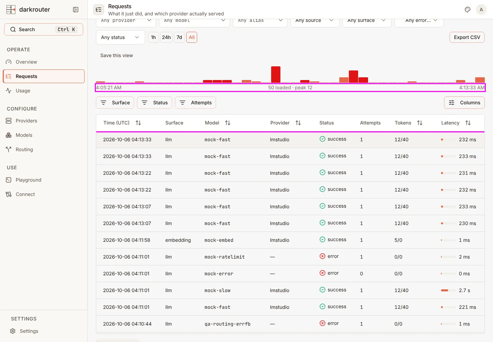

### OPERATE-25: Every Usage → Requests click-through fails with "since_ms must be an integer"
- Severity: High
- Where: Usage table key links, `web/src/features/usage/usage-screen.tsx:427-431` (`<Link to="/requests" search={requestsSearch(...)}>`) and `:169-180` (`since_ms: String(...)`). The reader is `web/src/lib/search-filters.ts:25`, which uses raw `URLSearchParams`. Found by the coordinator after the hourly rollup populated Usage.
- Steps: 1. Send traffic and wait for the hourly rollup (or restart the gateway, which rolls up at startup). 2. Open Usage → Model (or Provider/Alias). 3. Click any key in the table, e.g. `mock-error`, `flaky-1` or `vllm`.
- Expected: Requests opens filtered to that key over the same UTC-day window.
- Actual: The URL is `/requests?model=mock-error&since_ms=%221788739200000%22&range=30-utc-days`. `since_ms` carries literal double quotes. `GET /api/requests?…since_ms="1788739200000"` returns **400**, and Requests shows "The requests did not load · since_ms must be an integer". Every link in every dimension does this (checked: `mock-error`, `flaky-1`, `vllm`).
- Evidence: `operate-25-usage-table-links.png` shows the linked keys. `operate-25-clickthrough-400.png` shows the result of clicking `mock-error`: the error banner and the `mock-error` filter applied.
- Root cause: TanStack Router's default `stringifySearch` JSON-encodes each search value, and a string that would parse as a number is quoted (`"1788739200000"`) so that it round-trips as a string. The Requests screen deliberately bypasses the router's parser (`useSearchFilters` reads `location.searchStr` with `URLSearchParams`), so the quotes reach the API. The unit test for `requestsSearch` checks the object, not the URL it produces.
- Proposed fix: The console treats every search param as a plain string, so give the router plain query-string (de)serialisers in `lib/router.tsx` and make every writer agree:
  ```ts
  export const router = createRouter({
    routeTree: …,
    parseSearch: (s) => Object.fromEntries(new URLSearchParams(s)),
    stringifySearch: (o) => {
      const q = new URLSearchParams(o as Record<string, string>).toString()
      return q ? `?${q}` : ""
    },
    …
  })
  ```
  Add a test that renders the Usage table, clicks a key and asserts that the resulting `location.searchStr` contains `since_ms=<digits>`. Even once fixed, the `mock-error`/`mock-ratelimit` rows (0 served, 16/10 attempts) will land on "No results" because of OPERATE-01/02. The click-through should use `attempted_provider` and the requested model.

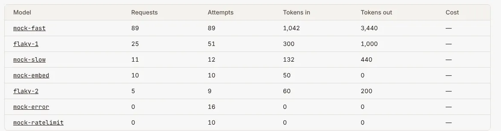

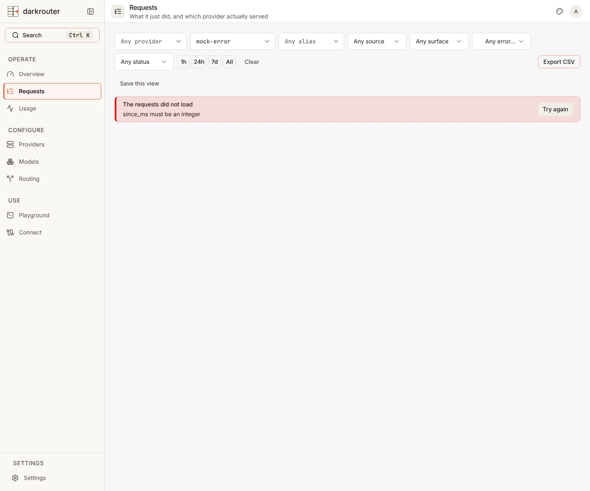

### OPERATE-04: Routing flow labelled "30d" mixes an hour-lagged rollup with a 5-minute window — "0 requests · 6 failed over", arcs between "no traffic" providers
- Severity: Medium
- Where: Overview → Routing flow. Node volumes come from `useUsage("alias"|"provider")` (usage_daily, recomputed only by `RunRollup` every 45–60 min: `internal/server/server.go:686`, `internal/store/rollup.go:180-208`); the router's "failed over" count and the arcs come from `/api/overview` `failover_edges` over `overviewWindow = 5 * time.Minute` (`internal/admin/usage.go:15`, `:139`). Heading `web/src/features/overview/overview-screen.tsx:346-351` says "· 30d"; count `:386`.
- Steps: 1. Send ~6 requests to an alias whose first target fails (here `qa-routing-failover`: vllm/flaky-1 → lmstudio/mock-fast), plus `traffic.sh`. 2. Open Overview within the hour.
- Expected: one window for the whole graph, with numbers that add up (the parts of a "30d" graph include the last few minutes).
- Actual: Router node reads "0 requests" and "6 failed over"; every provider says "no traffic", yet a dashed arc labelled 6 runs from vLLM to LM Studio; the Live strip above says 6.4 req/min. Right after startup (or within up to an hour of new traffic) the whole graph says nothing happened.
- Evidence: `operate-ov-failovers.png` — Router "0 requests / 6 failed over", arc "6" between two "no traffic" rows, Recent failovers list below with 5 rows.
- Root cause: two data sources with different windows and freshness rendered under one "30d" label.
- Proposed fix: source the failover edges for the same 30-day window as the volumes (add a `days` window to `FailoverEdges` and use it here), or label the arcs "last 5 min" and drop the router's "failed over" line; and include today's not-yet-rolled-up requests (e.g. have `/api/usage` union the live `requests` table for today, or run `Rollup` on demand when the newest usage_daily row is older than N minutes) so "0 requests" never sits next to a live rate.

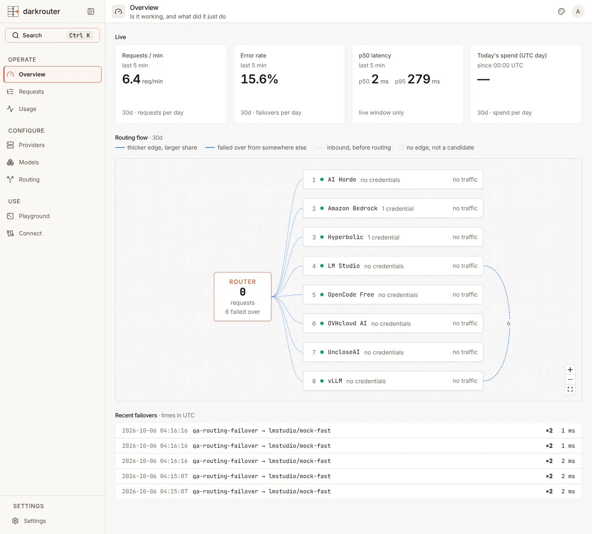

### OPERATE-05: Provider nodes in the routing flow are links but cannot be clicked with the mouse
- Severity: Medium
- Where: `web/src/features/overview/flow-graph.tsx:250-273` (node content is a `<Link to="/providers/$id">`) with `elementsSelectable={false}` and `nodesDraggable={false}` (`:347-349`). xyflow then renders the node wrapper with `pointer-events: none` (`@xyflow/react/dist/esm/index.js:2266,2362`: `hasPointerEvents = isSelectable || isDraggable || onClick || …`).
- Steps: 1. Overview. 2. Hover the "vLLM" row in the graph (cursor shows "grab", not a pointer). 3. Click it.
- Expected: navigates to /providers/vllm (the link's href).
- Actual: nothing happens — the click goes to `.react-flow__pane` (`document.elementFromPoint` at the node centre = `react-flow__pane draggable`; node computed `pointer-events: none`). Keyboard focus + Enter does navigate, proving the link exists.
- Evidence: `operate-06-node-click.png` — magenta dot = click point on the outlined vLLM link; after the click the URL is still `/` and the element at that point is `react-flow__pane draggable`.
- Root cause: xyflow disables pointer events on nodes that are neither selectable, draggable nor have node handlers.
- Proposed fix: in `flow-graph.css` add `.rf-wrap .react-flow__node-provider { pointer-events: all; }` and give the link `className="rf-provider-link nopan nodrag"`; or pass `onNodeClick={() => {}}` to `ReactFlow` so xyflow keeps pointer events.

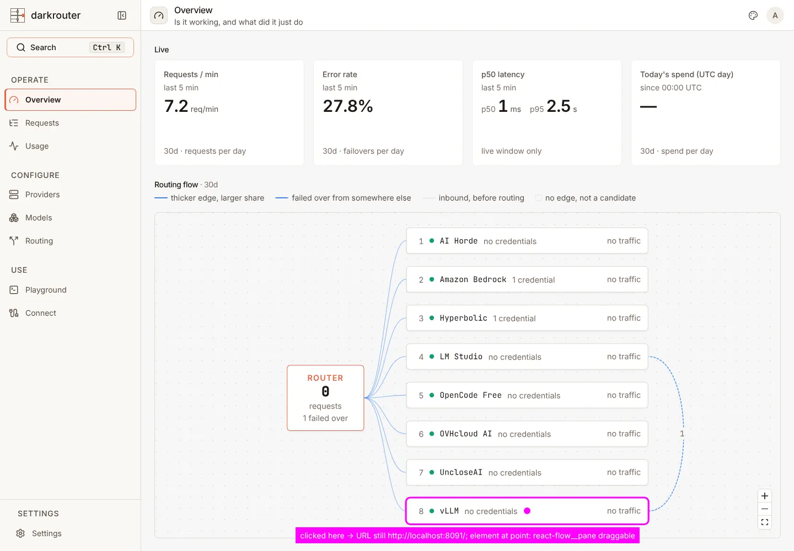

### OPERATE-06: Routing flow is unreadable and clipped at tablet/phone widths
- Severity: Medium
- Where: `web/src/features/overview/flow-graph.tsx:336-346` (`fitView` with `minZoom: 0.4`, right padding 14%); `FailoverEdge` (`:191-216`) bows up to 96px past the provider column, outside the node bounds `fitView` measures.
- Steps: 1. Overview at 375×812 and at 768×1024 with at least one failover in the last 5 minutes.
- Expected: node text at least the 14px floor (CLAUDE.md), or a horizontally scrollable graph; the failover arc and its count visible.
- Actual: at 375 the viewport is scaled 0.467 — 14px node text renders ~6.5px (bounding box 9.8px line), unreadable; at 768 scale 0.66. At both widths the failover arc and its count label are cut off at the right edge.
- Evidence: `operate-07-graph-375.png` (tiny text, arc leaving the right edge, count not visible), `operate-07-graph-768.png` (arc and label clipped on the right).
- Root cause: fitting a fixed ~900px-wide layout into a narrow canvas by zooming out, and edges are not part of the fit bounds.
- Proposed fix: below a width threshold set `minZoom`/`fitViewOptions.minZoom` to 1 and let `.rf-wrap` scroll horizontally (`overflow-x: auto` with an inner min-width), or stack the columns vertically on narrow screens; add the max bow (96px) to the right padding as an absolute value rather than 14%.

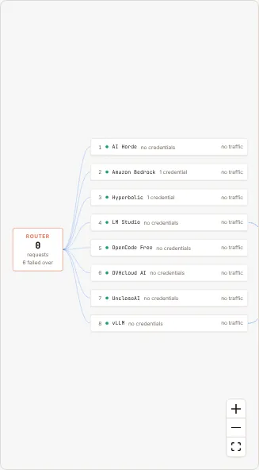

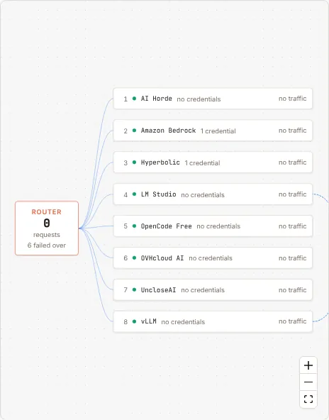

### OPERATE-07: Keyless providers are labelled "no credentials" in the routing flow
- Related: Same class as ROUTING-01.
- Severity: Medium
- Where: `web/src/features/overview/flow-graph.tsx:85-92` (`if (p.credentials === 0) return "no credentials"`); `/api/overview` tiles carry no auth style (`internal/admin/usage.go:26-34`).
- Steps: 1. Overview → Routing flow.
- Expected: LM Studio / vLLM (local, `auth_style: none`) and AI Horde / OpenCode / OVHcloud / UncloseAI (`anonymous`/`optional`) read as fine — they need no key, the backend itself treats them as configured (`usage.go:103-110`), and LM Studio is serving every successful request.
- Actual: all six read "no credentials" in the same slot where Bedrock/Hyperbolic read "1 credential" — it reads as a misconfiguration and sends the operator looking for a key that does not exist (the exact thing the backend comment at `usage.go:103` warns about).
- Evidence: `operate-ov-failovers.png` — LM Studio / vLLM rows "no credentials" while the Live strip shows traffic they served.
- Root cause: the note keys on the credential count without knowing whether the provider needs one.
- Proposed fix: add `Keyless bool \`json:"keyless"\`` to `tileView` (set from `auth.IsKeyless(p.AuthStyle)`), carry it into `FlowProvider`, and in `providerNote` return e.g. `"no key needed"` when `p.keyless && p.credentials === 0`.


### OPERATE-08: Usage empty state says usage "rolls up once a day" and offers "Get a client connected" while the log holds hundreds of requests
- Severity: Medium
- Where: `web/src/features/usage/usage-screen.tsx:355-369`; actual cadence `internal/server/server.go:686` (`RunRollup(…, time.Hour)`, jittered to 45–60 min, `rollup.go:203-208`).
- Steps: 1. Send traffic (`traffic.sh 3`); Requests shows 50+ rows, Overview 12 req/min. 2. Open /usage (any range/dimension) before the next rollup.
- Expected: a "today's traffic appears after the next rollup (within the hour)" note — not first-run onboarding.
- Actual: "Usage rolls up once a day, once requests start arriving" + primary button "Get a client connected" → /connect. Both are wrong: requests are arriving, a client is connected, and the rollup is hourly. An operator reasonably concludes usage accounting is broken or their client is not connected.
- Evidence: `operate-us-1440-light.png` (and `operate-us-375-light.png`) — empty state with the onboarding CTA, taken while `/api/requests` returned 50+ rows.
- Root cause: `usageRows.length === 0` is treated as "no traffic ever"; the copy states the wrong cadence.
- Proposed fix: fetch one row of `useRequests({limit: "1"})`; when it is non-empty render "Today's requests are added to usage at the next rollup, within the hour" with a link to Requests instead of the /connect CTA; fix the title text to "Usage is rolled up hourly".

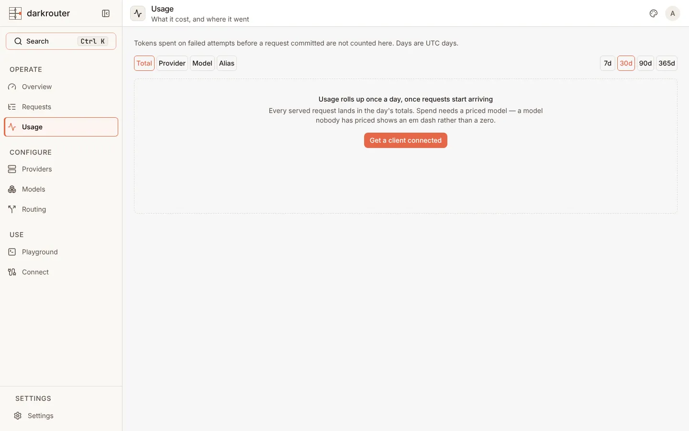

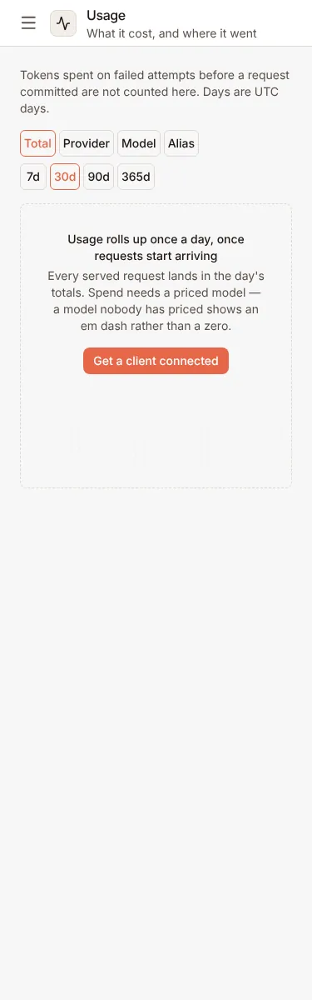

### OPERATE-09: Time-range pills and saved views freeze `since_ms`, so "1h" stops meaning the last hour
- Severity: Medium
- Where: `web/src/features/requests/requests-screen.tsx:382-389` writes `since_ms = Date.now() - window.ms` once; `saved-views.ts:224-228` stores that absolute `since_ms` with `range`; `saved-views-bar.tsx:257-263` re-applies it verbatim.
- Steps: 1. /requests, Status = error, click "1h", "Save this view" as `qa-operate-errors-1h` (saved 04:15:56 UTC; localStorage holds `"since_ms":"1791256556028","range":"1h"`). 2. Later, click the saved view (or simply leave the screen open / reload the URL).
- Expected: "1h" = rows from the last hour at the moment of viewing.
- Actual: re-applied at 04:55:52 UTC, the URL gets the original `since_ms=1791256556028` (03:15:56 UTC) back while the "1h" pill is lit — the "1h" window is really 100 minutes and keeps growing. The same happens without saved views: a reloaded/pasted `?range=1h&since_ms=…` URL, or a Requests tab left open (the 3 s poll reuses the frozen `since_ms`). (No request in this sandbox was yet older than an hour when re-applied, so the table itself does not yet show an out-of-window row; the frozen window is shown directly.)
- Evidence: `operate-09-stale-1h.png` — the "1h" pill outlined; the annotation above the toolbar prints the URL the saved view produced, its decoded `since_ms` (03:15:56Z) and the current time (04:55:52Z): a 100-minute window labelled 1h.
- Root cause: a relative window is persisted as an absolute timestamp.
- Proposed fix: persist only `range` for presets and derive `since_ms` at query time: in `apiFilters`, when `filters.range` is one of `TIME_WINDOWS`, replace `since_ms` with `String(Date.now() - window.ms)` (round to the poll interval so the query key does not change every render); in `saveView` drop `since_ms` when `range` is a preset.

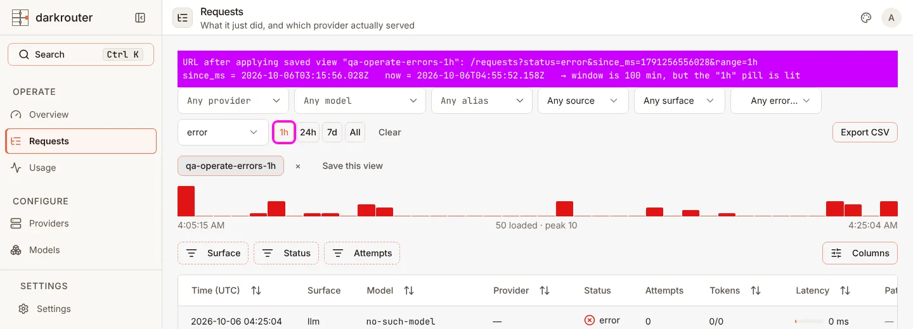

### OPERATE-10: Trace drawer never shows why a request failed — no error code, empty "Attempts" for 0-attempt failures
- Severity: Medium
- Where: `web/src/features/requests/trace-drawer.tsx:279-345` — `trace.data.error_code` (returned by `/api/requests/{id}`, typed in `api-types.ts:127`) is never rendered; the Attempts section renders an empty Ladder when `attempts` is `[]`.
- Steps: 1. `traffic.sh 1`. 2. Open the trace of the `no-such-model` request (client got HTTP 404).
- Expected: the drawer says what happened: error code `not_found` (the API returns it) and "No candidate — the model is not routable" or similar; same for `mock-error` skipped as cooling (`api_error`).
- Actual: Status "error", Total "0 ms", an "Attempts" heading over an empty box, and nothing else. The only failure detail in the whole drawer is the attempt's status code when an attempt happened.
- Evidence: `operate-tr-nosuch.png` — drawer for no-such-model with an empty Attempts section and no reason anywhere.
- Root cause: the error_code field is not part of the drawer's `<dl>`; no empty state for a ladder with no rows.
- Proposed fix: add `{trace.data.error_code && (<><dt>Error</dt><dd className="font-mono">{trace.data.error_code}</dd></>)}` after Status, and when `attempts.length === 0` render `<p className="text-sm text-[hsl(var(--muted-foreground))]">No attempt was made{skips.length ? " — every candidate was skipped" : " — nothing routes this model"}.</p>` instead of the empty Ladder.

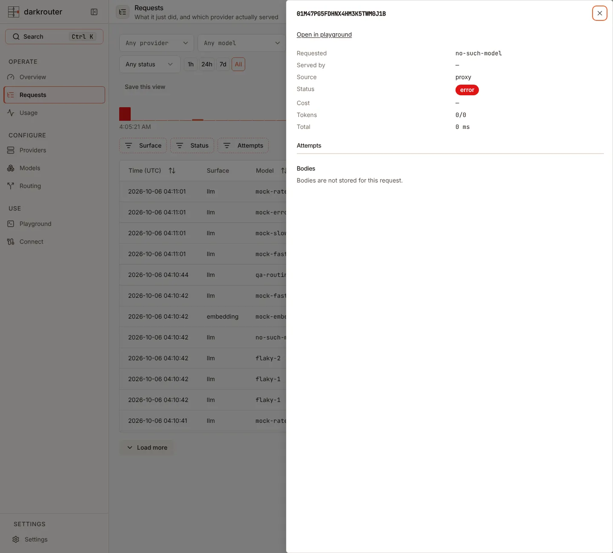

### OPERATE-11: Latency waterfall is empty for streamed requests — attempt latency stops at response headers
- Severity: Low
- Where: `web/src/features/requests/trace-drawer.tsx:101-120,205-245` lays attempts end to end along `total_ms`; `internal/exec/exec.go:662` records `time.Since(ac.sent)` right after the upstream answers headers, so a 214 ms stream has a 0 ms attempt.
- Steps: 1. `traffic.sh 1`. 2. Open the streamed `mock-fast` request (total 214 ms).
- Expected: the track shows where the 214 ms went (attempt + streaming).
- Actual: Attempts row "200 0 ms", waterfall "first token at 0 ms · total 214 ms" with an empty track; the same on failover traces (0 ms + 1 ms of 201 ms).
- Evidence: `operate-tr-stream-crop.png` — empty Latency track under "total 214 ms", attempt "0 ms".
- Root cause: attempt latency measures time-to-headers, the UI assumes attempts sum to the total.
- Proposed fix: in `attemptSegments`, extend the served attempt to the end of the track (`fraction = 1 - start` for `a.outcome === "success"`) and label the remainder "streaming/body"; or record attempt latency at body completion in exec.

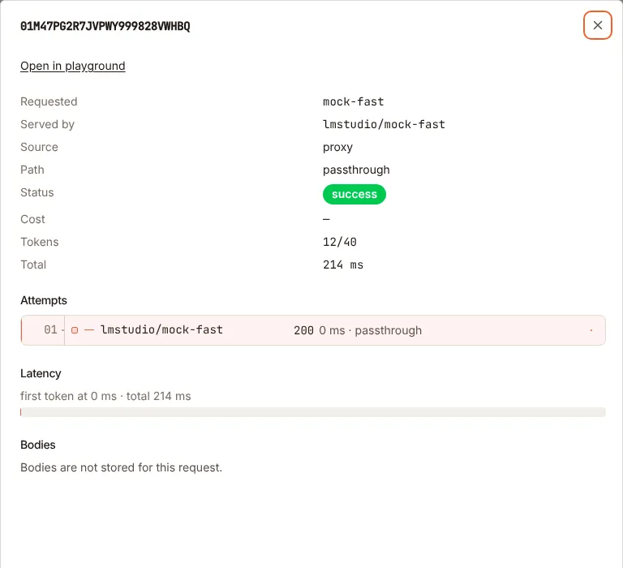

### OPERATE-12: "Skipped candidates" prints the internal key `lmstudio//mock-error:cooling`
- Severity: Low
- Where: `web/src/features/requests/trace-drawer.tsx:349-360` renders `skips` verbatim; format from `internal/exec/exec.go:1326` (`provider/keyID/model:reason`, keyID empty for keyless).
- Steps: 1. Send `mock-error` twice so lmstudio/mock-error cools. 2. Open the next `mock-error` trace.
- Expected: "lmstudio/mock-error — cooling down".
- Actual: `lmstudio//mock-error:cooling` (double slash, raw reason code).
- Evidence: `operate-tr-mockerr0-crop.png`.
- Root cause: wire encoding shown as UI text.
- Proposed fix: parse in the drawer: `const [target, reason] = s.split(":"); const [prov, key, model] = target.split("/")` → render `${prov}/${model}` + `key ? \` (key ${key})\` : ""` + a reason label map (`cooling` → "cooling down", `no_adapter` → "no adapter").

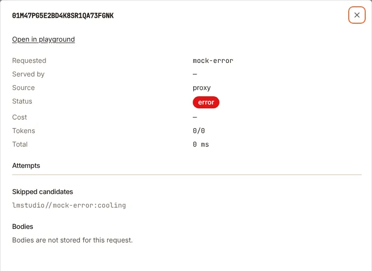

### OPERATE-13: Attempts cell tooltip says "served on the first attempt" on failed and zero-attempt requests
- Severity: Low
- Where: `web/src/features/requests/requests-columns.tsx:93-97`.
- Steps: 1. /requests?status=error. 2. Hover the Attempts value of a failed row (1) or of `no-such-model` (0).
- Expected: "failed on its only attempt" / "no attempt was made".
- Actual: "served on the first attempt" on both.
- Evidence: `operate-08-attempts-title.png` — tooltip text rendered next to the cells (magenta annotation of the `title` attribute).
- Root cause: the ternary only distinguishes `attempts > 1`.
- Proposed fix: `attempts === 0 ? "no attempt was made" : attempts > 1 ? \`${attempts} attempts — this request failed over\` : status === "success" ? "served on the first attempt" : "failed on its only attempt"`.

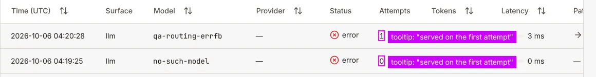

### OPERATE-14: Column picker lists raw field ids "Ts_ms" and "Total_ms"
- Severity: Low
- Where: `web/src/features/requests/requests-columns.tsx:53-56,113-115` — function headers, so darkraise's menu (`darkraise-ui/dist/chunk-VSMQOSUY.js:89-90`: `typeof header === "string" ? header : col.id`) falls back to the accessor key.
- Steps: 1. /requests → Columns.
- Expected: "Time", "Latency" (the column headings).
- Actual: "Ts_ms", "Total_ms".
- Evidence: `operate-04-columns-menu.png`.
- Proposed fix: give those columns readable ids: `{ id: "time", accessorKey: "ts_ms", … }` and `{ id: "latency", accessorKey: "total_ms", … }` (the menu capitalises), or `id: "Time"`.

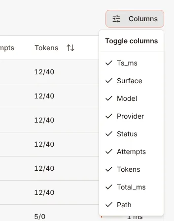

### OPERATE-15: Source / Surface / Error code / Status selects have no accessible name, and lose their visible label once set
- Severity: Low
- Where: `web/src/features/requests/filter-select.tsx:181-184` — `SelectTrigger` has no `aria-label`; the label is only the placeholder, which is replaced by the value.
- Steps: 1. `/requests?source=proxy&surface=llm&status=error&error_code=api_error`.
- Expected: each control announces/reads as "Source: proxy", "Status: error", etc.
- Actual: accessibility tree has `combobox: proxy`, `combobox: llm`, `combobox: api_error`, `combobox: error` — no names; visually four bare values ("error" vs "api_error" — which is Status?).
- Evidence: `operate-10-unlabelled-selects.png` (aria snapshot printed above the outlined controls).
- Proposed fix: `<SelectTrigger className="w-36" aria-label={label}>` and render the value as `{label}: {value}` when set (e.g. `<SelectValue>{value ? \`${label}: ${value}\` : undefined}</SelectValue>`).

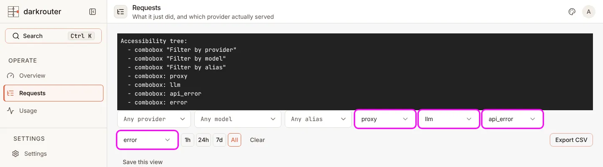

### OPERATE-16: "Save this view" ignores Enter and Escape, and silently ignores an empty name
- Severity: Low
- Where: `web/src/features/requests/saved-views-bar.tsx:265-308` — the input is not in a form and has no key handler; `confirmSave` returns early on `""` without feedback.
- Steps: 1. /requests → "Save this view". 2. Click Save with an empty name → nothing happens, no message. 3. Type `qa-operate-errors-1h`, press Enter → nothing (input stays, no view). 4. Press Escape → input stays.
- Expected: Enter saves, Escape cancels, empty name shows a validation message or disables Save.
- Actual: as above; only a mouse click on Save works.
- Evidence: `operate-05-enter-no-save-crop.png` — after Enter the name is still in the input and no view button exists.
- Proposed fix: wrap in `<form onSubmit={(e) => { e.preventDefault(); confirmSave() }}>` with `<Button type="submit" disabled={!savingName?.trim()}>`, `onKeyDown={(e) => e.key === "Escape" && setSavingName(null)}`, and trim the name.

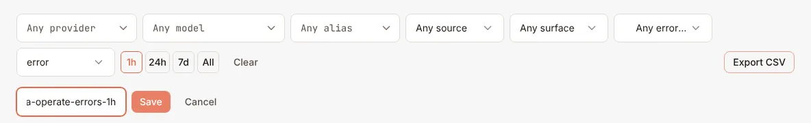

### OPERATE-17: CSV export downloads as `requests.csv.csv` with Time as raw epoch milliseconds
- Severity: Low
- Where: `web/src/features/requests/requests-screen.tsx:416` passes `"requests.csv"`; `exportToCsv` appends `.csv` (`darkraise-ui/dist/chunk-VSMQOSUY.js:575`). `CSV_COLUMNS` (`requests-columns.tsx:19`) exports `ts_ms` raw.
- Steps: 1. /requests → Export CSV.
- Expected: `requests.csv`, Time readable (ISO-8601).
- Actual: `requests.csv.csv`; Time column `1791260465669`.
- Evidence: `operate-09-csv.png` — downloaded filename and first lines of the file.
- Proposed fix: `exportToCsv(rows.map(r => ({ ...r, ts_ms: new Date(r.ts_ms).toISOString() })), "requests", CSV_COLUMNS)`.

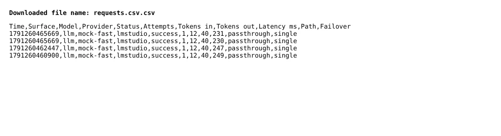

### OPERATE-18: Time-range and dimension toggle groups are unnamed radiogroups
- Severity: Low
- Where: `web/src/features/requests/requests-screen.tsx:374-397`; `web/src/features/usage/usage-screen.tsx:317-343`.
- Steps: 1. Inspect the accessibility tree of /requests and /usage.
- Expected: `radiogroup "Time range"`, `radiogroup "Group by"`, `radiogroup "Range"`.
- Actual: three unnamed `radiogroup`s; a screen-reader user hears "7d, radio" with no idea what it ranges.
- Evidence: `operate-10-unlabelled-selects.png` shows the same toolbar; aria snapshot from `operate-us3.mjs`: `- radiogroup: - radio "Total" [checked] …` with no name.
- Proposed fix: add `aria-label="Time range"` / `"Group by"` / `"Range"` to each `ToggleGroup`.


### OPERATE-19: "Open in playground" from an embedding trace opens Chat mode
- Severity: Low
- Where: `web/src/features/requests/trace-drawer.tsx:271-277` hardcodes `search={{ mode: "chat", seed }}` regardless of `trace.data.surface`.
- Steps: 1. Open the `mock-embed` (surface `embedding`) trace. 2. Click "Open in playground".
- Expected: the Auxiliary (embeddings) mode, which is where an embeddings request is replayed.
- Actual: Chat mode, "Ready to send to mock-embed" with a chat composer.
- Evidence: `operate-tr-embed-playground.png`.
- Proposed fix: `mode: trace.data.surface === "llm" ? "chat" : "auxiliary"` (and teach aux mode to read `seed`), or hide the link for non-llm surfaces.

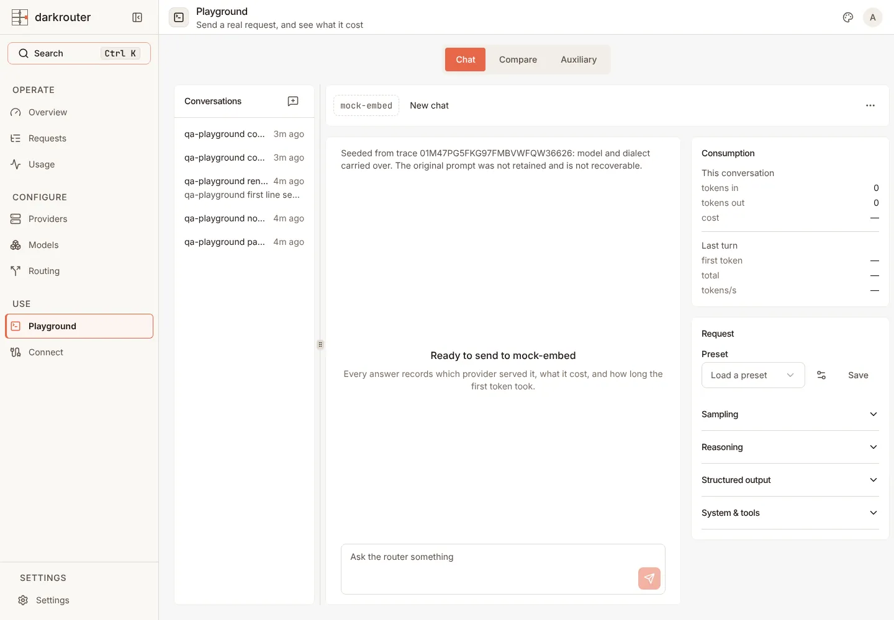

### OPERATE-20: Duplicate empty states on Requests; the actionable one is pushed below a 640px blank box
- Severity: Low
- Where: `web/src/features/requests/requests-screen.tsx:467-492` — DataTable with `virtualize={{ height: 640 }}` renders its own "No results found", then `NoMatch` / `EmptyState` is rendered under it.
- Steps: 1. `/requests?model=zzz-none` at 1440×900.
- Expected: one empty state with the "Clear filters" action in view.
- Actual: "No results found" inside a ~590px empty table; "No requests match these filters. Clear filters" only below it (below the fold at 900px height).
- Evidence: `operate-11-nomatch.png` (1440×1100 so both are visible).
- Proposed fix: don't render the DataTable when `rows.length === 0` (render the header-less empty state only), or pass the NoMatch/EmptyState as DataTable's empty slot if it has one.

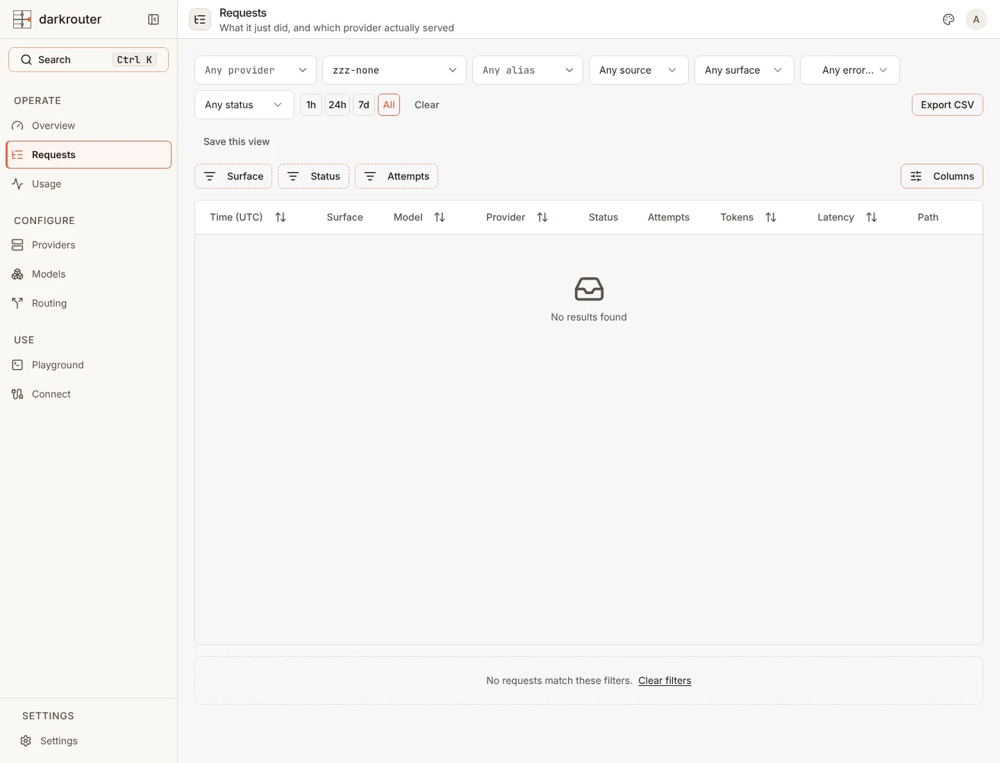

### OPERATE-21: At 768px and 375px the table toolbar (facets, Columns) scrolls away with the table; Columns is clipped/off-screen
- Severity: Low
- Where: `web/src/features/requests/requests-screen.tsx:461-473` — the `overflow-x-auto` wrapper encloses the whole `DataTable`, including its toolbar.
- Steps: 1. /requests at 375×812 and at 768×1024.
- Expected: facet buttons wrap and "Columns" is visible.
- Actual: "Attempts" facet clipped at the right edge, "Columns" at x=383 (outside the 375px viewport); only reachable by horizontally scrolling the table.
- Evidence: `operate-rq-375-light.png` — "Attempt…" cut off, no Columns button; `operate-rq-768-light.png` — "Columns" button cut at the right edge.
- Proposed fix: apply the horizontal scroll to the table element only, e.g. `[&_.dr-data-table-toolbar]:flex-wrap` plus moving `overflow-x-auto` to a `[&_table]` container, or make the toolbar `sticky left-0`.

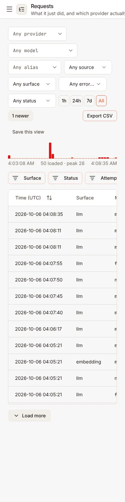

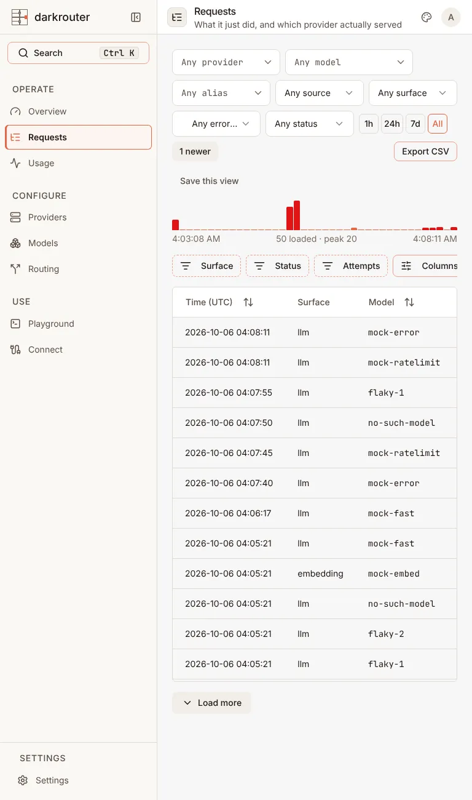

### OPERATE-24: Trace drawer "success" badge is white on bright green — 2.2:1 contrast
- Severity: Low
- Where: `web/src/features/requests/trace-drawer.tsx:305-315` (`<Badge variant="green">`).
- Steps: 1. Open any successful trace (light or dark mode).
- Expected: at least 4.5:1 for 14px text (WCAG AA).
- Actual: text rgb(255,255,255) on rgb(0,201,81) = 2.22:1 in both modes (the "error" badge, white on rgb(225,20,20), is 4.87:1).
- Evidence: `operate-12-badge.png`.
- Root cause: the green accent badge fill is too light for white text.
- Proposed fix: render status the way the table does — `<span className="inline-flex items-center gap-1.5"><RequestStatus status={...} /><span>{status}</span></span>` (reusing `../shell/status-mark`) — or use `variant="outline"` for success; keep the filled destructive badge only for errors.

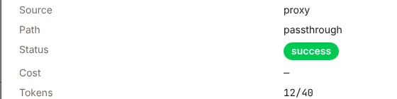

### OPERATE-26: The Cost chart draws a $0 line for a window with no priced model, stops before today, and labels every tick "<$0.0001"
- Severity: Low
- Where: `web/src/features/usage/usage-screen.tsx:108-127` (`stackByDay` zero-fills days with no rows) and the `CostLineChart` Y axis in `web/src/features/usage/usage-charts.tsx:103-107`.
- Steps: 1. Have traffic only on unpriced models (the API answers `priced: false`, and every Cost cell in the table is "—"). 2. Open Usage, any dimension.
- Expected: The Cost card says cost is unknown, e.g. "No priced model served traffic in this window", consistent with the "—" in the table and the Overview spend tile.
- Actual: A flat line sits at `$0` for 29 days and stops just before 2026-10-06, the only day with traffic, whose cost is `null`. The Y axis reads `$0, <$0.0001, <$0.0001, <$0.0001, <$0.0001`, and the hover tooltip on the cost chart is empty. The picture says "free, then nothing", while the table says "unknown".
- Evidence: `operate-26-cost-chart-unpriced.png`: the flat line, four identical `<$0.0001` ticks, and the line ending before the last day.
- Root cause: Days with no rows are filled with `0` while the day with rows has `null`. Recharts' default domain for an all-zero series is [0, 1] micro-dollar, which `costTick` formats as `<$0.0001`.
- Proposed fix: When `usage.data.priced === false`, or every `cost_micros` in the window is `null`, render the card with a one-line note in place of the chart. Otherwise pass `domain={[0, (max: number) => Math.max(max, 10_000)]}` (a floor of 1¢) and `allowDecimals={false}` to the cost `YAxis` so ticks are distinct, and fill no-row days with `null` when the window has no priced rows at all.

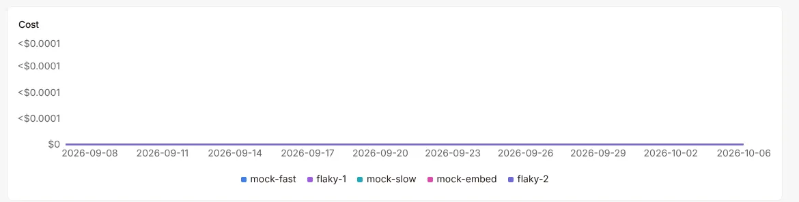

### OPERATE-27: At 375px the Usage table breaks key names one character per line
- Severity: Low
- Where: `web/src/features/usage/usage-screen.tsx:421` (key `TableCell`, `font-mono text-sm`, no `whitespace-nowrap`).
- Steps: 1. Open Usage → Model at 375×812. 2. Scroll to the table.
- Expected: Key names stay on one line, and the table scrolls horizontally inside its `overflow-x-auto` wrapper, which already exists.
- Actual: `mock-fast` renders as "mock / - / fast" and `mock-ratelimit` takes five lines, while the numeric columns keep their width and still overflow ("Tok… in", "1,0…" clipped at the right). The chart legends wrap the same way ("mock- / fast").
- Evidence: `operate-27-usage-table-375.png`.
- Root cause: The table has `w-full`, and the browser shrinks the only wrappable column, the monospace key with hyphens, to its minimum.
- Proposed fix: Add `whitespace-nowrap` to the key cell and the header (the wrapper already scrolls), or give the key column `min-w-[10rem]`. For legends, set `whitespace-nowrap` on recharts' legend item text via `chart-scope.css`.

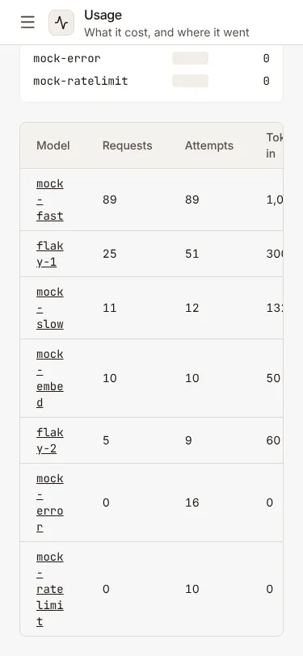

### OPERATE-22: Routing-flow legend: the "failed over" swatch renders as a solid line
- Severity: Cosmetic
- Where: `web/src/features/overview/overview-screen.tsx:363-366` — a 2px-tall box with `border-t-2 border-dashed` and `rounded`; Chromium paints it solid at this size.
- Steps: 1. Overview, look at the legend (zoom in).
- Expected: dashed like the actual failover edge (`stroke-dasharray: 3 3`, flow-graph.css).
- Actual: identical to the "thicker edge, larger share" swatch.
- Evidence: `operate-legend-zoom.png` (4× device scale) — both first swatches solid.
- Proposed fix: draw the swatch as the edge itself: `<svg className="h-1 w-6" aria-hidden="true"><line x1="0" y1="2" x2="24" y2="2" stroke="hsl(var(--info))" strokeWidth="1.5" strokeDasharray="3 3"/></svg>`.

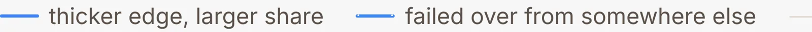

### OPERATE-23: Latency tile is captioned "p50 latency" but shows p50 and p95
- Severity: Cosmetic
- Where: `web/src/features/overview/overview-screen.tsx:321-331`.
- Steps: 1. Overview.
- Expected: caption "Latency" (the readings carry their own p50/p95 labels).
- Actual: "p50 latency" above "p50 1 ms  p95 2.5 s".
- Evidence: `operate-ov-1440-light.png` — third tile.
- Proposed fix: `caption="Latency"`.

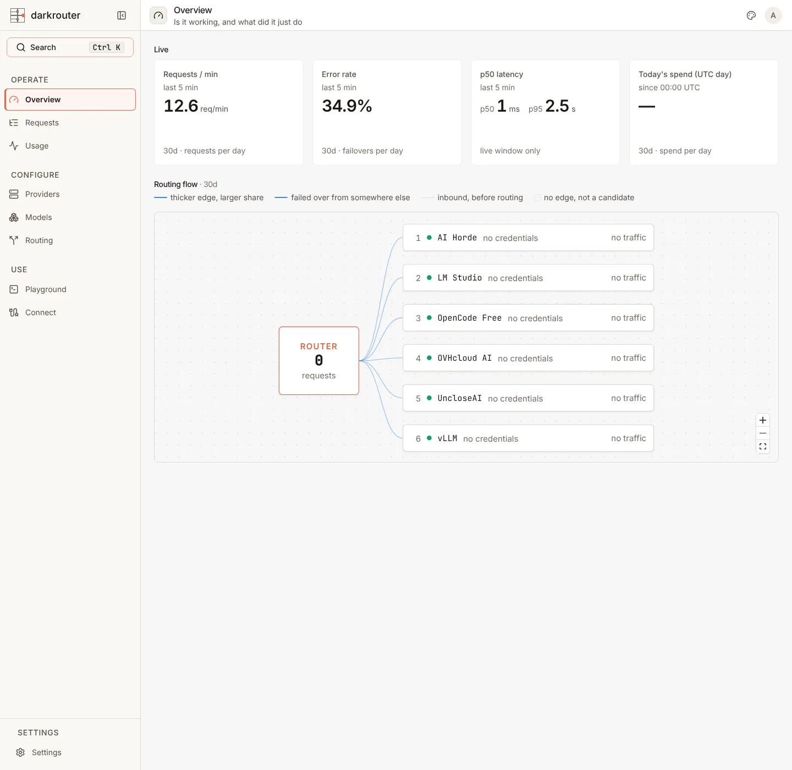

<details><summary>Tested and working — Overview, Requests, Usage</summary>

- Overview: four stat cards cross-checked against `/api/requests` over the same 5 min (7.2 req/min, 27.8% error rate, p95 279 ms all match); spend "—" for unpriced; skeletons; "30d" sparkline captions; zoom in/out/fit (viewport transform changes and fit restores), drag-to-pan; failover arcs + count label at 1440; Recent failovers list (links to `/requests/<id>`, opens the drawer); provider links via keyboard; dark mode contrast of tiles, graph and controls.
- Requests: provider/model/alias comboboxes write the URL and survive reload; Status/Source/Surface/Error code selects; 1h/24h/7d/All pills; Clear; "N newer" button (counts and prepends new rows without moving the table); Load more (cursor paging, de-dup); Surface/Status/Attempts facets with counts; column sorting; column hide/show; traffic strip buckets, failure tint and caption; live 3s poll; no-match state; Export CSV contents (columns/values correct apart from OPERATE-17).
- Saved views: create (`qa-operate-errors-1h`, `qa-operate-empty`), apply (clears other filters, writes URL), delete; persisted in localStorage (both views deleted again at the end). (No rename control exists.)
- Usage, populated (covered by the coordinator after the 04:56 rollup): totals per dimension match `/api/usage` exactly (Total 140 req / 197 attempts; lmstudio 110/137, vllm 30/60; per-model and per-alias rows); stacked Requests/Tokens charts and legends; Requests tooltip lists every series for the hovered day; ranking bars; 768/375/dark have no page-level horizontal overflow. Defects: OPERATE-25/26/27.
- Trace drawer: deep link `/requests/<id>` on reload; unknown id → "No request with that id…" message; Escape, backdrop click and × close it; focus moves into the drawer on open; failover trace (2 attempts, 500 → 200), 429 trace, flaky-1 500, embedding (surface metadata encoding/input_count), Anthropic `/v1/messages` (dialect anthropic, path ir), streaming, slow (2.5 s) — data matches `/api/requests/<id>`; 375/768 layouts and dark mode. There are no copy buttons in the drawer.
- Usage: Total/Provider/Model/Alias and 7d/30d/90d/365d toggles write `?dimension=&days=`, survive reload, re-clicking the active pill keeps it; invalid `?dimension=bogus&days=12` falls back to Total/30d; empty state; 375/768/dark layouts.
- Typography rule: no `text-xs`, `text-[Npx]` or pixel `font-size` in `features/overview`, `features/requests`, `features/usage` (chart-scope.css and flow-graph.css use `var(--text-*)`).
- No console errors or failed `/api` calls during normal use (only the intentional 404 for an unknown trace id).

</details>

## Providers & Models

_Scope: Provider list/grid/filters, add-credential/keyless/local dialogs, provider detail, probe/discovery, settings dialog, Models screen, overrides._

### PROVIDERS-01: Every LM Studio chat model is labelled "embedding" (and every model carries all of its preset's surfaces)
- Severity: High
- Where: provider detail → Models table, and the Models screen. Root cause: `internal/catalog/merge.go:284` (`surfaces()`), called at `merge.go:114`. UI amplifier: `web/src/features/providers/provider-models.tsx:105`
- Steps: 1. Open /providers/lmstudio and look at the Models table. 2. Open /models and look at the Surfaces column. 3. `GET /api/models?provider=lmstudio`.
- Expected: mock-fast, mock-slow, mock-error and mock-ratelimit are chat models and should show no "embedding" badge. Only mock-embed is an embedding model.
- Actual: all five rows show an `embedding` badge on the detail page, and `llm, embedding` on /models. The API returns `"surfaces":["llm","embedding"]` for every LM Studio model. On the detail page `llm` is filtered out, so each chat model reads as embedding-only.
- Evidence: `providers-01-lmstudio-embedding.png`: Models card, all five rows say "embedding · inferred". `providers-01b-models-surfaces.png`: Surfaces column reads "llm, embedding" on all five lmstudio rows (vllm rows read "llm").
- Root cause: `surfaces()` resolves `override → preset → row`. The `lmstudio` preset declares `surfaces: [llm, embedding]` (`internal/catalog/presets.yaml:1427`). That is a provider-level capability ("this server can serve embeddings"), but the merge copies it onto every discovered model, so the preset always wins. The comment says the row is skipped because discovery hardcodes `["llm"]`. The same thing happens on every multi-surface preset: every Groq model gets `llm, stt, tts`, every Fireworks model gets `image`. The router reads the same field. I verified that `POST :8090/v1/embeddings {"model":"mock-fast"}` is dispatched to lmstudio (the mock happens to answer it; a real LM Studio chat model would fail upstream rather than be skipped). By the same logic a chat request for `mock-embed` is considered servable.
- Proposed fix: treat preset surfaces as the set a model may have, not the set it has. In `mergeOne`, when no override and no models.dev join supplies surfaces, default to `[llm]` and add other preset surfaces only when the model id matches a per-surface rule. For example, add `embedding` for ids matching `/embed|bge|e5-|nomic|gte-/` through a `surface_rules` list in presets.yaml, alongside `model_traits`. Keep the override as the operator's escape hatch. UI side, in `provider-models.tsx`, show the full surface list when a model has more than one, so "llm + embedding" is not rendered as "embedding".

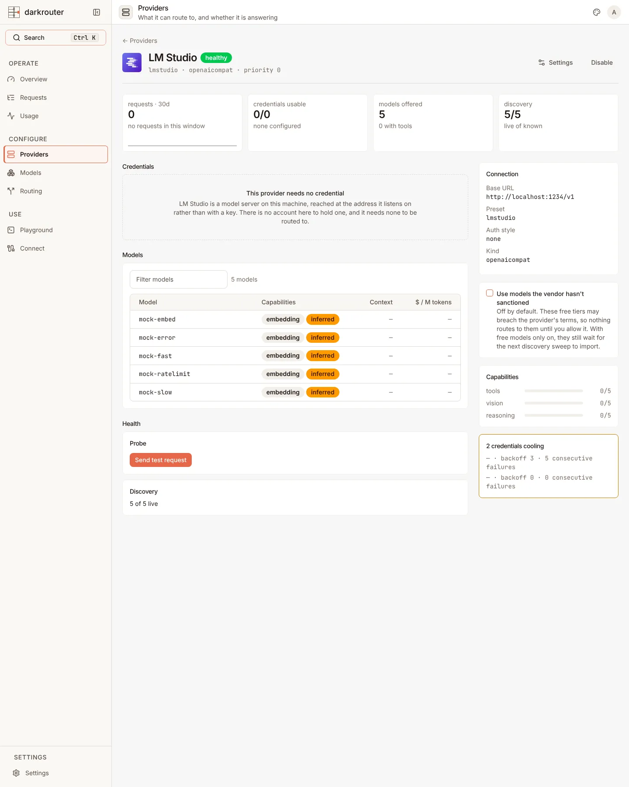


### PROVIDERS-02: "All" chip count ignores the other filters (reads 209 beside a 6-row list)
- Severity: Medium
- Where: Providers list, connection chips. `web/src/features/providers/providers-screen.tsx:718`
- Steps: 1. /providers. 2. Turn on "Configured only" (or type a search, or pick a state).
- Expected: "All" counts the rows the other filters leave, like its siblings do (and as the comment at :548 says). With "Configured only" that is All 6 (Local 2 + No auth 4).
- Actual: "All 209" stays fixed while the summary reads "6 of 209" and the sibling chips add up to 6. Same with search "studio" (All 209, siblings sum to 6) and state=degraded (All 209, everything else 0).
- Evidence: `providers-02-all-chip.png`: "Configured only" on, chip row "All 209 · API key 0 · Local 2 · No auth 4 …", summary "6 of 209", six rows.
- Root cause: the All chip renders `{all.length}` (the whole merged catalogue). The other chips render `counts[type]` from `filterProviderRows(all, {q,state,configuredOnly,freeTier})`.
- Proposed fix: compute `const allCount = Object.values(counts).reduce((n, c) => n + c, 0)` and render `{allCount}` in the All chip.

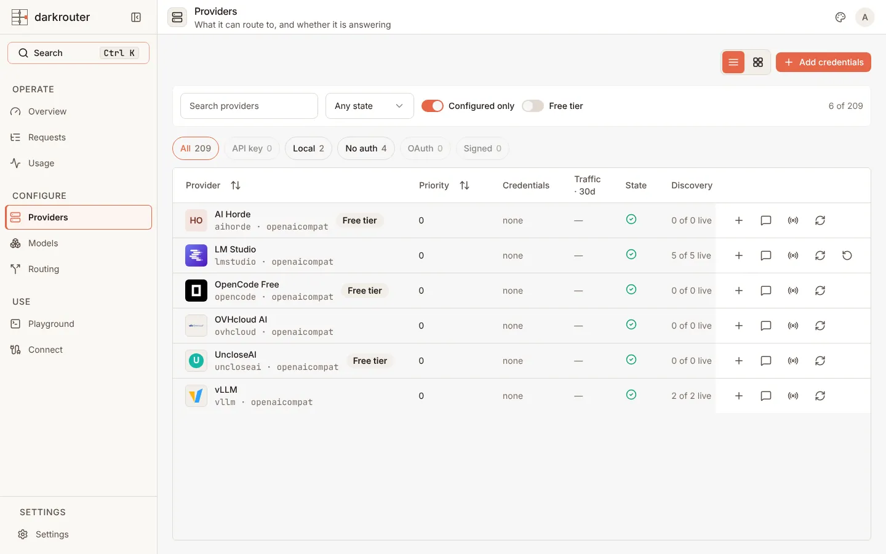

### PROVIDERS-03: Per-model breakers are shown as "N credentials cooling", on a provider with no credentials, with no model named
- Severity: Medium
- Where: provider detail aside card, `web/src/features/providers/provider-detail.tsx:662-676`. Providers list "Cooling credentials" card, `providers-screen.tsx:856-873`.
- Steps: 1. `bash SCRATCH/traffic.sh 1` (trips the mock-error / mock-ratelimit breakers on lmstudio). 2. Open /providers/lmstudio.
- Expected: a card naming the cooling models (`mock-error · backoff 3 · 5 consecutive failures · until …`), titled "models cooling", or "credentials cooling" only when `key_id` is set.
- Actual: "2 credentials cooling", with rows `— · backoff 3 · 5 consecutive failures` and `— · backoff 0 · 0 consecutive failures`. The same page reads "credentials usable 0/0 · none configured". The list's card prints `lmstudio/— · backoff 3 …`. Neither says which model is cooling, and that is the only identifying field `/api/health/providers` returns for these entries (`key_id:""`, `model:"mock-error"`).
- Evidence: `providers-03-cooling-detail.png`: bottom-right card "2 credentials cooling" with "— · backoff …" rows, next to the "credentials usable 0/0" tile at the top.
- Root cause: both renderers print `e.key_id || "—"` and never `e.model`, and the heading always counts the entries as credentials. Breaker entries on keyless providers (and per-model breakers in general) have an empty `key_id`.
- Proposed fix: render `{e.key_id ? `${e.key_id}/` : ""}{e.model || "all models"} · backoff …`, and title the card by what is cooling: `${n} ${keyed ? "credentials" : "models"} cooling`. Make the same change on the list card.


### PROVIDERS-04: "requests · 30d: 0 · no requests in this window" and an empty Traffic column for providers that have served traffic
- Related: Same root cause as OPERATE-04/OPERATE-08 (30d views read the hourly rollup only).
- Severity: Medium (shared root cause with the Usage area)
- Where: provider detail "requests · 30d" tile (`provider-detail.tsx:452-465`, text at :459). Providers list "Traffic · 30d" column. Data comes from `/api/usage?group_by=provider`, which is filled by the hourly rollup (`internal/server/server.go:686`).
- Steps: 1. Send traffic (`traffic.sh`). The requests table holds 88 lmstudio and 25 vllm requests. 2. Open /providers/lmstudio and /providers.
- Expected: the tile counts today's requests, or it says the figure is as of the last rollup.
- Actual: the tile reads "0 · no requests in this window" with a flat sparkline, and the Traffic column shows "—" for lmstudio and vllm. `/api/usage` returns `"days":[]`. The rollup last ran at 03:59:01, before any traffic; the next run is about an hour later.
- Evidence: `providers-04-requests-zero.png`: top-left tile "requests · 30d 0 / no requests in this window" for LM Studio (88 requests in the DB at the time).
- Root cause: usage_daily is recomputed only by `RunRollup` every hour. The UI presents an absent rollup as "no requests".
- Proposed fix: have `handleUsage` merge in a live aggregate of `requests` for today (the rollup already recomputes today wholesale, so the two cannot double-count once today is excluded from usage_daily). Alternatively return `rolled_up_at` and render the note as "as of HH:MM" instead of "no requests in this window" when the newest request is newer than the rollup.

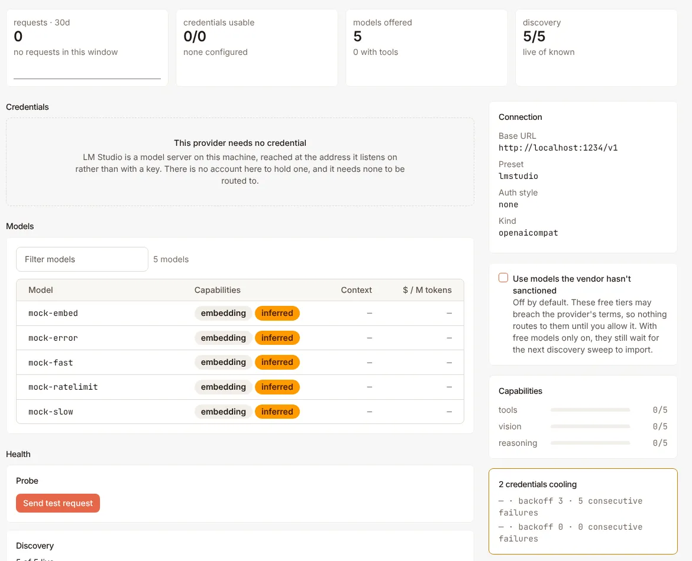

### PROVIDERS-05: Keyless providers that cannot be reached show "healthy", "0 of 0 live" and "Nothing has asked this provider what it serves"
- Severity: Medium
- Where: providers list State/Discovery cells, provider detail tiles, Models empty state and Discovery panel. `web/src/features/providers/provider-state.ts:29`, `internal/admin/discoveryapi.go:25`, `provider-models.tsx:66`.
- Steps: 1. /providers: aihorde, opencode, ovhcloud and uncloseai all show the green healthy mark and "0 of 0 live". 2. Open /providers/aihorde. 3. Click its Probe icon.
- Expected: a provider whose every discovery sweep fails says so (for example "discovery failing · Forbidden"), and is not marked healthy.
- Actual: the state badge is "healthy". The discovery tile reads "0/0 live of known". The Models card says "Nothing has asked this provider what it serves", which is false: sweeps ran and failed. The Discovery panel reads "0 of 0 live", the exact wording the code comment in `discoveryLine` says must not be used for a failure. The probe toast is red: `Get "https://oai.aihorde.net/v1/models": Forbidden`. The backend already has the facts: `provider_discovery` holds `consecutive_failures=1, last_success_at=NULL, last_error='Get "https://oai.aihorde.net/v1/models": Forbidden'` for all four, and for hyperbolic/bedrock while they existed.
- Evidence: `providers-05-aihorde-healthy.png`: "healthy" badge, "0/0 live of known", "Nothing has asked…", Discovery "0 of 0 live". `providers-05b-aihorde-probe-fails.png`: red probe toast for the same provider.
- Root cause: `providerState()` returns "healthy" for any enabled keyless provider without looking at anything else. `handleDiscoveryHealth` emits only model counts and drops `DiscoveryStates()` (consecutive_failures, last_error, last_success_at), so the UI cannot tell "never ran" or "ran, empty" from "failing".
- Proposed fix: add `consecutive_failures`, `last_error` and `last_success_at` to `discoveryHealthView`, joined from `DB.DiscoveryStates`. In `discoveryLine`, return `discovery failing · ${last_error}` (warning tone) when `consecutive_failures > 0 && total === 0`. In `providerState`, return "degraded" for a keyless provider whose discovery has never succeeded and is failing. In `ProviderModels`, show "Discovery has failed N times: <error>" instead of "Nothing has asked…" when a failure is recorded.


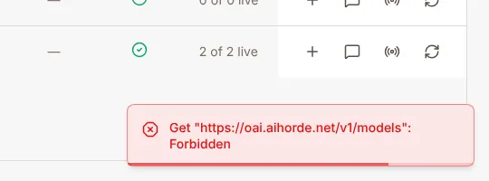

### PROVIDERS-06: A malformed AWS credential is stored enabled even with "Check every key before keeping it" on
- Severity: Medium
- Where: Add credentials dialog → Amazon Bedrock. Probe classification at `internal/admin/probe.go:377`. No validation at `internal/admin/providers.go:544`.
- Steps: 1. /providers?q=bedrock → Add credentials. 2. Label `qa-providers-bad`, AWS access key `not-json-qa-providers`, Region `us-east-1`, keep "Check every key…" ticked. 3. Add credential.
- Expected: the key is refused ("not a JSON document with access_key_id/secret_access_key"), either at POST /keys or by the check, and nothing is kept.
- Actual: the dialog closes, the warning toast reads "1 added, 1 failed (qa-providers-bad: kept unverified: provider "bedrock": parse aws credentials: invalid character 'o'…)", and the key is listed as **enabled**. The provider shows **healthy** with "credentials usable 1/1 · all available", and the list shows a full green 1/1 strip. A secret that can never sign a request is in rotation. "1 added, 1 failed" for a single key is also self-contradictory.
- Evidence: `providers-06-bedrock-malformed-kept.png`: "healthy" badge, credential `qa-providers-bad` "enabled", 1/1 tile, and the toast quoting the parse error.
- Root cause: `probeSigV4` returns the `Auth.For` parse error unwrapped (`return "signature", 0, err`), so the probe reports `rejected:false`. `addCredentials` (`accounts.ts`) treats `rejected:false` as "the check could not complete" and keeps the key. `handleAddCredential` validates only that the secret is non-empty.
- Proposed fix: in `probeSigV4` wrap credential-parse errors as `rejectedCredential{err}` (a secret that does not parse is a refusal of the credential, not an outage), and do the same for gcp-sa. Better, validate the secret's shape in `handleAddCredential` for `sigv4`/`gcp-sa` (`auth.ParseAWSCredentials`) and answer 400, which the dialog already shows inline under "Not added — still in the form".

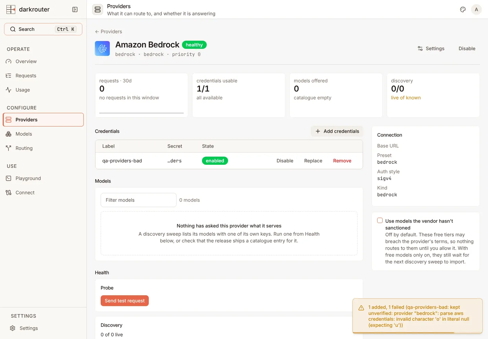

### PROVIDERS-07: Provider settings shows Region/Project as "unset" when they are set
- Severity: Medium
- Where: `web/src/features/providers/provider-settings-dialog.tsx:200,210` (placeholder "unset"). `GET /api/providers` omits region/project/location.
- Steps: 1. Add Bedrock with region `us-east-1` (PROVIDERS-06 steps). The DB row holds `region='us-east-1'`. 2. /providers/bedrock → Settings.
- Expected: Region shows `us-east-1`.
- Actual: Region and Project are empty with the placeholder "unset". The Connection card does not show the region either, so the page claims the one field Bedrock needs is missing. Region/Project are also offered on openaicompat providers (Hyperbolic), where they mean nothing.
- Evidence: `providers-07-region-unset.png`: Amazon Bedrock settings, Region field outlined in magenta, reading "unset".
- Root cause: the provider view JSON does not carry region/project/location, so the dialog has nothing to prefill and its placeholder makes a claim instead.
- Proposed fix: add `region`, `project` and `location` to the provider view in `internal/admin/providers.go`, prefill them in `draftOf()`, and show them in the Connection card. Until then the placeholder should read "not shown — type to replace", not "unset". Show Region only for `bedrock` and Project/Location only for `vertex`, using the existing `endpointFieldsFor(kind)`.

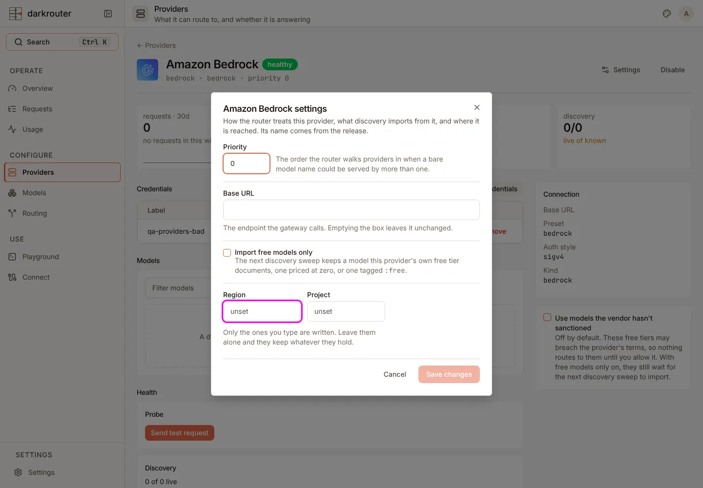

### PROVIDERS-08: Provider detail header loses the provider name at phone width
- Severity: Medium
- Where: `web/src/features/providers/provider-detail.tsx:401` (and :118 for the unconfigured variant).
- Steps: 1. Open /providers/lmstudio at 375x812. 2. Repeat at 768x1024.
- Expected: the name stays readable, and Settings/Disable wrap below it.
- Actual: at 375 the `<h2>` is 0px wide, so "LM Studio" is gone entirely. The id line breaks one word per line ("lmstudio / · / openaicompat / · / priority / 0") beside the buttons. At 768 it is truncated to "LM Stu…".
- Evidence: `providers-08-detail-375.png`: only the "healthy" badge where the name should be. `providers-08b-detail-768.png`: "LM Stu…".
- Root cause: the name block is `min-w-0 flex-1` in a `flex-wrap` header, so it can shrink to zero and the buttons never wrap.
- Proposed fix: give the name block a floor, e.g. `className="min-w-[12rem] flex-1"` (or `basis-full sm:basis-auto`), so the Settings/Disable buttons wrap to the next line first.

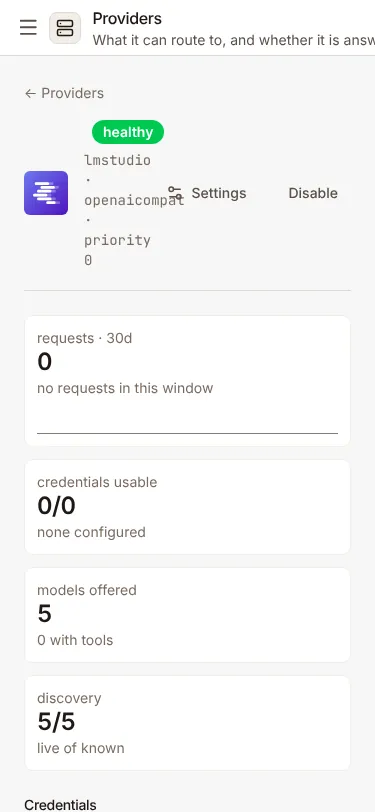

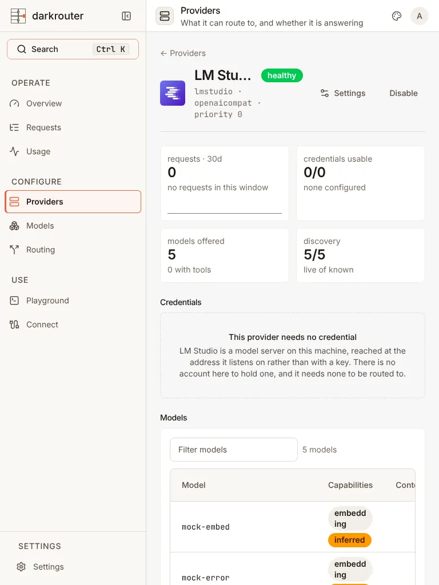

### PROVIDERS-09: Grid view overflows the viewport at 375px; names truncate to four letters at 768px
- Severity: Medium
- Where: `web/src/features/providers/providers-screen.tsx:814` (grid container) and `provider-card.tsx`.
- Steps: 1. /providers at 375x812 → Grid view. 2. Same at 768x1024.
- Expected: one card per row that fits the 327px column; names readable at tablet width.
- Actual: at 375 each card is 500px wide (right edge at x=526 in a 375 viewport). The state badge and every value in the card (priority, credentials, kind) sit off-screen, and the pane scrolls sideways. At 768 there are two columns and names read "AI Ho…", "Amaz…", "Hype…", "Open…".
- Evidence: `providers-09-grid-375.png`: AI Horde card outlined in magenta, cut at the right edge, "Priority/Credentials/Kind" with no values. `providers-09b-grid-768.png`: truncated names.
- Root cause: below `sm` the grid has no `grid-template-columns`, so the implicit column is `auto` and grows to the card's max-content (500px). At `sm` the 2-column split leaves about 160px for the name after the icon and the state badge.
- Proposed fix: `className="grid grid-cols-1 gap-3 sm:grid-cols-2 lg:grid-cols-3"` (Tailwind `grid-cols-1` is `minmax(0,1fr)`) plus `min-w-0` on the Card. Consider `md:grid-cols-2` instead of `sm:` so tablets keep one card per row, or move the state badge under the name.

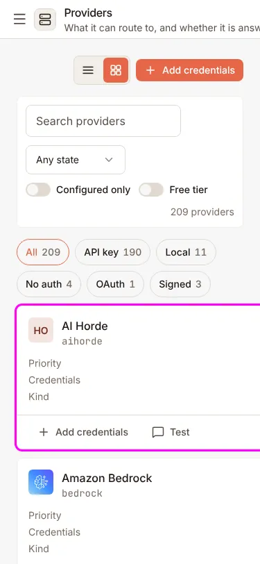

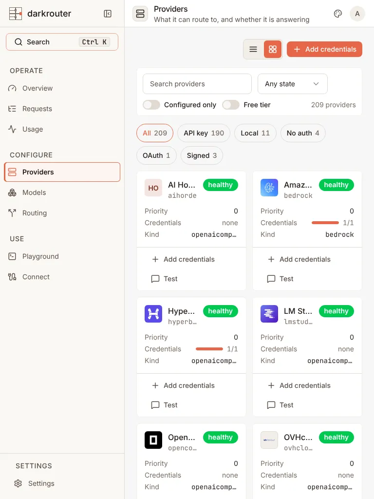

### PROVIDERS-10: Models table overflows at 1440 and breaks badges mid-word ("inf/err/ed", "embeddi/ng")
- Severity: Low
- Where: `web/src/features/models/models-screen.tsx:331` (Source badge), Surfaces cell, and darkraise's `.dr-table-cell { overflow-wrap: anywhere }`.
- Steps: 1. /models at 1440x900.
- Expected: Override is reachable without scrolling sideways, and badges keep their words whole.
- Actual: the table is 1563px wide in a 1134px wrapper. Capabilities, State, Source and the Override button sit off the right edge (Override at x=1740–1824). When scrolled, the Source badge renders as three lines "inf / err / ed" and the Surfaces cell as "llm, / embeddi / ng". Rows are 83px tall for one line of data. The detail page's capability badges also wrap "embedd / ing" at 768.
- Evidence: `providers-10-models-1440.png`: Surfaces header clipped at the right edge, "embeddi/ng". `providers-10b-models-scrolled.png`: Source column "inf/err/ed" on every row.
- Root cause: darkraise sets `overflow-wrap: anywhere` on every `.dr-table-cell`, which makes the min-content width of a cell one character. Auto table layout then squeezes the short-text columns to a few characters while the 16rem Model column and the Serves column keep their width.
- Proposed fix: add `whitespace-nowrap` to the Source `<Badge>`, to the Surfaces `<span>` (or render surfaces as badges), and to the capability badges in `provider-models.tsx`. Drop the Model column's `min-w-[16rem]` to `min-w-[12rem]`, or hide Publisher/Max output by default so Override fits at 1440.

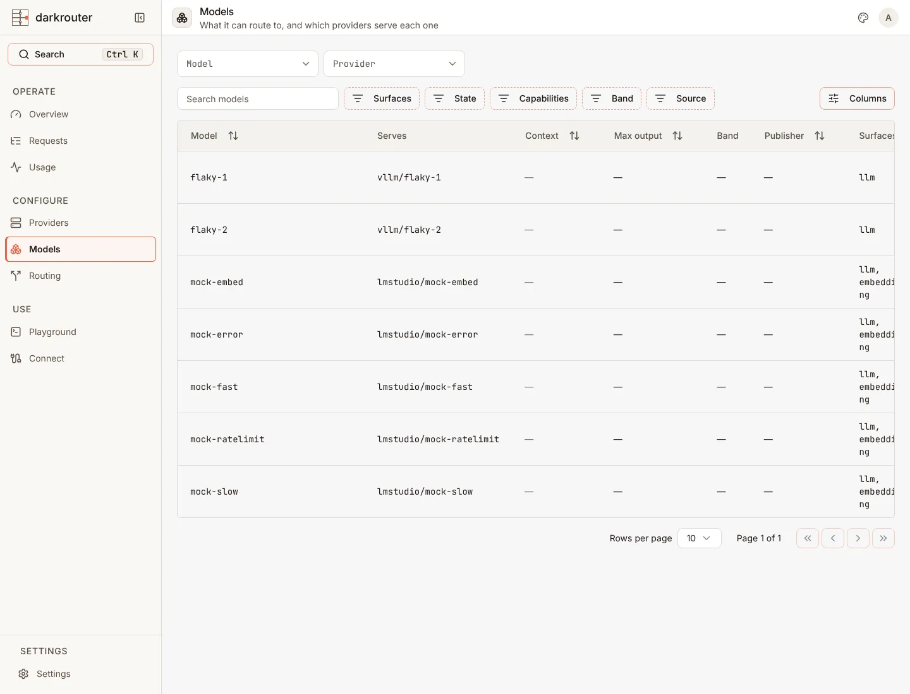

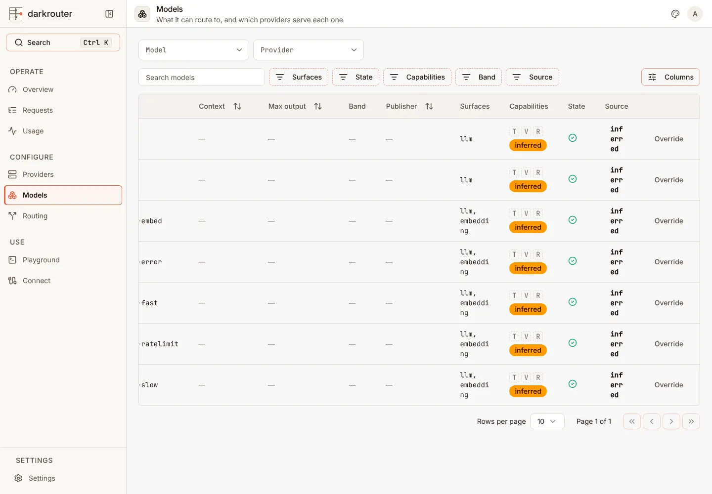

### PROVIDERS-11: The empty Models card says "Run one from Health below", but the page has no discovery control
- Severity: Low
- Where: `web/src/features/providers/provider-models.tsx:66`, `discovery-panel.tsx`.
- Steps: 1. Open /providers/aihorde (or any provider with an empty catalogue).
- Expected: either a "Run discovery" button in Health → Discovery, or a hint that does not promise one.
- Actual: the hint says "A discovery sweep lists its models… Run one from Health below". Health has a Probe card ("Send test request") and a Discovery card that only prints "0 of 0 live". The only Discover action is the icon on the list row.
- Evidence: `providers-11-no-discover-control.png`: hint in the Models card, and Health → Discovery with no button.
- Root cause: `DiscoveryPanel` is read-only. The discover mutation lives only in `providers-screen.tsx` (`POST /api/providers/{id}/discover`).
- Proposed fix: add a `Run discovery` button to `DiscoveryPanel` with the same `useApiMutation` (success "Discovery sweep queued", invalidating `keys.models` and `keys.discovery`).

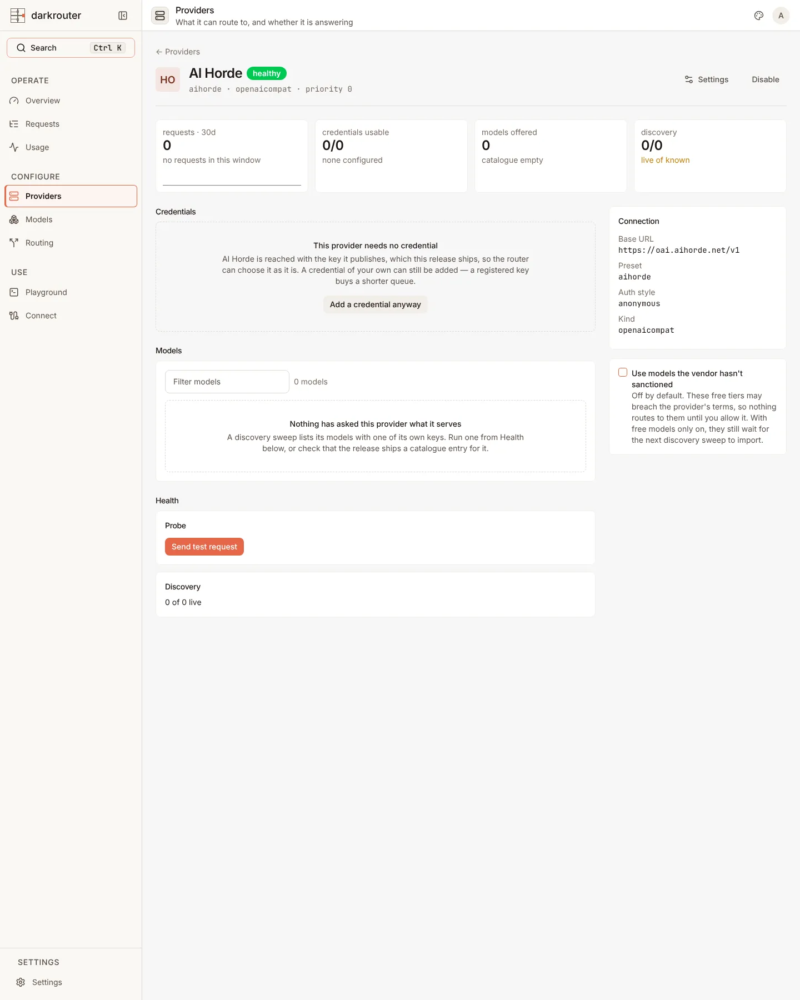

### PROVIDERS-12: "Add credentials — add another key" is offered on local runtimes and no-auth providers
- Severity: Low
- Where: `web/src/features/providers/providers-screen.tsx:411-419` (row "+"), `provider-card.tsx` (grid "Add credentials").
- Steps: 1. /providers?configured=1. 2. Hover then click "+" on LM Studio (or vLLM).
- Expected: no add-credential action on a local runtime. The detail page hides it ("There is no account here to hold one"), and the dialog's own picker excludes configured local presets (`add-accounts-dialog.tsx`, `exclude`).
- Actual: the tooltip reads "Add credentials — add another key to LM Studio" (it has none), and the dialog opens on an API-key form for LM Studio, whose auth style `none` would ignore the key.
- Evidence: `providers-12-lmstudio-addcred.png`: Add credentials dialog targeting LM Studio `http://localhost:1234/v1`.
- Root cause: `RowActionCell` shows the "+" on every configured row. Only the unconfigured-keyless branch is special-cased.
- Proposed fix: hide the "+" when `isLocalPreset(preset ?? row.provider)` or `row.provider?.auth_style === "none"`, matching `provider-detail.tsx:519`. Make the title say "add a key" rather than "another key" when `row.accounts === 0`.

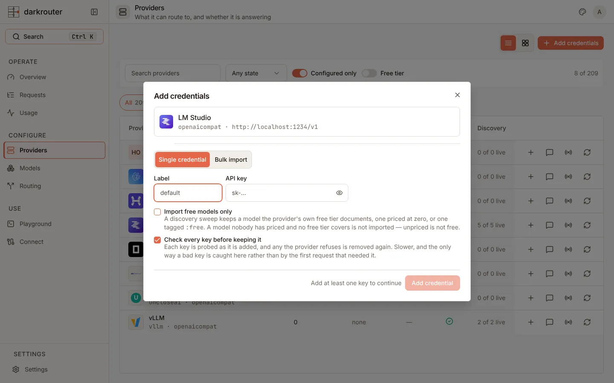

### PROVIDERS-13: Probing a provider with no credential reports "Credential accepted"
- Severity: Low
- Where: `web/src/features/providers/provider-state.ts:88` (`probeOutcome`).
- Steps: 1. /providers → Probe icon on LM Studio (auth `none`, zero credentials).
- Expected: "Endpoint answered · 5 models · 1 ms" (there is no credential).
- Actual: green toast "Credential accepted · 5 models · 1 ms". The row's tooltip also says "Probe — check the credential is accepted".
- Evidence: `providers-13-credential-accepted-toast.png`.
- Root cause: `probeOutcome` always leads with "Credential accepted".
- Proposed fix: pass the row (or `auth_style` / credential count) into `probeOutcome` and say "Endpoint answered" when the provider is keyless or has no credentials. Change the title to "Probe — check the provider answers".

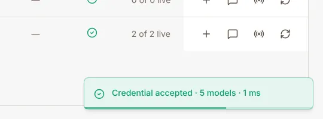

### PROVIDERS-14: Saving the override editor without edits writes an empty override and toasts "Override saved"
- Severity: Low
- Where: `web/src/features/models/override-editor.tsx:159` (`buildPatch`).
- Steps: 1. /models?model=mock-slow → Override. 2. Click Save without touching anything.
- Expected: Save is disabled until something changes, or nothing is written.
- Actual: `PUT /api/models/lmstudio/mock-slow/override {"surfaces":[]}`, a toast "Override saved", and a `model_overrides` row `(lmstudio, mock-slow, NULL, NULL, NULL)` in the DB. The editor then shows no "overridden" badge and "Remove override" stays disabled, so the junk row cannot be removed from the UI. (I removed it with DELETE.) The editor also does not show the model's current surfaces or context window. Both fields are blank while the capability switches show the catalogue's values.
- Evidence: `providers-14-override-noop.png`: magenta banner with the PUT body `{"surfaces":[]}` and "Remove override disabled: true", plus the "Override saved" toast.
- Root cause: `buildPatch` always sets `patch.surfaces` (an empty array when blank), and Save is enabled whenever the load settled.
- Proposed fix: only include `surfaces` when the trimmed list is non-empty or an override already holds surfaces. Disable Save when `buildPatch()` is `{}` and `existing === null`, or when nothing differs from `existing`. Prefill the surfaces placeholder from the catalogue row (`llm, embedding`) so the operator sees what they are overriding.

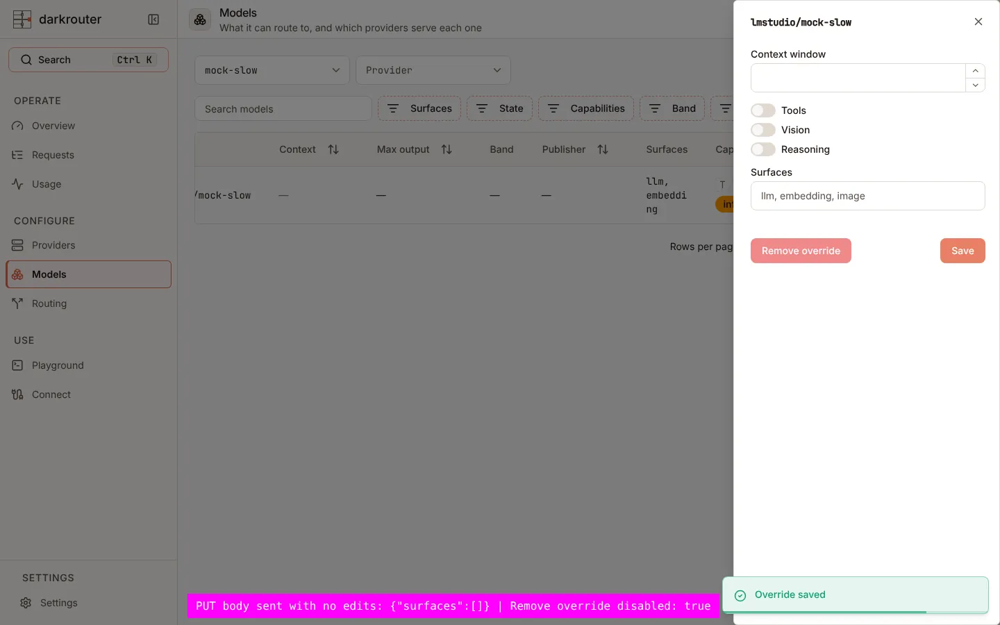

### PROVIDERS-15: Replace-secret field has no label, Enter does not save, and Escape drops focus to `<body>`
- Severity: Low (a11y)
- Where: `web/src/features/providers/credential-row.tsx:80-99`.
- Steps: 1. /providers/<provider with a credential> → Replace. 2. Type, press Enter. 3. Press Escape.
- Expected: the field has an accessible name, Enter saves, and Escape returns focus to the Replace button.
- Actual: the input has no `<label>` and no `aria-label` (placeholder "new secret" only). Enter does nothing. After Escape, `document.activeElement` is `<body>`, so keyboard users are thrown to the top of the page.
- Evidence: `providers-15-replace-focus.png`: magenta banner "label=0 aria-label=null … Enter submitted: false | focus after Escape: <body>".
- Root cause: the field is unmounted on Escape with no focus restore, and it is not inside a `<form>`.
- Proposed fix: wrap the replace controls in `<form onSubmit={…patch.mutate({secret})}>`, add `aria-label={`New secret for ${credential.label}`}`, and keep a ref to the Replace button and call `replaceRef.current?.focus()` after cancelling or saving.

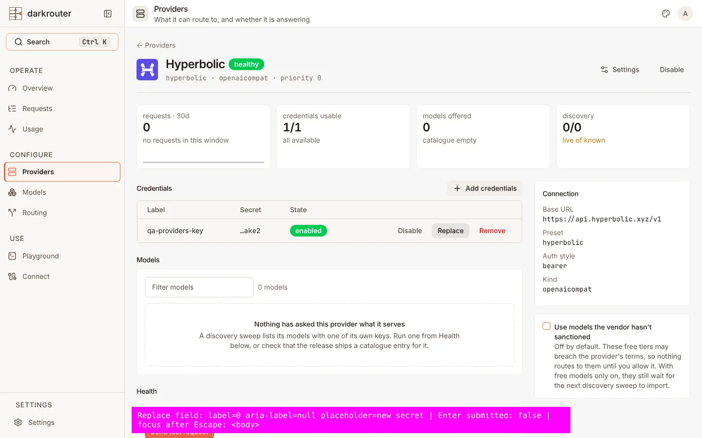

### PROVIDERS-16: Models screen has two model-name filters and shows two empty states at once
- Severity: Low
- Where: `web/src/features/models/models-screen.tsx:428` (`searchKey="model"`) and :433.
- Steps: 1. /models. 2. Type `zzz` in the "Model" combobox.
- Expected: one model filter, and one empty state.
- Actual: there are two inputs that both filter by model name: the URL-backed "Model" combobox and DataTable's "Search models" (not in the URL, and not cleared by "Clear filters"). With no match the page shows the table's "No results found" and the pager reads "Page 1 of 0", and a second card "No models match these filters. Clear filters" appears below it.
- Evidence: `providers-16-models-double-empty.png`.
- Root cause: `searchKey="model"` adds DataTable's own search on top of the URL filter. The `NoMatch` card renders in addition to DataTable's built-in empty row.
- Proposed fix: drop `searchKey`/`searchPlaceholder` (the combobox is the URL-backed filter), and render `NoMatch` / `EmptyState` instead of `DataTable` when `models.length === 0`.

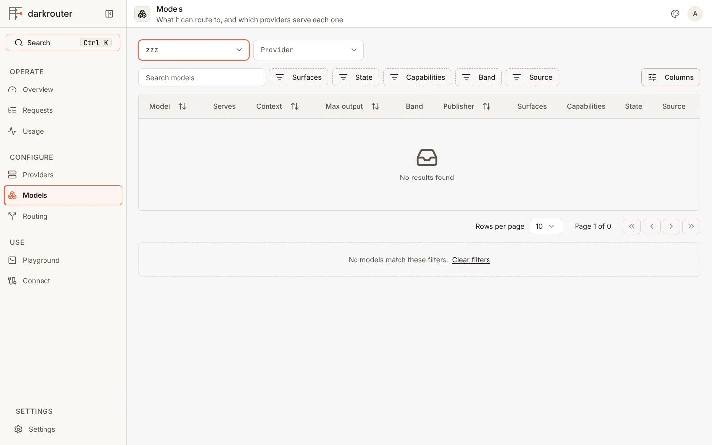

### PROVIDERS-17: A disabled provider still reads "credentials usable 1/1 · all available"
- Severity: Low
- Where: `web/src/features/providers/provider-detail.tsx:467-481`.
- Steps: 1. Provider with one key → Disable → confirm.
- Expected: the usable tile reflects that the router will not choose the provider (for example "0/1 · provider disabled").
- Actual: the badge says "disabled" while the tile says "1/1 · all available".
- Evidence: `providers-17-disabled-tiles.png`: Hyperbolic "disabled" badge with "Enable" button, tile "1/1 all available".
- Root cause: `accountSummary` ignores `provider.enabled`.
- Proposed fix: when `!provider.enabled`, render value `0/${total}` and note "provider disabled" with warning tone.

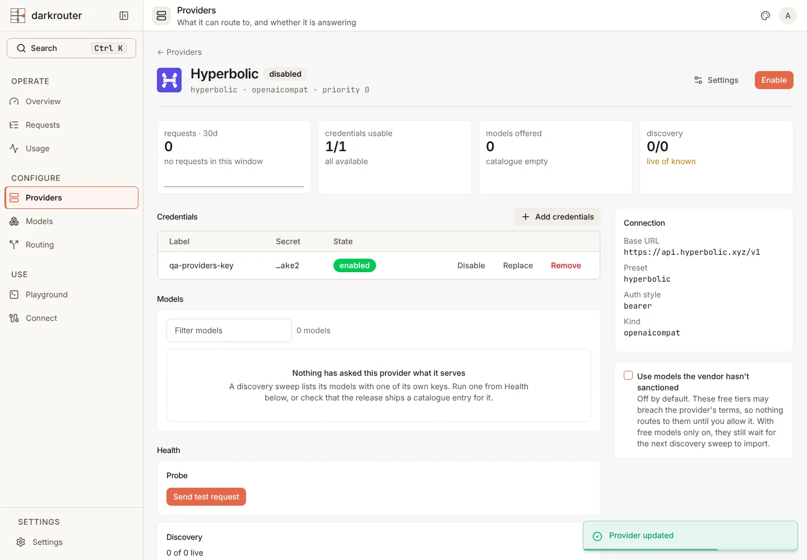

### PROVIDERS-18: Settings → Priority silently ignores invalid input
- Severity: Low
- Where: `web/src/features/providers/provider-settings-dialog.tsx:63`.
- Steps: 1. Provider → Settings. 2. Type `abc` (or `10.5`) in Priority.
- Expected: an inline message such as "Priority must be a whole number".
- Actual: "Save changes" just goes disabled with no explanation (`aria-invalid` unset). If another field was also edited, Save stays enabled and the typed priority is silently dropped from the PATCH.
- Evidence: `providers-18-priority-silent.png`: Priority "abc", Save disabled, no message.
- Root cause: `settingsPatch` omits an unparseable priority, and the dialog has no validation state.
- Proposed fix: compute `priorityError = typed !== "" && !Number.isInteger(Number(typed))`, render `<p role="alert" className="text-sm text-[hsl(var(--destructive))]">Priority must be a whole number</p>`, set `aria-invalid`, and disable Save while it is set.

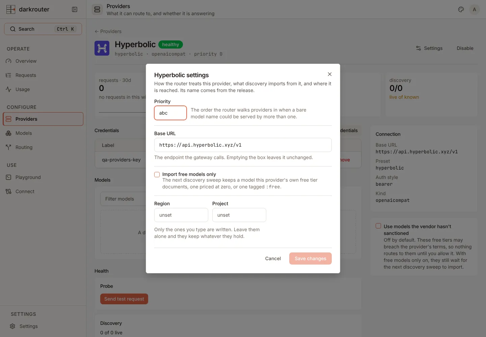

### PROVIDERS-19: Unconfigured local runtime page contradicts itself about needing a credential
- Severity: Low
- Where: `web/src/features/providers/provider-detail.tsx:225`.
- Steps: 1. Open /providers/ollama (unconfigured).
- Expected: the Models section agrees with the panel above it. Discovery starts once the runtime is added; no key is needed.
- Actual: the top panel says "what it needs is the address … rather than a credential". The Models panel says "Discovery lists a provider's models with one of its own keys, so the catalogue fills in once a credential exists." The same text appears for keyless presets such as auggie.
- Evidence: `providers-19-ollama-needs-credential.png`.
- Root cause: the Models hint in `UnconfiguredProvider` is not branched on `local` / `keyless`.
- Proposed fix: when `local || keyless`, use "Discovery lists its models on the first sweep after it is added." Keep the credential sentence for keyed presets only.

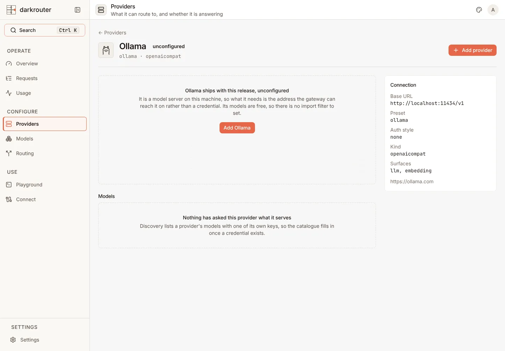

### PROVIDERS-20: OVHcloud brand mark is unreadable (wordmark shrunk into a 36px tile; dark blue on dark)
- Related: Duplicate of SHELL-15.
- Severity: Cosmetic
- Where: `web/src/features/providers/provider-assets.ts:59` (`ovhcloud.svg`), `provider-icon.css`.
- Steps: 1. /providers in dark mode, OVHcloud AI row.
- Expected: a recognisable mark, or the monogram fallback.
- Actual: a horizontal wordmark scaled to about 4px tall. In dark mode it is dark blue on the dark tile and close to invisible.
- Evidence: `providers-20-ovh-mark-dark.png` (zoomed crop).
- Proposed fix: ship OVHcloud's square glyph instead of the wordmark, or drop the entry so the monogram tile is used.


### PROVIDERS-21: Keyless "Add provider" dialog collapses to an empty ghost while closing
- Severity: Cosmetic
- Where: `web/src/features/providers/providers-screen.tsx:752` with `add-keyless-dialog.tsx`.
- Steps: 1. Delete a keyless provider (ovhcloud) and re-add it from its row: Add provider → Add OVHcloud AI.
- Expected: the dialog fades out with its content.
- Actual: during the close animation the dialog renders title and description only, at a shifted position (body gone), over the table.
- Evidence: `providers-21-keyless-close.png`: translucent "Add a keyless provider" header floating over the first row.
- Root cause: closing sets `keylessPreset` to `null`, which is both the open flag and the content (`{preset && …}`), so the body unmounts before the exit animation finishes. The add also stays on the list, unlike the local and credential dialogs, because `onDone` is not passed.
- Proposed fix: keep the last preset in a separate state for rendering (`const [shown, setShown] = useState(preset); if (preset && preset !== shown) setShown(preset)`) and drive `open` separately. Pass `onDone={(id) => navigate({ to: "/providers/$id", params: { id } })}` for consistency.

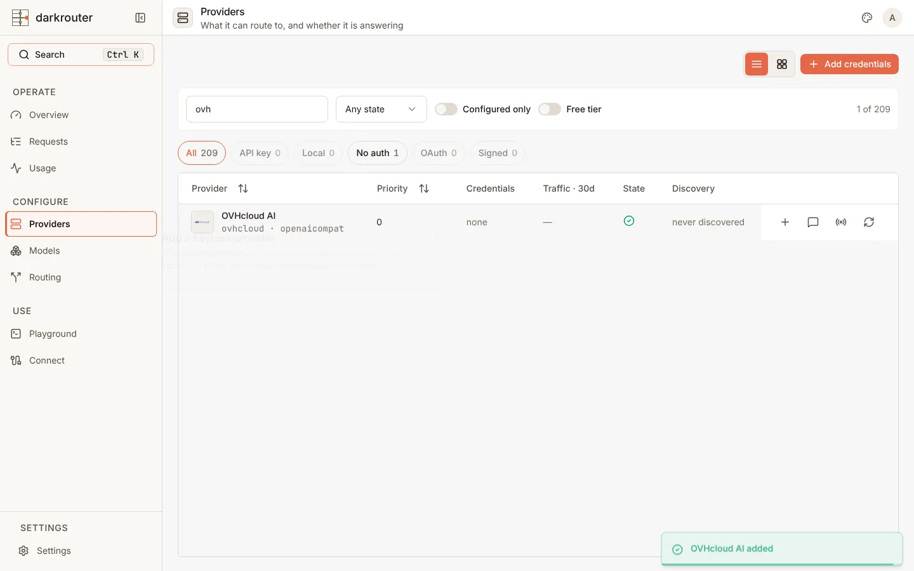

<details><summary>Tested and working — Providers & Models</summary>

- Providers list: list/grid toggle (persisted in localStorage), search, state select (Any/healthy/degraded/disabled/unconfigured; URL-backed), Configured only and Free tier switches (URL-backed, the summary "N of 209" is correct), connection chips filter correctly and their sibling counts are right (only "All" is wrong, PROVIDERS-02), zero-count chips are disabled, Provider/Priority column sort, NoMatch empty state with Clear filters. The Columns picker is deliberately hidden (`providers-table.css`), which is consistent.
- Row actions have accessible names (sr-only) plus title tooltips: Add credentials/Test/Probe/Discover/Reset breaker. Probe gives success/error toasts with the server's verdict. Discover shows "Discovery sweep queued". Breaker reset opens a confirm, `POST /breaker/reset` returns 200, the icon disappears, and `/api/health/providers` is cleared.
- Test drawer: model combobox, prefilled probe prompt, a served reply with metrics (ttft/total/tokens), failure verdict for mock-error and flaky vllm ("upstream request failed"), Log tab lists console-sourced runs, Escape closes, and focus returns to the row's Test button.
- Add credentials dialog: picker search, Surface/Auth filters, Free-tier switch, keyboard (Tab into listbox, arrows, Enter advances), Back, Escape closes and restores focus to the trigger. The fake bearer key on hyperbolic was kept "unverified", which is correct given no internet, and the reason is in the toast. Endpoint fields appear for Bedrock (Region). "Add at least one key to continue" disables submit.
- Add local runtime dialog: preset address prefilled, "Use host.docker.internal" rewrites only the host, invalid URL / `ftp://` show "Not an http or https URL yet." and disable both buttons, Test connection with `http://localhost:1/v1` shows "connection refused" and rolls back (POST → test → DELETE, no row left), Add runtime with a bad URL also rolls back, the "already added" guard works, Escape/Cancel close and reset on reopen, focus returns to the trigger.
- Keyless add (ovhcloud re-added with "Import free models only", stored `free_models_only=true`).
- Provider detail: credential Disable (confirm, state → degraded) / Enable / Replace (PATCH, masked suffix updates) / Remove (confirm, DELETE). Provider Disable (confirm with credential count) / Enable, list state filter "disabled". Settings priority/free-only save → header and list update → reverted. Probe panel ok/failed details. Back link. Unconfigured preset pages (groq/ollama/auggie) and unknown id ("No provider named …").
- Models screen: Model/Provider comboboxes (URL-backed), facets, Columns menu, pagination, override editor create (context 8192 + surfaces `embedding` → `/api/models` reflected it) and remove (confirm → DELETE 204 → catalogue values back). The server rejects unknown surfaces (`400 unknown surface chat`).
- Dark mode on list/grid/detail/settings/models: no invisible text or hard-coded light colours apart from PROVIDERS-20.
- No console errors or failed /api requests during normal use. The only failures were the expected 502s from the playground test against mock-error and flaky vllm.

Cleanup: hyperbolic and bedrock credentials removed via the UI and both providers deleted. The empty mock-slow override row was deleted. ovhcloud was re-added with its original `free_models_only=true`. hyperbolic priority and free-only were reverted before deletion. lmstudio and vllm were never disabled or edited (only their breaker was reset).

</details>

## Routing & aliases

_Scope: Strategy card, alias editor, add-alias dialog, model combobox, ladder & chain graph, live failover through the gateway._

### ROUTING-01: Keyless providers (lmstudio, vllm, all keyless presets) are drawn as unusable: every healthy target shows amber "no credentials" or "cooling", and rule 3's priority list leaves them out
- Related: Same class as OPERATE-07 and PROVIDERS-05/12/13: keyless providers judged by credential count.
- Severity: High
- Where: Routing → Strategy card, alias pills, Add-alias dialog. Root cause: `web/src/features/routing/chain-health.ts:300-308` (`usableCredentials` / `live`) and `:345-355`. Also `web/src/features/routing/strategy-card.tsx:20-24` (`priorityOrder`).
- Steps: 1. Open /routing (lmstudio and vllm are `auth_style: none` and have `credentials: []`). 2. Look at the alias pills, hover `lmstudio/mock-fast`. 3. Open Add alias and pick `flaky-1` or `lmstudio/mock-fast` as a target. 4. Read rule 3 on the Strategy card.
- Expected: Every target shows green "routable", because these providers serve traffic (the gateway answers 200 through them, and Overview shows them as healthy). Rule 3 lists every provider the router actually walks.
- Actual: Every pill on lmstudio or vllm has an amber dot. The tooltip says "no credentials · lmstudio has no credentials". Bare names say "cooling — nothing offering flaky-1 can be dispatched to right now". Rule 3 lists only `1. bedrock 2. hyperbolic`, the two providers other testers added with a key, and omits the six keyless providers the router really uses. Health colouring is wrong for the whole screen, so a real problem cannot be told apart from a false one. Related: breakers are keyed per (provider, key "", model) (`/api/health/providers`), so a keyless target that really is cooling (`lmstudio/mock-error`, backoff level 7) is never shown as cooling either.
- Evidence: `routing-01-keyless-pills.png`: rule 3 shows only bedrock/hyperbolic, the tooltip says "lmstudio has no credentials", and every dot is amber. `routing-01-keyless-dialog.png`: the dialog says "no credentials — lmstudio has no credentials" and "cooling — nothing offering flaky-2 can be dispatched to right now". Compare `routing-x-overview.png`, where Overview lists LM Studio and vLLM as healthy priority 4 and 8.
- Root cause: `chain-health.ts` and `priorityOrder` copy the sqlsource rule "drop a provider with no enabled credential" but leave out its exception, `&& !auth.IsKeyless(r.authStyle)` (`internal/provider/sqlsource.go:89`). `live()` requires a non-cooling credential, which a keyless provider never has.
- Proposed fix: Widen `ChainProvider` to include `auth_style`, and reuse `isKeyless` from `features/providers/provider-state.ts`:
  ```ts
  // chain-health.ts
  function live(p: ChainProvider) {
    return p.enabled && (isKeyless(p) || usableCredentials(p).some((c) => !c.cooling))
  }
  // targetFacts: only return provider-unconfigured when usable.length === 0 && !isKeyless(provider)
  // strategy-card.tsx priorityOrder:
  .filter((p) => p.enabled && (isKeyless(p) || p.credentials.some((c) => c.enabled)))
  ```
  For cooling on keyless or per-model breakers, also read `useProviderHealth()` (`/api/health/providers`) into `ChainContext` and mark a target `cooling` when its (provider, model) entry has `cooling_until` in the future.

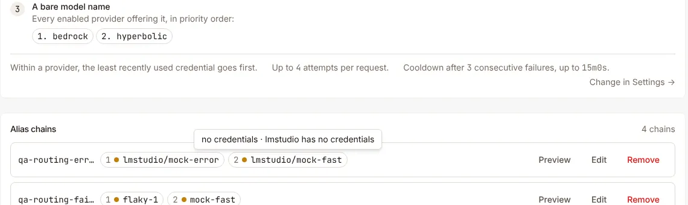

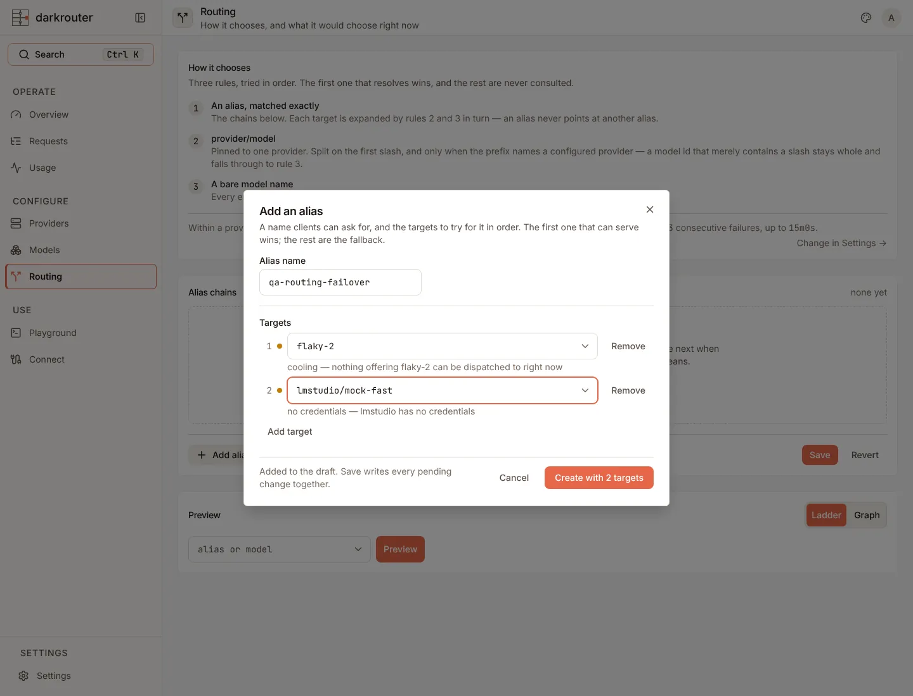

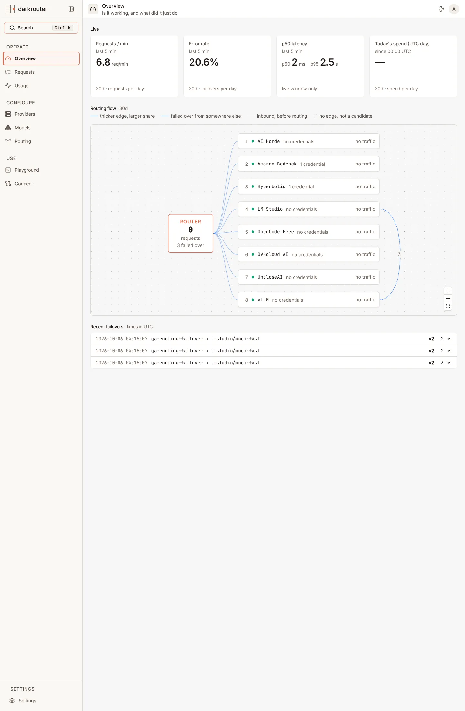

### ROUTING-02: An alias whose fallback is another model on the same provider never fails over on a 5xx, yet the Routing preview and graph say it will
- Severity: High
- Where: Gateway executor `internal/exec/advance.go:40-47` (`skipProvider`), and how the Routing preview presents it (`routing-screen.tsx` `previewRows`, `chain-graph.tsx` note "would be tried in this order").
- Steps: 1. Create alias `qa-routing-sameprov` = `vllm/flaky-1`, `vllm/flaky-2` (or `qa-routing-errfb` = `lmstudio/mock-error`, `lmstudio/mock-fast`) and Save. 2. Preview it: the ladder and graph show both targets, "would be tried in this order". 3. `curl localhost:8090/v1/chat/completions -d '{"model":"qa-routing-sameprov",...}'` several times, streaming and not.
- Expected: When target 1 returns 500, target 2 is tried, as the dialog promises: "The first one that can serve wins; the rest are the fallback."
- Actual: Every request that hits the 500 returns `502`, `X-Darkrouter-Attempts: 1`. Re-verified: 3 of 6 `qa-routing-sameprov` requests and every `qa-routing-errfb` request after each cooldown expiry. The trace lists both candidates but has one attempt and `skips: []`, so it never says the fallback was skipped. Cross-provider failover (`qa-routing-failover`, vllm→lmstudio) works.
- Evidence: `routing-02-sameprov-graph.png` (the preview promises 1. vllm/flaky-1 → 2. vllm/flaky-2). `routing-02-errfb-graph.png` (same promise for mock-error → mock-fast). `routing-02-trace-502.png` (the real request: one attempt, `lmstudio/mock-error` 500, status error, and no mention of mock-fast).
- Root cause: `nextIndex` treats any non-429 `retryable_provider` outcome as "the upstream is down" and calls `skipProvider`, which skips every remaining candidate with the same `ProviderID`, including different models. Breakers, however, are scoped per (provider, key, model), and a 500 from one model on LM Studio, vLLM or OpenRouter says nothing about the others. The preview endpoint and UI don't model this rule. The skipped candidates are also not recorded, against FR-RTE-8.
- Proposed fix: In `skipProvider`, skip only the remaining candidates with the same `ProviderID` **and** `ModelID` (other credentials for the same model), which matches breaker granularity. If the provider-wide skip is kept on purpose, (a) record each skipped candidate in `skips` with a reason such as `provider_failed`, and (b) make the Routing preview and Add-alias dialog say so. For example, when two consecutive chain targets share a provider, add a note to the second: "only reached on 429 / model errors — a 5xx from <provider> skips it".

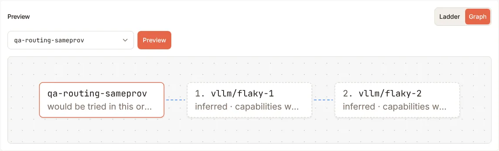

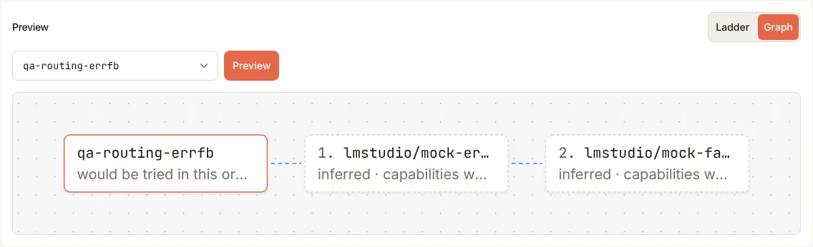

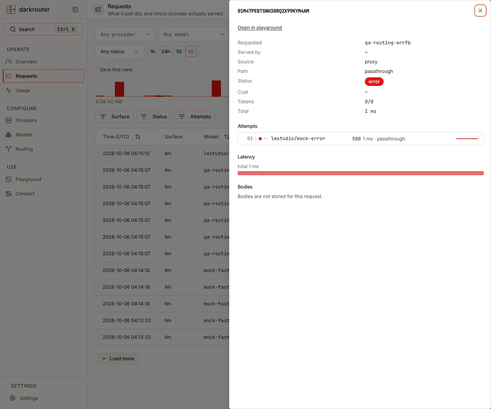

### ROUTING-03: Escape in a target combobox closes the whole Add-alias dialog and throws away the name and every target typed
- Related: Same root cause as PLAYGROUND-03 (darkraise-ui DismissableLayer handles Escape in capture phase).
- Severity: Medium
- Where: Add alias dialog, `web/src/features/routing/add-alias-dialog.tsx:101` (DialogContent has no `onEscapeKeyDown`). The cause is in darkraise-ui: `DismissableLayer` listens for keydown on `document` in the **capture** phase (`chunk-TRCSHFXR.js:66-79`), so it fires before the combobox's own Escape handler (`chunk-7BWRADKS.js:420`).
- Steps: 1. Add alias → name `qa-routing-esc`, target 1 `flaky-1`, Add target, type `mock-` in target 2 (suggestion list open). 2. Press Escape to dismiss the suggestions.
- Expected: Only the suggestion list closes, which is standard combobox behaviour.
- Actual: The dialog closes, and reopening shows an empty name and targets. Everything entered is lost.
- Evidence: `routing-03-esc-before.png` shows the dialog with name, target 1 and the open list for target 2. `routing-03-esc-after.png`, one Escape later, shows the dialog gone and no new chain.
- Root cause: Capture-phase dismissal runs before the input's handler, so `preventDefault` in the combobox is too late.
- Proposed fix: In `AddAliasDialog`:
  ```tsx
  <DialogContent onEscapeKeyDown={(e) => {
    const t = e.target as HTMLElement | null
    if (t?.getAttribute("role") === "combobox" && t.getAttribute("aria-expanded") === "true") e.preventDefault()
  }} …>
  ```
  The same guard belongs in every dialog that hosts `ModelCombobox`. Better still, fix it once in darkraise-ui's DismissableLayer by honouring `defaultPrevented` from a bubbling-phase check.

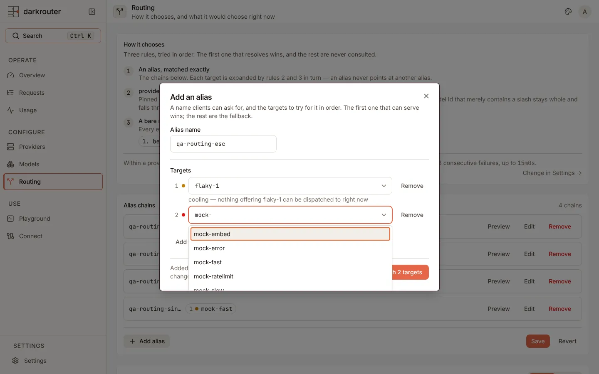

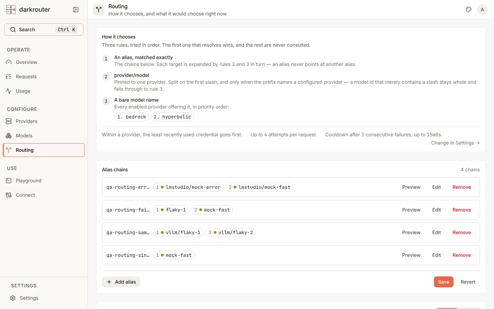

### ROUTING-05: Chain graph nodes cut off target names at every width, and at phone width the graph shrinks to ~7px text and clips the first and last nodes
- Severity: Medium
- Where: `web/src/features/routing/chain-graph.tsx:16-22` (`nodeW: 200`, fixed `height: 200`) and `:116-127` (`fitView`, default `minZoom` 0.5). `chain-graph.css:191-210` (`white-space: nowrap; text-overflow: ellipsis`, no `title`).
- Steps: 1. Preview `qa-routing-failover` → Graph at 1440. 2. Repeat at 768 and 375.
- Expected: The target identity, which is the one fact a node exists to show, is readable, and the run fits or can be scrolled at a readable size.
- Actual: At 1440, `lmstudio/mock-fa…`, `would be tried in this or…` and `inferred · capabilities w…` are cut off, with no tooltip and nodes that cannot be selected. Even an 18-character id doesn't fit; real ids such as `openrouter/meta-llama/llama-3.3-70b-instruct` never will. At 375, the viewport transform is `scale(0.5)`, so 14px text renders at 7px. The origin node starts at x=20 and the last ends at x=356, inside a 41–334 wrapper, so both are clipped. At 768 the scale is 0.56. Because the scale is applied to the whole canvas, the graph also opts out of the font-size axis in effect.
- Evidence: `routing-05-graph-1440.png` (cut-off titles and notes at full width). `routing-05-graph-375.png` (tiny text, "outing-failover" cut at the left edge, "lmstudio/mock-" cut at the right).
- Root cause: Fixed 200px nodes with single-line ellipsis, combined with `fitView` and xyflow's default `minZoom` of 0.5 for a horizontal run that is wider than the container.
- Proposed fix: Size nodes to their content (`width: max-content; max-width: 22rem`), and let the title wrap (`overflow-wrap: anywhere`) instead of using ellipsis. Add `title={d.title}` on `.cg-title`. Below about 640px, render the ladder instead of the graph (or lay the run out vertically), and set `minZoom={1}` with horizontal pan so text is never scaled below its token size.

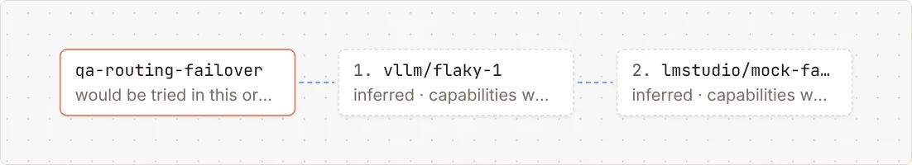

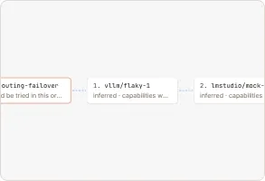

### ROUTING-06: The preview puts skipped and cooling targets after the candidates and joins them with a fallback edge, which states the wrong failover order
- Severity: Medium
- Where: `web/src/features/routing/routing-screen.tsx:28-51` (`previewRows` appends skips after candidates and numbers them in sequence). `chain-graph.tsx:74-84` (draws an edge into every node, including `kind: "skip"`).
- Steps: 1. While `lmstudio/mock-error` is cooling (send a few requests to it), preview `qa-routing-errfb` (chain: 1 mock-error, 2 mock-fast). 2. Compare the ladder and graph with the alias pills.
- Expected: Either the chain order kept with mock-error marked as skipped and cooling in place, or skips shown apart from the ordered candidates. In no case should a skipped target be drawn as the next fallback.
- Actual: The ladder shows `01 lmstudio/mock-fast`, `02 lmstudio/mock-error cooling`. The graph shows `qa-routing-errfb → 1. lmstudio/mock-fast → 2. lmstudio/mock-error (cooling)`, with a dashed "and if that fails" edge into the cooling node. That reads as "if mock-fast fails, mock-error is tried next", which is false: a cooling target is not tried. The rank also contradicts the pill rank 1 beside the alias name.
- Evidence: `routing-06-skip-ladder.png` (mock-error numbered 02 after mock-fast). `routing-06-skip-graph.png` (fallback edge from 1. mock-fast to 2. mock-error "cooling").
- Root cause: `previewRows` gives skips ranks after the candidates. `buildChainGraph` connects all nodes in one sequence with no special case for `kind === "skip"`.
- Proposed fix: In `previewRows`, leave skipped rows unranked (or use a separate "not tried" group with no rank). In `buildChainGraph`, end the edge chain at the last candidate and place skip nodes on a second row with no incoming edge, labelled "skipped — <reason>".

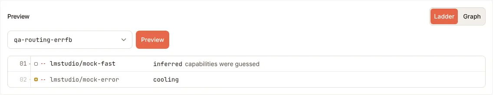

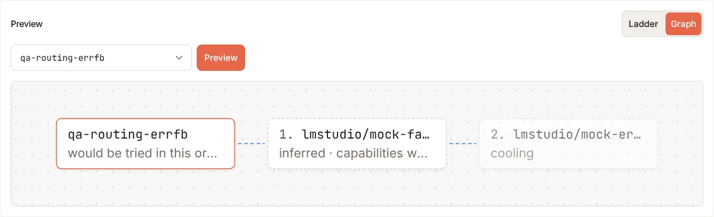

### ROUTING-07: Alias names are truncated to a fixed 8rem, so aliases sharing a prefix look identical in the chain list
- Severity: Medium
- Where: `web/src/features/routing/routing-screen.tsx:417` (`<span className="w-32 shrink-0 truncate …">`).
- Steps: 1. Have aliases `qa-routing-errfb` and `qa-routing-errfb-copy` (or any real pair such as `claude-sonnet-4-5` / `claude-sonnet-4-6`). 2. Open /routing at 1440.
- Expected: The name, which is the identity of the row, is shown in full. There is about 700px of free space on the row.
- Actual: Both rows read `qa-routing-err…`. Every qa alias is cut off (`qa-routing-fai…`, `qa-routing-sam…`, `qa-routing-sin…`). The full name is only in a hover `title`, which touch and keyboard users never see.
- Evidence: `routing-07-trunc.png`: the two magenta-outlined names are both "qa-routing-err…" with free space to their right.
- Root cause: A fixed `w-32` width with `truncate`.
- Proposed fix: Use `min-w-32 max-w-[40%] shrink-0 break-all` (or `w-auto` with `basis-auto`) so the name takes the width it needs and wraps on narrow rows instead of being cut off.

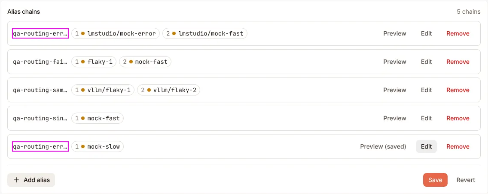

### ROUTING-08: Unsaved alias edits, including a brand-new alias from the dialog, are lost without warning on navigation, and nothing marks the editor as dirty
- Related: Same class as SETTINGS-02 (no unsaved-changes guard anywhere in the console).
- Severity: Medium
- Where: `web/src/features/routing/routing-screen.tsx:265-287` (draft held in component state only), `:610-617` (Save is always enabled), `:455` ("Preview (saved)" label).
- Steps: 1. Add alias `qa-routing-errfb-copy` → mock-slow → "Create alias". The dialog says "Added to the draft. Save writes every pending change together." 2. Click Models in the sidebar, then Routing.
- Expected: Either a prompt about unsaved changes, or the draft survives. While unsaved, the row or card shows a clear "unsaved" state, and Save is the only highlighted action.
- Actual: The new alias is gone (4 chains instead of 5). Nothing warned, and nothing was ever written (checked via `GET /api/aliases`). While it existed, the only hint was that its Preview button read "Preview (saved)", although the alias has never been saved; clicking it previews a bare model name and shows "no provider offers this model". Save is filled and enabled with zero changes, and a no-op click still sends a full `PUT /api/aliases` and toasts "Aliases saved", so its state carries no information.
- Evidence: `routing-07-trunc.png` shows the unsaved draft row (5th, "Preview (saved)", no unsaved marker) and an enabled Save. `routing-08-draft-gone.png` shows the same card after Models → Routing: 4 chains, the draft gone.
- Root cause: The draft lives in `useState` inside `AliasEditor` with no dirty tracking at card level, no route-leave blocker and no `beforeunload`. The `unsaved` flag is only used for the Preview label.
- Proposed fix: Compute `dirty = !sameMap(cleaned, aliases)`. Disable Save (outline variant) when not dirty. Show a "N unsaved changes" legend beside Save and an "unsaved" badge on each changed or new row. Register TanStack Router's `useBlocker({ shouldBlockFn: () => dirty })` plus a `beforeunload` handler. For a never-saved alias, label the button "Preview (not saved yet)" and disable it.


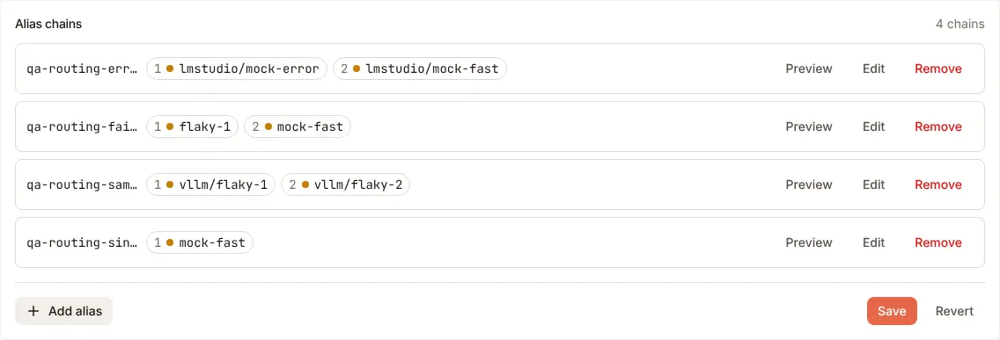

### ROUTING-04: Closing the Add-alias dialog drops keyboard focus to `<body>` instead of returning it to "Add alias"
- Severity: Low
- Where: `web/src/features/routing/add-alias-dialog.tsx:119` (`autoFocus` on the name input), together with darkraise-ui `useFocusTrap` (`chunk-4UD5ZBUS.js:64`).
- Steps: 1. Tab to "Add alias" and press Enter. 2. Close with Escape, Cancel or the X. 3. Press Tab.
- Expected: Focus returns to the "Add alias" button.
- Actual: `document.activeElement` is `BODY`, and the next Tab lands on "Skip to content" at the top of the page. A keyboard user loses their place. The Remove-chain ConfirmButton restores focus correctly.
- Evidence: `routing-04-focus-lost.png`: after Cancel and one Tab, the "Skip to content" link at the top-left is focused instead of anything near Alias chains.
- Root cause: React applies `autoFocus` during commit, before the focus trap's `useEffect` runs. The trap therefore records the dialog's own name input as `previousActive`, and that node is gone when it tries to restore focus.
- Proposed fix: Remove `autoFocus` from the name input. The trap's `focusFirst()` already focuses the first tabbable, which is that input. Otherwise, focus it from a ref inside a `requestAnimationFrame` after the trap has mounted.

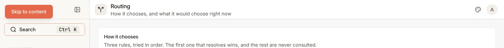

### ROUTING-09: The target suggestion list inside the Add-alias dialog is clipped by the dialog's scroll box and covers the Create button
- Severity: Low
- Where: `web/src/features/routing/add-alias-dialog.tsx:101` (`DialogContent … max-h-[85vh] overflow-y-auto`). darkraise-ui `ComboboxContent` renders in place, not in a portal (`chunk-7BWRADKS.js:537-551`).
- Steps: 1. At 1440×900, open Add alias. 2. Click the target 1 combobox.
- Expected: The suggestion list floats over the page, so its full height (up to 288px, 14 options) is visible.
- Actual: The list is cut off at the dialog's bottom edge. Only 3 of 14 options are fully visible (listbox bottom 807px, dialog bottom 654px), and the dialog gets an inner scrollbar. The list also hides the "Create alias" button while open.
- Evidence: `routing-09-clip.png`: the list stops mid-option ("lmstudio/mock-error") at the dialog's lower border and covers "Create alias".
- Root cause: An absolutely positioned popover inside an `overflow-y-auto` ancestor.
- Proposed fix: Take `overflow-y-auto` off `DialogContent` and put the scrolling on the targets `<ul>` (`max-h-[50vh] overflow-y-auto`), or render `ComboboxContent` in a portal with fixed positioning. darkraise-ui has a `Popover` portal primitive that could back it.

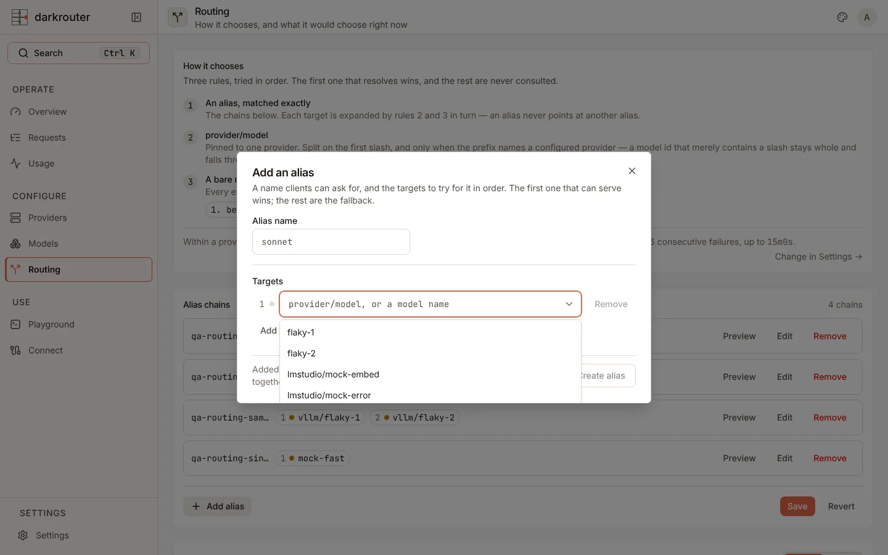

### ROUTING-10: Add alias silently accepts a name that hijacks an existing model id (or a `provider/model` string)
- Severity: Low
- Where: `web/src/features/routing/add-alias-dialog.tsx:23-32` (`aliasNameProblem` checks only duplicates and whitespace).
- Steps: 1. Add alias, name `mock-fast`, target `flaky-1`. 2. Look for any message. The same happens with `lmstudio/mock-fast` as the name.
- Expected: A warning that rule 1 wins: every client asking for `mock-fast` (or the pinned `lmstudio/mock-fast`) will be routed through this chain instead of the model. For the slash form, a refusal or a stronger warning.
- Actual: No message, and "Create alias" is enabled. One Save quietly redirects all existing traffic for that model.
- Evidence: `routing-10-shadow.png`: name `mock-fast`, which is a live catalogue model, with no warning and an enabled "Create alias" button.
- Root cause: The dialog receives `existingNames` but not the catalogue, so it cannot tell that the name is a model.
- Proposed fix: Pass `candidates` (model and provider/model strings) into `aliasNameProblem` as a second list and return a non-blocking warning: `"${name} is a model in the catalogue — requests for it will use this chain instead."`

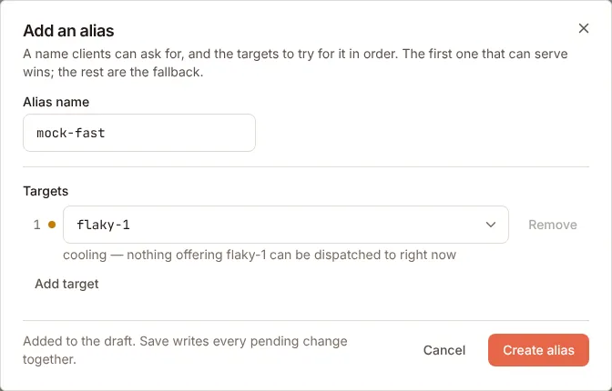

### ROUTING-11: The 409 toast tells the operator to "reload and try again", although the editor has already rebased and reloading would throw away their draft
- Severity: Low
- Where: `web/src/features/routing/routing-screen.tsx:315-321` (409 handling surfaces the server text as-is). The server text comes from `internal/config` ("aliases changed since you loaded them; reload and try again").
- Steps: 1. Open /routing in two tabs. 2. In tab B, edit `qa-routing-single` and Save. 3. In tab A, reorder `qa-routing-failover` and Save.
- Expected: A message explaining what happened and what to do: "Aliases changed elsewhere; your edits are kept on top of the new version — review and Save again."
- Actual: The red toast says "aliases changed since you loaded them; reload and try again". The editor had in fact already refetched and rebased: B's change appeared and A's reorder was kept, and a second Save succeeded with both. Following the toast (reload) would discard A's edit (see ROUTING-08).
- Evidence: `routing-11-conflict-toast.png`: the toast at the bottom right, with B's `mock-slow` already merged into qa-routing-single and A's reorder still showing.
- Root cause: The raw server error string is used as the toast text.
- Proposed fix: In the `save` mutation's `onError`, for `ApiError` with status 409, show the custom message above instead of `err.message`.

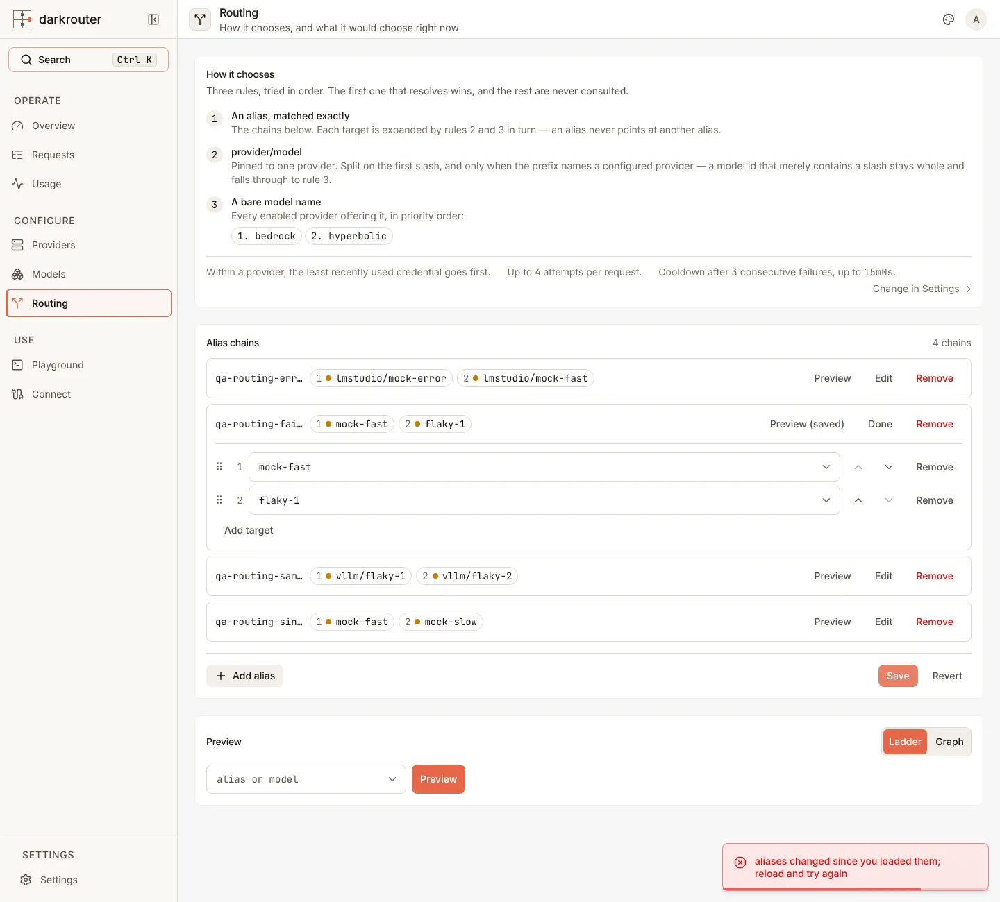

<details><summary>Tested and working — Routing & aliases</summary>

- Add-alias dialog: autofocus on the name field. Create stays disabled for an empty name and for zero targets, and the button label counts targets ("Create with 2 targets"). Duplicate name ("There is already an alias called …") and whitespace ("cannot contain spaces") messages work. Blank rows are dropped. Remove is disabled on the last row. Add target works. A target naming an unknown provider (`foo/x`) is flagged.
- Model combobox: opens on click and not on focus. Filtering puts prefix matches first. The first match is auto-highlighted and the highlight is visible. ArrowDown/Enter select. Selecting with the mouse works. Free text is kept. Chain fields exclude aliases, and the preview field includes them.
- Editor: Edit/Done toggle with aria-expanded. Move up/down buttons have aria-labels, are disabled at the ends, and keep focus on the moved row. Remove target. Remove chain asks for confirmation (Cancel keeps the chain, "Remove chain" drops it from the draft, and the Remove button gets focus back). Revert restores the saved map. Save sends `PUT /api/aliases` with If-Match, the server map matches exactly, and the "Aliases saved" toast appears.
- Concurrent edit: the stale save gets a 409, the editor refetches and rebases keeping both edits, and the second Save succeeds (only the copy is wrong, ROUTING-11).
- Preview: the Preview button on a row fills `?alias=` and runs. The ladder shows hollow marks, the inferred note and cooling skips. Ladder/Graph toggle. An unknown model shows "no provider offers this model". No console errors or failed /api requests during normal use (only the expected 409 in the conflict test).
- Gateway: `qa-routing-failover` fails over vllm/flaky-1 → lmstudio/mock-fast (Attempts: 2) for streaming and non-streaming. `qa-routing-single` serves directly. `qa-routing-errfb` uses mock-fast while mock-error is cooling.
- Overview "Recent failovers" lists exactly the qa-routing-failover requests that took 2 attempts (×2, `qa-routing-failover → lmstudio/mock-fast`), and the vllm→lmstudio failover edge count matches `/api/overview`.
- Layout: 1440 light and dark, 768, and 375 light and dark have no horizontal page scroll. Chain rows wrap their buttons together at narrow widths. Dark mode contrast of pills, ladder and graph is fine.
- Typography rule: no `text-xs`, `text-[Npx]` or pixel `font-size` in `features/routing`, `features/ladder`, `shell/model-combobox.tsx` or `styles/ladder.css`. Every size uses `var(--text-sm)` or `text-sm`.

</details>

## Playground & Connect

_Scope: Chat, compare, auxiliary, config pane, presets, conversations, metrics; Connect snippets, client tokens, public base URL._

### PLAYGROUND-01: Chat transcript does not follow new replies once it is taller than the viewport
- Severity: High
- Where: Playground → Chat, `web/src/features/playground/transcript.tsx:35-40` (follow effect), interacting with `markdown.tsx:14-31` (`useThrottled`)
- Steps: 1. Start a conversation on `mock-fast` (streaming on). 2. Send 3 messages in a row, waiting for each answer.
- Expected: While you are at the bottom, the transcript stays pinned there, so each new answer is visible as it arrives.
- Actual: After the second exchange the view stops moving. After 3 sends, `scrollTop=45, clientHeight=540, scrollHeight=1038`, so the newest answer sits 453px below the fold. The Consumption panel already counts 3 turns (36 in / 120 out), but only turns 0 and 1 are on screen. After 5 sends the view still showed turns 0 and 1. The operator has to scroll by hand after every message.
- Evidence: `playground-01-transcript-no-follow.png`. The header and rail show "verify follow 0..2" were sent. The transcript shows only the "follow 0" and "follow 1" answers, and "follow 2" is out of view.
- Root cause: The effect runs only on `[messages, busy]`, and only while `busy`. It measures `nearBottom` after the new user turn and the empty assistant turn are already in the DOM. The real height growth comes later, in two places that never re-run the follow:
  (a) `Markdown` throttles rendering through a 50 ms timer, so the text the effect sees is stale;
  (b) the final unthrottled render (list + code block) happens when `busy` flips to false, and the effect returns early on `!busy`.
  Once a single growth exceeds `FOLLOW_SLACK_PX` (160), `nearBottom` is false for good.
- Proposed fix: Track whether the reader was at the bottom from scroll events, not by measuring after growth. Follow on any content resize:
  ```tsx
  const stick = useRef(true)
  <div ref={scroller} onScroll={(e) => { stick.current = nearBottom(e.currentTarget) }}>
  useLayoutEffect(() => {
    const el = scroller.current, inner = el?.firstElementChild
    if (!el || !inner) return
    const ro = new ResizeObserver(() => { if (stick.current) el.scrollTop = el.scrollHeight })
    ro.observe(inner); return () => ro.disconnect()
  }, [])
  ```
  Also set `stick.current = true` when the operator sends, since their own send should always bring them to the bottom.

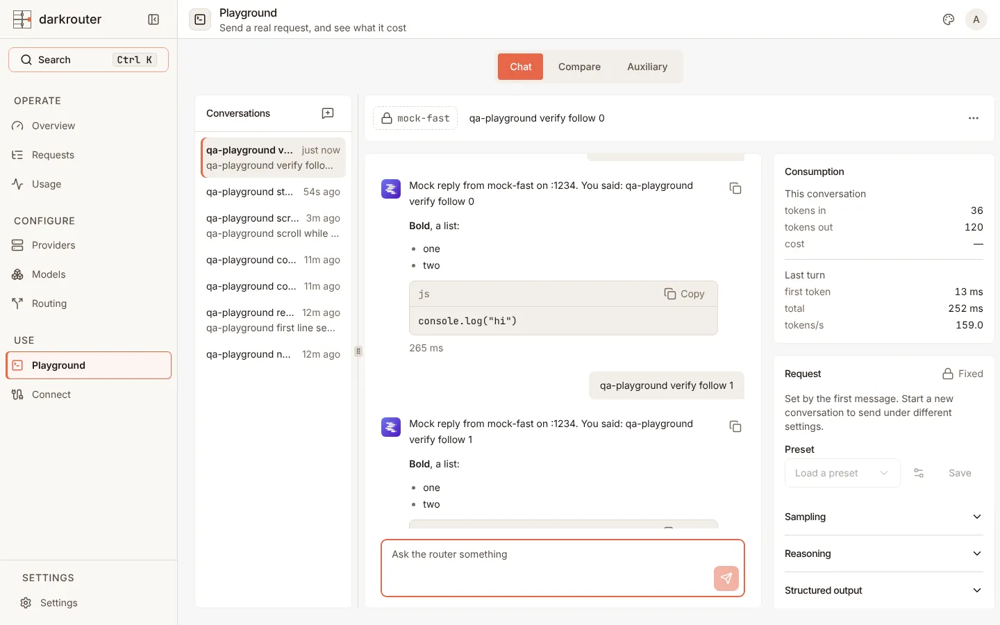

### PLAYGROUND-02: Creating the first client token silently locks every client out of the gateway; revoking it does not undo that, and the screen still says "No client token exists yet"
- Severity: High
- Where: Connect → "New client token" and "Client snippets"
  - copy: `web/src/features/connect/connect-screen.tsx:310` and `:496`
  - behaviour: `internal/server/server.go` `authed()` ("Authentication is off only when the shared secret is unset and no proxy token has ever been issued. Issued, not live")
- Steps (private instance, so the shared gateway was not touched): 1. Fresh instance with no `server.proxy_token`. `curl :18190/v1/models` returns **200**. 2. On Connect, type a name and click Create. 3. Wait about 5 s (the token cache TTL) and run `curl :18190/v1/models` again. 4. Revoke the token through the Revoke confirm dialog. `/api/proxy-tokens` now returns `{"tokens":[]}`. 5. Wait 6 s and curl again.
- Expected: Creating the first token is a gateway-wide switch from open to authenticated, so the UI should say so before the click. After revoking, the screen should describe the real state.
- Actual: Step 3 returns **401** `invalid proxy token` for every unauthenticated client. Step 5 still returns **401**. Yet the page goes back to exactly the "nothing configured" copy it showed in step 1:
  - "No client token exists yet, so snippets show a placeholder. Create one under New client token, below, and paste it in."
  - "Give each client its own, and a token you revoke stops that client alone."

  Both statements are wrong for the first token. Nothing on the screen says the gateway is open now (it is, on the shared UAT instance), or closed now. The screen pushes the operator to create a token. Doing so breaks every existing client, and revoking it cannot undo that.
- Evidence: `playground-02-token-before.png` (gateway open, HTTP 200) and `playground-02-token-after-revoke.png` (gateway closed, HTTP 401) show identical copy (outlined). The curl results are printed by `SCRATCH/e2e/cn-03.mjs` and `cn-04.mjs`.
- Root cause: The server treats "a token was ever issued" as the switch for authentication (`tokens.configured()`), but the Connect screen bases its copy only on `tokens.data.length`. No API field tells the UI whether proxy auth is in force.
- Proposed fix:
  - Expose `proxy_auth: "off" | "shared" | "tokens"` (or `tokens_ever_issued`) from `/api/proxy-tokens` or `/api/config`.
  - On Connect, show a status line: "The gateway currently accepts requests without a token", or "Every request must carry a token".
  - Put a confirm in front of the first Create: "Creating the first client token turns on authentication for every client of this gateway, and revoking it later does not turn it off."
  - Replace "a token you revoke stops that client alone" with wording that is true.
  - When `tokens == [] && issued`, say "Every client token has been revoked — the gateway refuses all clients until you create a new one", not "No client token exists yet".

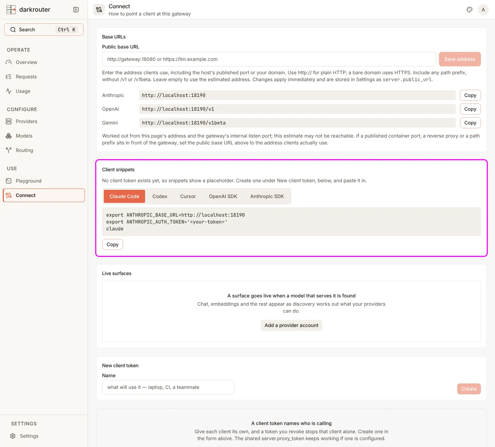

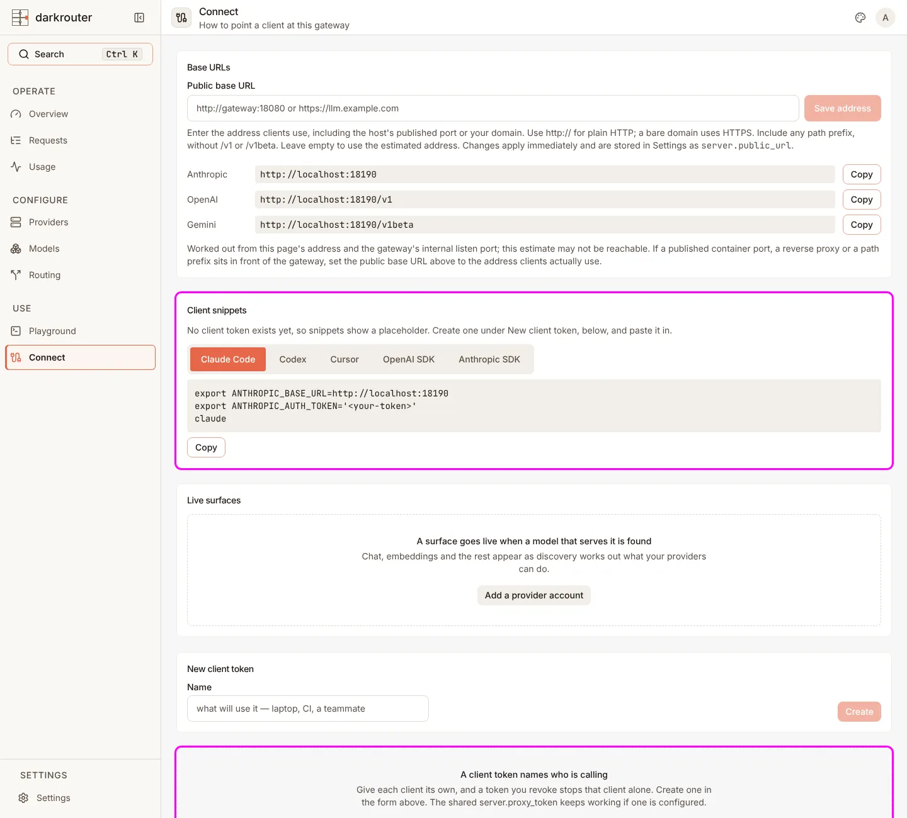

### PLAYGROUND-03: Pressing Escape to close a model suggestion list or the Dialect select closes the whole New conversation / Request settings dialog and discards the draft
- Related: Same root cause as ROUTING-03.
- Severity: Medium
- Where: Chat → New conversation / "Choose a model" dialog
  - `web/src/features/playground/chat/new-conversation-dialog.tsx:75` (`closeOnEscape={!nested}`)
  - `web/src/features/shell/model-combobox.tsx:151-168`
  - the Dialect `<Select>` in `config-pane.tsx`
- Steps: 1. Click "New conversation". 2. Type `mock-f` in "Model or alias". The suggestion list opens. 3. Press Escape. Repeat with the Dialect select open.
- Expected: Escape closes only the open listbox. The dialog and everything typed into it stay.
- Actual: The whole dialog closes, every value typed into it is lost, and the chat falls back to "No model". The same happens with the Dialect select open (`dialogs after esc on select: 0`).
- Evidence: `playground-03-esc-before.png` shows the dialog with the suggestion list open. `playground-03-esc-after.png` shows the dialog gone and the header reading "No model".
- Root cause: The combobox and select popovers portal to `<body>`, so the dialog's dismissable layer handles the same Escape. `NestedDialogContext` already exists for this exact problem (see `config-pane/nested-dialog.tsx`), but only `PresetPicker` reports through it. `ModelCombobox` and the Dialect/Effort `Select`s do not.
- Proposed fix: Report popover open state through the existing channel. In `ModelCombobox`, track `open` via `onOpenChange` and call `useReportNestedDialog(open)`. Do the same for the `Select`s in `ConfigPane`, `Reasoning` and `PresetPicker` (`onOpenChange={setOpen}` → `useReportNestedDialog(open)`). Alternatively, stop propagation of Escape on the combobox input when the list is open.

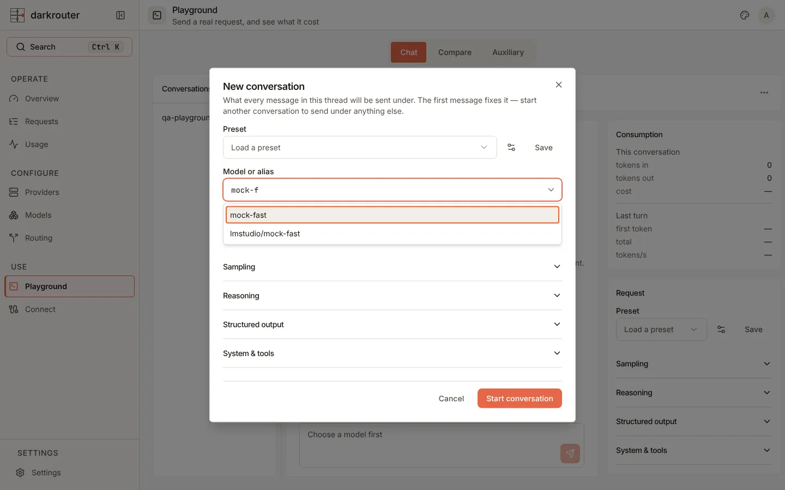

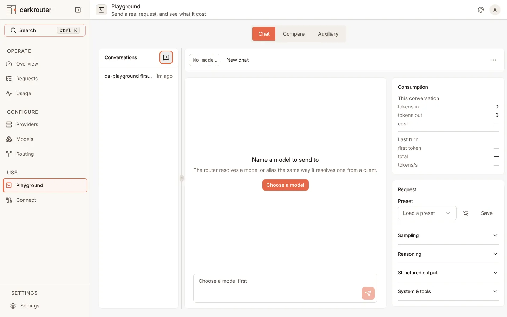

### PLAYGROUND-04: A failed or stopped turn loses its trace: a 429 is shown as a bare "upstream request failed" with no link, though the gateway returned the request id
- Severity: Medium
- Where: Chat composer error and Compare column error
  - `web/src/lib/api.ts:265-272` (`stream()` calls `onStart` only for OK responses)
  - `web/src/features/playground/lib/use-chat-run.ts:256-263`
  - `compare.tsx` `runColumn`
- Steps: 1. New conversation on `mock-ratelimit` (upstream always answers 429), then send. 2. Repeat with `mock-error` (500). 3. Separately, send to `mock-fast` and press Stop after the first words.
- Expected: The operator can tell a rate limit from a server error and can open the trace. The gateway recorded both: the trace for request `01M47PBJ49CQ6H55FH6YY2WSY8` has `attempts[0].status_code: 429, outcome: "retryable_provider"`. The response also carried `X-Darkrouter-Request`.
- Actual: Both 429 and 500 render the same red line, "upstream request failed", under the composer. There is no trace link and no provider or status. The assistant row is an empty dashed placeholder that never resolves. A stopped turn keeps its partial text but shows no route line or trace link either. Those only appear after the conversation is reopened, as "187 ms" plus the warning "upstream connection failed after commit: context canceled".
- Evidence: `playground-04-ratelimit-error.png` (429 shown as "upstream request failed", empty dashed gutter, no link). `playground-04-stopped-turn.png` (stopped partial answer: dashed gutter, no route, no stopped marker).
- Root cause: `stream()` throws via `throwOnExecutorError(res)` before it reads `X-Darkrouter-Request`, so `liveRequestId` stays `""`. For a stop, `traceWhenWritten(liveRequestId, controller.signal)` is passed the already-aborted signal, so it returns null at once.
- Proposed fix: In `stream()`, call `onStart` before the `!res.ok` check, or attach `requestId` to the thrown `ApiError`. In `useChatRun`'s catch, and after an abort, still call `traceWhenWritten(liveRequestId)` with a fresh signal and set `routes[answerAt]`, so the route line and "trace" link render under the failed or stopped turn. Show the attempt's status (for example "429 from lmstudio") in the error. Apply the same to `runColumn` in `compare.tsx`.

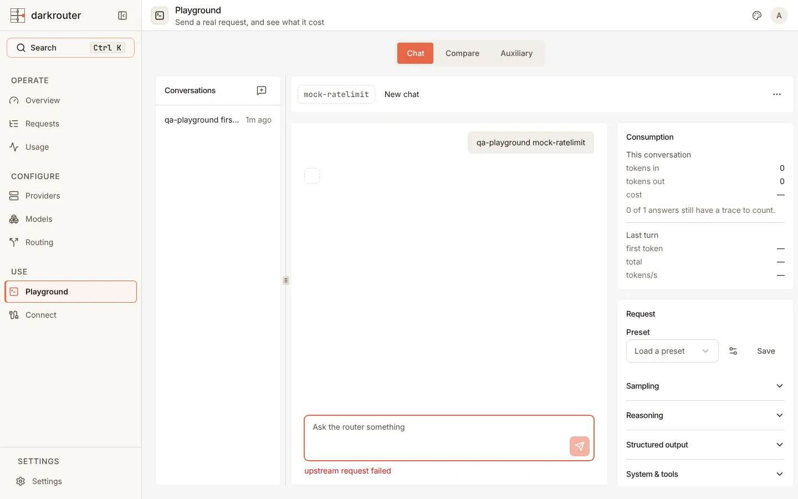

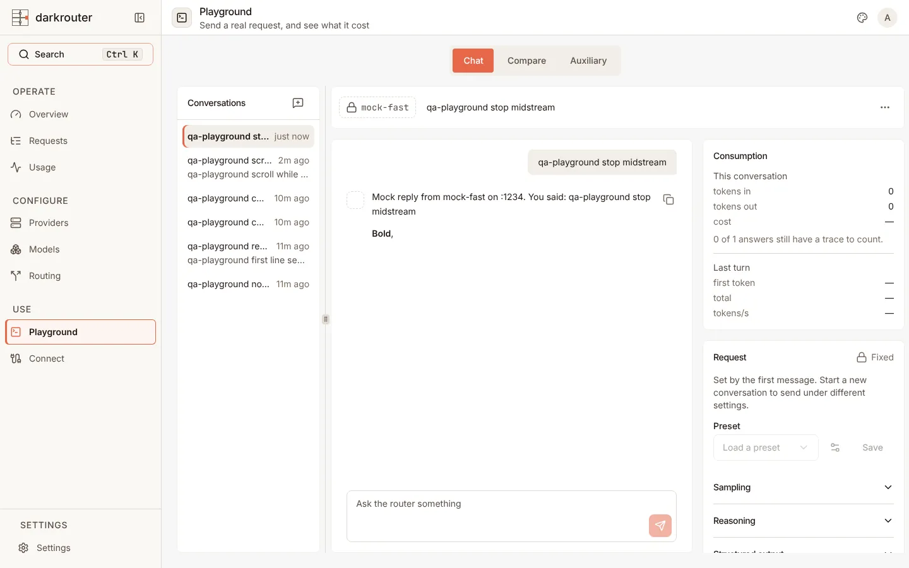

### PLAYGROUND-06: The Tools field ignores the dialect: Gemini refuses tools only at send (400), and Anthropic silently drops tools written in the OpenAI shape the placeholder suggests
- Severity: Medium
- Where: Request pane → System & tools
  - `web/src/features/playground/config-pane/config-pane.tsx:191-202` (placeholder `JSON array, e.g. [{"type":"function",…}]` for every dialect)
  - `dialect-support.ts` (no `tools` control)
  - `lib/request.ts` `requestProblem`
  - server check at `internal/admin/playground.go:79-83`
- Steps: 1. New conversation, model `mock-fast`, dialect `gemini`. 2. In System & tools, paste `[{"type":"function","function":{"name":"f","parameters":{"type":"object"}}}]`. 3. Click Start conversation and send. 4. Repeat with dialect `anthropic`.
- Expected: The pane gates Tools like it gates Top K, Effort and Schema: disabled for gemini with the reason, and with a dialect-correct placeholder for anthropic. The Send button stays blocked with the reason before anything is sent.
- Actual:
  - Gemini: the field accepts tools, Send is enabled, and the request returns HTTP 400 "gemini declares tools as functionDeclarations; send tools through the openai or anthropic dialect". The conversation has already been set up around the tools.
  - Anthropic: the request succeeds, but the turn shows "tools[].type -> openaicompat: typed server tool has no equivalent; the tool was dropped". The example shape the placeholder offers is not the Anthropic shape (`name`, `input_schema`).
- Evidence: `playground-06-gemini-tools-400.png` (error under the composer). `playground-06-anthropic-tools-dropped.png` (the warning list under the answer, last line).
- Root cause: `Control` in `dialect-support.ts` has no `tools` entry. `parseTools` only checks that the value is a JSON array, and the placeholder is fixed.
- Proposed fix: Add `"tools"` to `Control` and `REASONS`, with gemini set to the server's own sentence. Wrap the Tools textarea in `GatedField reason={reasonFor(dialect,"tools")}`. In `requestProblem`, return that reason when `toolsRaw` is non-empty and the dialect does not carry tools. Make the placeholder per dialect (OpenAI `{"type":"function","function":{…}}`, Anthropic `{"name":…,"input_schema":{…}}`).

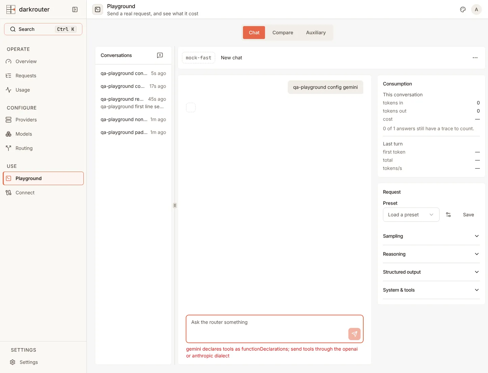

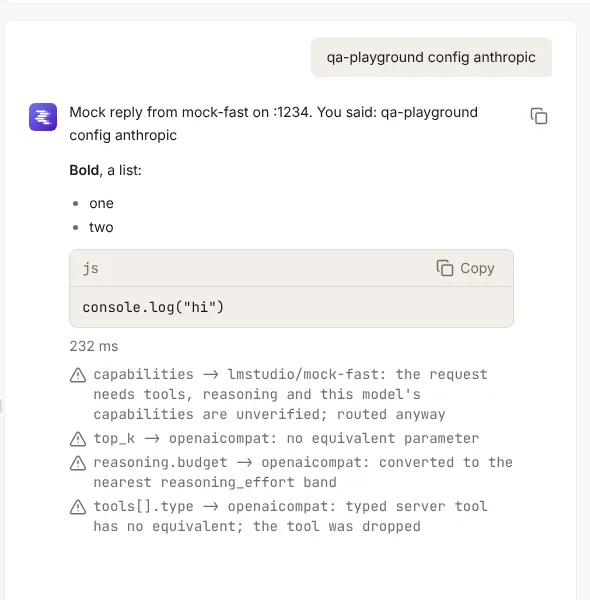

### PLAYGROUND-07: Compare ignores the "Stream the reply" switch it shows
- Severity: Medium
- Where: Playground → Compare, `web/src/features/playground/compare.tsx:40` (`chatBody({ ...config, model, stream: true, messages: turns })`)
- Steps: 1. Compare, two columns on `mock-fast`, type a prompt. 2. Open Sampling in the right pane and turn "Stream the reply" off (`aria-checked=false`). 3. Click Run and inspect the POST bodies to `/api/playground`.
- Expected: Either the request is sent with `"stream": false`, or the switch is not offered on Compare.
- Actual: Every column's body has `"stream": true` while the switch reads off. The control does nothing on this surface, which `config.ts` itself calls a defect ("a control that does nothing").
- Evidence: `playground-07-compare-stream-ignored.png`. The "Stream the reply" switch is off in the right pane while the columns stream. The request bodies are printed by `pg-08.mjs` / `pg-verify.mjs` (`bodies [true, true]`).
- Root cause: `runColumn` hard-codes `stream: true` because it only parses SSE (`drainSSE`). It has no unary path like `useChatRun`'s `extractUnaryText`.
- Proposed fix: Honour `config.stream`. Pass it through, and when false, parse the buffered body with `extractUnaryText(config.dialect, buffer)` after the loop, as `use-chat-run.ts` does. If streaming should stay mandatory here, hide the switch: add a `showStream` prop to `ConfigPane`/`Sampling` and pass `showStream={false}` from Compare.


### PLAYGROUND-09: At 1440px with 3-4 Compare columns the model names are cut to about 8 characters, two columns both read "lmstudio", and the 4th column is clipped
- Severity: Medium
- Where: `web/src/features/playground/compare.tsx:235-238` (grid `minmax(14rem, 1fr)` inside `overflow-x-auto`) and `compare-column.tsx:84-91` (remove button is `variant="ghost"` at default size, not `size="icon"`)
- Steps: 1. Viewport 1440×900, Compare. 2. Add models up to 4/4. 3. Set the columns to `lmstudio/mock-fast`, `lmstudio/mock-slow`, `vllm/flaky-1`, `vllm/flaky-2`.
- Expected: Each column says which model it ran. The cap text claims "Four is the most that stays readable side by side."
- Actual: Each model input is 114px wide with its text overflowing. Columns 1 and 2 both display "lmstudio", and columns 3 and 4 both display "vllm/fla". The grid is 944px wide in an 816px scroller, so column 4 and its error text ("upstream requ…") are cut off at the right edge. At 1920 the same setup fits (inputs 202px, no overflow).
- Evidence: `playground-09-compare-4cols-1440.png` (inputs outlined magenta, scroller dashed blue, two identical "lmstudio" labels, clipped 4th column). `playground-09-compare-done-1440.png` (after a run: "mock-fas", "mock-slo", "mock-err", "mock-rat"; 4th column error cut).
- Root cause: The 320px config aside plus the 260px sidebar leave about 816px for four `14rem` columns. Inside each card, the status dot, a default-size ghost button (much wider than the icon) and the gaps take about 90px from the model input.
- Proposed fix:
  - Make the remove control `size="icon"`.
  - Show the full model name as a non-truncated line in the column (for example `<p className="truncate font-mono text-sm" title={model}>`), or put the combobox on its own row above the status and remove controls.
  - Give the grid `repeat(auto-fit, minmax(16rem, 1fr))` so columns wrap to a second row instead of scrolling sideways.
  - Change the cap copy so it does not promise that four fit.

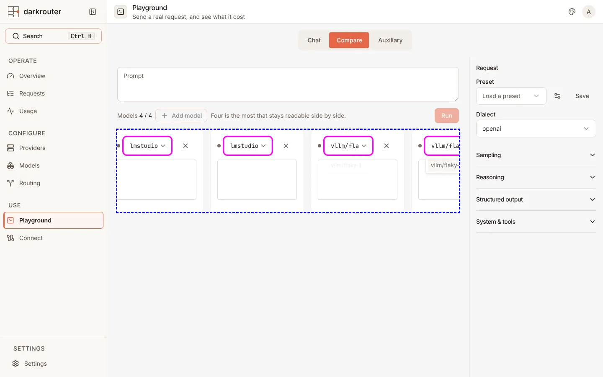

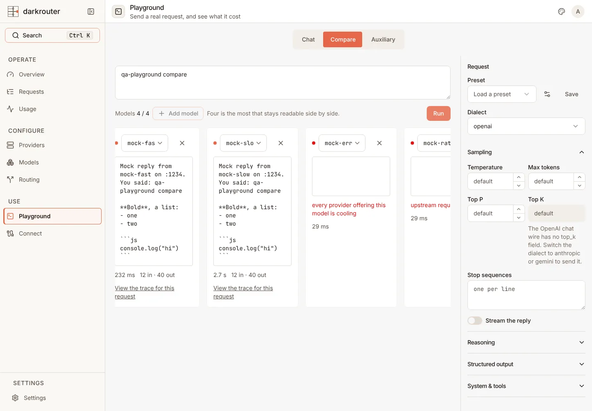

### PLAYGROUND-10: On tablet and phone widths the Compare results are crushed into a nested scroll box by the request pane (52px tall at 375)
- Severity: Medium
- Where: `web/src/features/playground/compare.tsx:181` (`flex-col lg:flex-row`) and `:266` (`<aside className="flex w-full shrink-0 … overflow-y-auto …">`)
- Steps: 1. Viewport 375×812 (and 768×1024), Compare. 2. Two columns of `mock-fast`, a prompt, Run.
- Expected: Below `lg` the answers can be read by scrolling the page, with the settings stacked below them or behind a toggle.
- Actual: The aside is `shrink-0` and takes 436px, so the prompt-and-columns region is squeezed to 240px. Inside it, the columns grid (an `overflow-x-auto`, which forces overflow-y to auto too) gets **52px of height for 458px of content** at 375. The answers are effectively invisible behind a tiny nested scroller. At 768 the grid gets 264 of 458px, and even with only 2 columns the model names are truncated to "mock-fas".
- Evidence: `playground-10-compare-375.png` (magenta box: the whole results region after a successful run; no answer text visible, Request pane fills the rest). `playground-10-compare-768.png` (answers cut mid-list, model names truncated).
- Root cause: Below `lg` both children of a fixed-height flex column are allowed to scroll internally, and the aside never shrinks.
- Proposed fix: Below `lg`, let the page scroll as one column. Make the outer container `overflow-y-auto lg:overflow-hidden`, give the aside `lg:overflow-y-auto` with no `shrink-0` on mobile, and drop `min-h-0` from the left column below `lg`. Alternatively, show the aside's ConfigPane in a Sheet behind a "Request settings" button, as Chat does with its history rail.

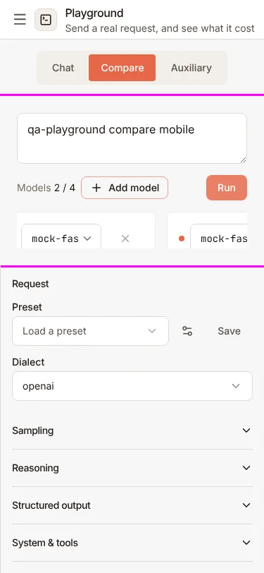

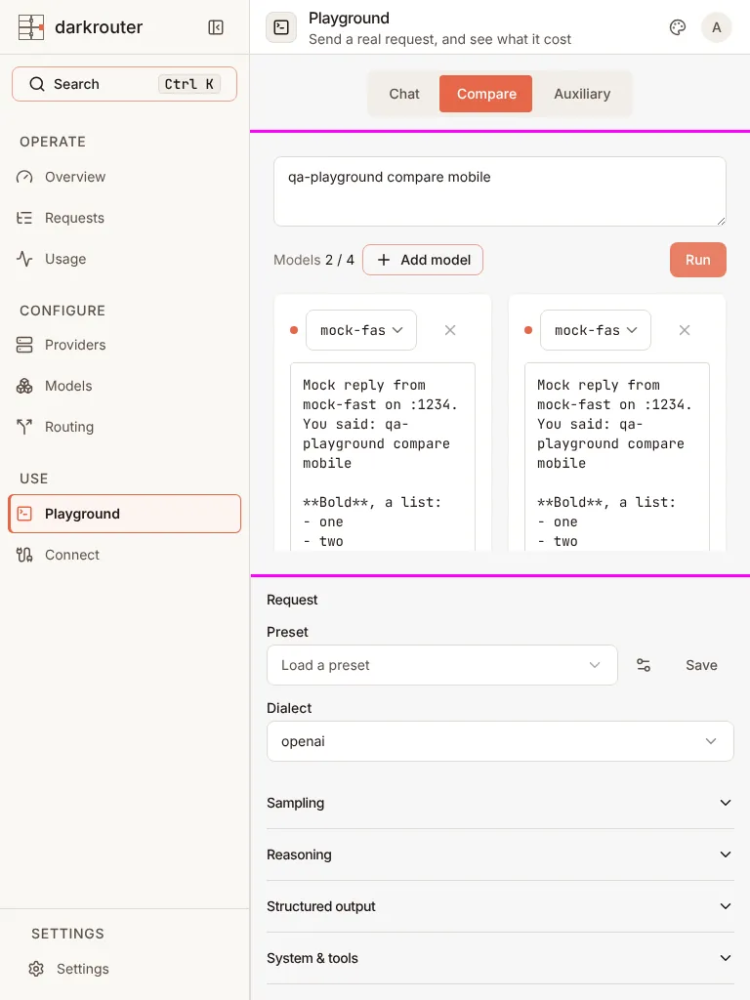

### PLAYGROUND-11: Deleting a saved conversation is a single click, with no confirmation and no undo
- Severity: Medium
- Where: `web/src/features/playground/chat/history-rail.tsx:122-131` (hover trash) and the header menu "Delete conversation"; both call `removeConversation` → `remove.mutate` (`chat/chat-mode.tsx:478-479`)
- Steps: 1. Hover a conversation in the rail. 2. Click the trash icon that replaces the timestamp.
- Expected: A confirmation (the console uses `ConfirmButton` for token revoke) or an Undo, because the conversation and every turn in it are deleted server-side and cannot be recovered.
- Actual: The conversation is deleted immediately (`DELETE /api/playground/conversations/{id}`, gone from the API listing). Only a success toast appears, with no Undo action.
- Evidence: `playground-11-delete-no-confirm.png`. No dialog, the row is gone from the rail, and the toast "Deleted qa-playground padded" has no Undo.
- Root cause: `removeConversation` calls the mutation directly.
- Proposed fix: Route both entry points through `ConfirmButton` (or a confirm dialog) titled "Delete {title}?" with the description "The transcript is removed from the server and cannot be recovered." Alternatively, defer the DELETE for 5 s behind a toast with an Undo action.

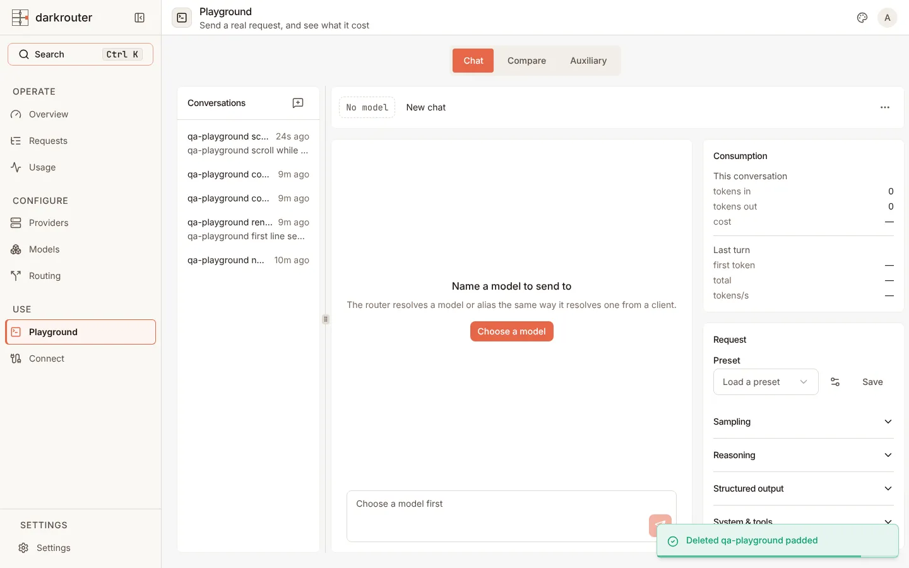

### PLAYGROUND-12: The Public base URL accepts values its own help text forbids (a trailing /v1, ftp://), and an invalid value is reported only in a transient toast
- Related: Overlaps SETTINGS-07 (same setting, seen from Settings).
- Severity: Medium
- Where: Connect → Base URLs
  - `web/src/features/connect/connect-screen.tsx:132-180` (`PublicUrlEditor`, error only via `toast.error`)
  - server validation `internal/config/load.go:204-215` (any scheme, any path accepted)
- Steps: 1. Enter `https://llm.qa-playground.example/v1` and click Save address. 2. Enter `ftp://qa-playground.example` and save. 3. Enter `not a url` and save. (I reverted to empty afterwards and confirmed the stored value is `""`.)
- Expected: The help text says "Include any path prefix, without /v1 or /v1beta", so a `/v1` suffix should be refused or stripped. Only http/https should be accepted. A rejected value should show as an inline field error (`aria-invalid`, text under the field) naming what was typed.
- Actual:
  1. Saved. The OpenAI base URL becomes `…/v1/v1`, Gemini becomes `…/v1/v1beta`, and every snippet copies the broken URL.
  2. Saved. All three base URLs and every snippet start with `ftp://`.
  3. Only a toast that disappears: `server.public_url is unusable (… got "https://not a url")`. It quotes a normalized value the operator never typed. The field shows no error state, and the old `ftp://` addresses stay on screen as if current.
- Evidence: `playground-12-public-url-v1-suffix.png` (OpenAI row `https://llm.qa-playground.example/v1/v1`). `playground-12-public-url-ftp-and-toast.png` (ftp:// base URLs and snippet, "not a url" still in the field, error only in the bottom-right toast).
- Root cause: `validate()` only checks `IsAbs()`, a non-empty host and no query or fragment. The editor has no client-side validation and keeps no field-level error.
- Proposed fix:
  - Server: in `validate`, require `u.Scheme == "http" || u.Scheme == "https"`, and refuse (or trim) a path ending in `/v1` or `/v1beta`.
  - Client: keep the last error in state and render `<p role="alert" id="public-base-url-error" className="text-sm text-[hsl(var(--destructive))]">` under the field with `aria-invalid` and `aria-describedby`. Quote the value as typed.

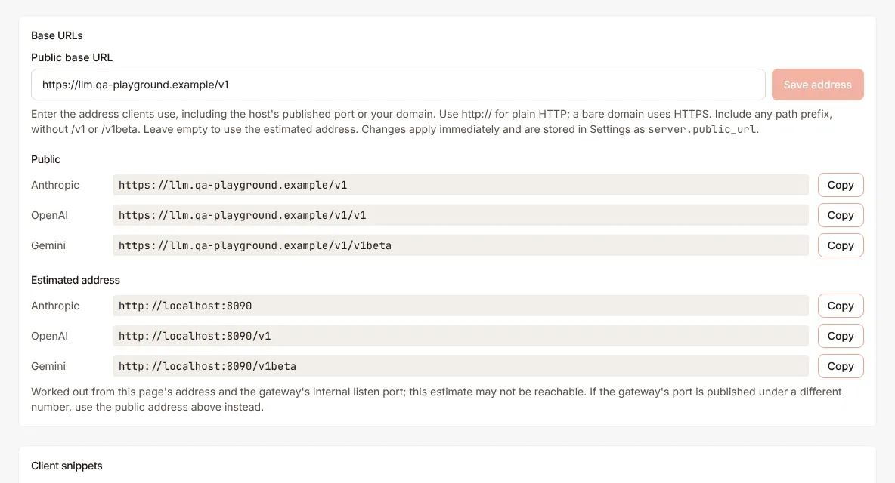

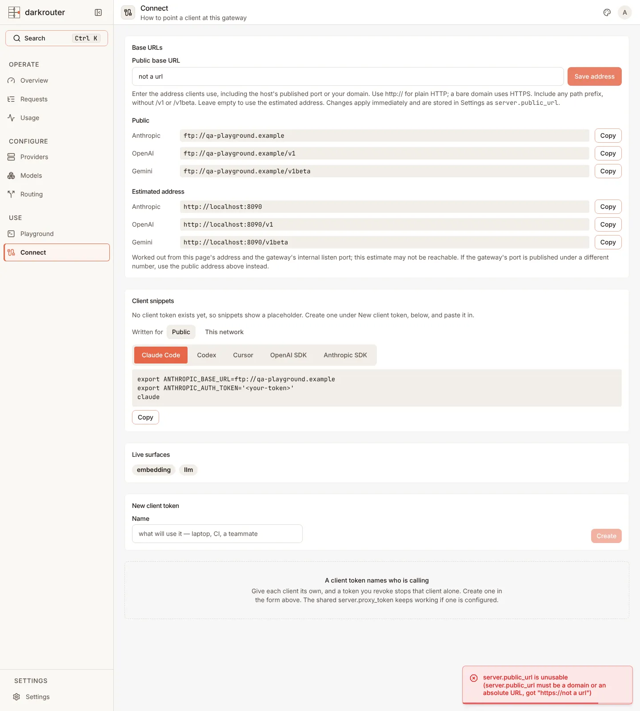

### PLAYGROUND-05: Consumption reads "0 of 1 answers still have a trace to count" after a failed or stopped turn
- Severity: Low
- Where: Chat → Consumption, `web/src/features/playground/token-panel.tsx:87` and `:127`, fed by `consumptionOf(run.routes, run.messages.filter(assistant).length)` in `chat/chat-mode.tsx`
- Steps: 1. New conversation on `no-such-model` (or `mock-error`, or Stop before the answer completes). 2. Send.
- Expected: A failed exchange is not an answer, and is not part of the conversation (`history` already drops it). The panel should not imply that a trace is missing or still coming.
- Actual: "0 of 1 answers still have a trace to count." The sentence is ungrammatical for the case, and it counts an error as an answer.
- Evidence: `playground-05-consumption-failed-turn.png`. Under "cost" in the Consumption card: "0 of 1 answers still have a trace to count."
- Root cause: `turns` counts every assistant row in `run.messages`, including the dropped ones and the ones that failed before streaming.
- Proposed fix: Pass `run.history.filter(m => m.role === "assistant").length` instead of `run.messages…`. Once PLAYGROUND-04 is fixed, failed turns will have a route with `tokensIn/Out = 0` anyway. Reword to "Token counts cover N of M answers; the rest have no trace in the request log."

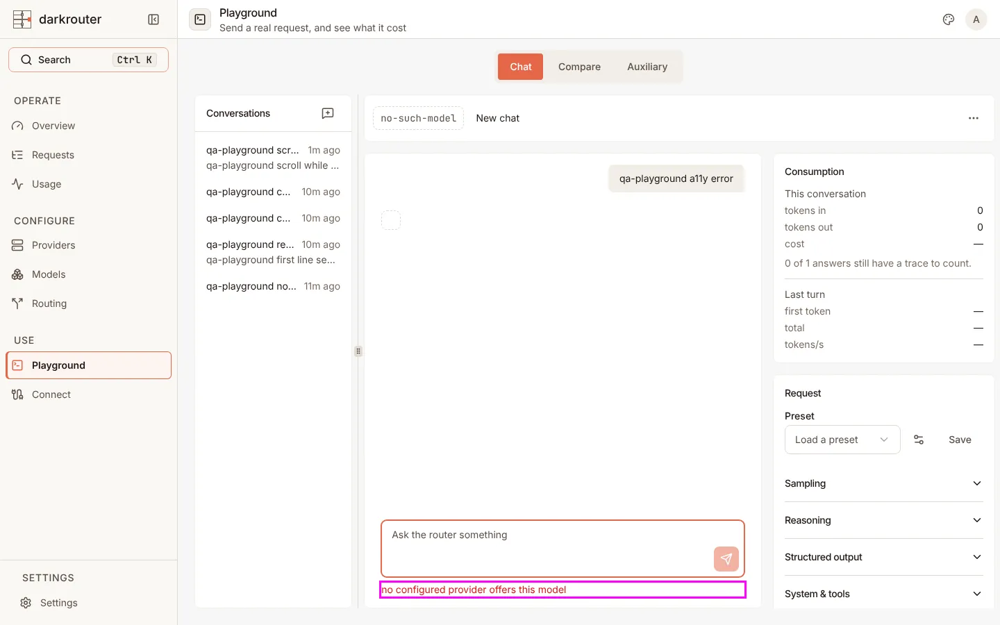

### PLAYGROUND-08: A Compare run cannot be stopped, and while it runs the pane says "Set by the first message. Start a new conversation…"
- Severity: Low
- Where: `web/src/features/playground/compare.tsx:226` (Run becomes a disabled "Running…") and `:267` (`<ConfigPane … locked={busy} />` with no `lockNote`). The remove-column buttons are `disabled={busy}` (`compare-column.tsx`).
- Steps: 1. Compare with `mock-fast`, `mock-slow`, `mock-error`, `mock-ratelimit`. 2. Click Run and look at the screen during the 2.5 s `mock-slow` wait.
- Expected: A Stop control for the run, as Chat has. The lock copy should describe Compare, which has no conversation and no first message.
- Actual: There is no stop or cancel control (`stop button? 0`), and every "Remove column" button is disabled. A run against a hung provider can only be abandoned by leaving the tab. The pane shows the Chat-specific "Fixed — Set by the first message. Start a new conversation to send under different settings."
- Evidence: `playground-08-compare-no-stop-wrong-lock-copy.png`. "Running…" is disabled, the X buttons are greyed, and the top right of the pane reads "Fixed / Set by the first message. Start a new conversation…".
- Root cause: The controllers are already kept per column (`controllers.current`), but nothing in the UI calls `abortColumn` for all of them. `ConfigPane`'s default `lockNote` is written for Chat.
- Proposed fix: While `busy`, render `<Button variant="secondary" onClick={() => [...controllers.current.keys()].forEach(abortColumn)}>Stop</Button>` in place of the disabled Run. Pass `lockNote="Locked while this comparison runs."` to `ConfigPane` from Compare.

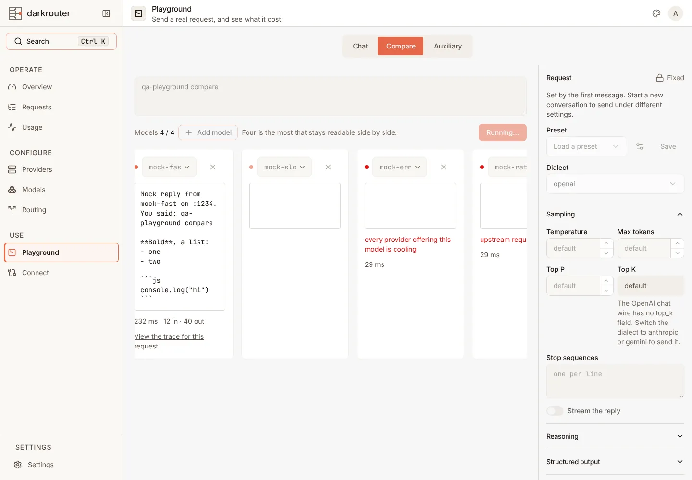

### PLAYGROUND-13: Connect snippet tabs overflow at 768 and 375, so the whole page scrolls sideways
- Severity: Low
- Where: `web/src/features/connect/connect-screen.tsx:335-341` (`<TabsList>` with 5 triggers, no wrap or scroll container)
- Steps: 1. Open /connect at 375×812 (also 768×1024).
- Expected: All five tabs are reachable inside the card, and there is no horizontal page scroll.
- Actual: The tab list is 592px wide at 375 (848px at 768). It sticks out past the card, and `main` becomes horizontally scrollable (`scrollWidth 592 > 375`). Reaching "Anthropic SDK" scrolls every card sideways off screen. At 768, "Anthro…" is cut at the card edge.
- Evidence: `playground-13-connect-375-hscroll.png` (page scrolled sideways, cards cut on the left, tab list outlined). `playground-13-connect-768-tabs.png` ("Anthro" clipped).
- Root cause: The darkraise `TabsList` is an inline-flex row with no wrapping, inside a card that does not contain the overflow.
- Proposed fix: Wrap it in `<div className="max-w-full overflow-x-auto">`, or give the list `className="flex h-auto flex-wrap"`. Alternatively, below `sm`, use a `Select` of the five tools.

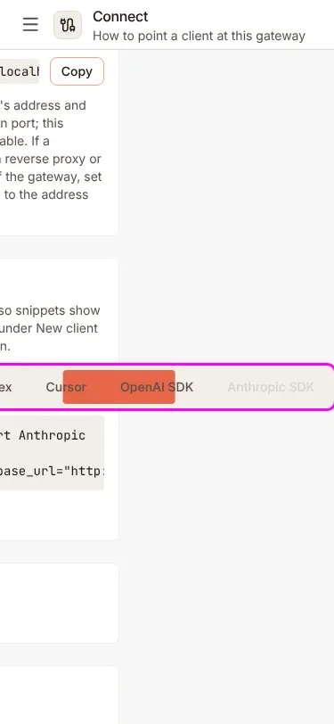

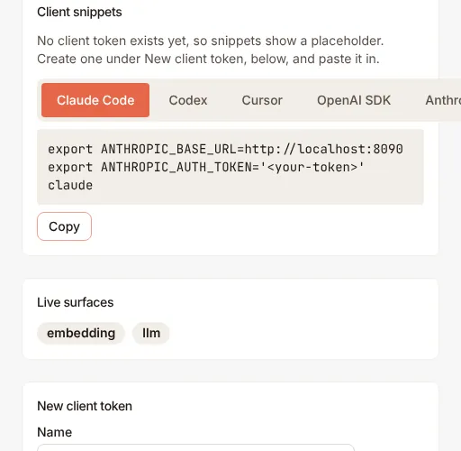

### PLAYGROUND-14: Chat send errors are not announced to assistive technology
- Severity: Low
- Where: `web/src/features/playground/composer.tsx:113-115`
- Steps: 1. New conversation on `no-such-model`. 2. Send.
- Expected: The failure is announced, as Auxiliary's error is (`aux-mode.tsx` uses `role="alert"`) and as the console's other errors are. The message box is associated with it.
- Actual: The error renders as a plain `<p>` with no role and no live region, and the textarea has no `aria-describedby`. A screen-reader user hears nothing after pressing Enter. The same applies to the per-column error in `compare-column.tsx`.
- Evidence: `playground-14-composer-error-not-alert.png` (outlined "no configured provider offers this model"). The DOM check `{tag:'P', role:null, live:'no live region', describedby:null}` comes from `pg-17.mjs`.
- Proposed fix: `<p id="composer-error" role="alert" className="text-sm text-destructive">`, and `aria-describedby={problem || error ? "composer-error" : undefined}` on the Textarea. Add `role="alert"` to the column error in `compare-column.tsx`.


### PLAYGROUND-15: Once a conversation's settings are locked, they cannot be saved as a preset
- Severity: Low
- Where: `web/src/features/playground/config-pane/config-pane.tsx:112-113` (`<PresetPicker>` sits inside `<Fieldset locked={locked}>`)
- Steps: 1. Open any conversation that has turns (pane shows "Fixed"). 2. Try "Save" or "Manage presets" in the Request pane.
- Expected: The lock prevents changing the conversation's settings. Saving those settings as a preset, or deleting an unrelated preset, does not change them and should stay available. "This setup worked, keep it" is the natural moment to save one.
- Actual: Both buttons are disabled (`Save disabled true, Manage disabled true`), so a good configuration can only be saved by re-entering it in a new conversation.
- Evidence: `playground-15-locked-preset-save.png` (greyed Save and Manage buttons outlined under "Fixed").
- Root cause: The `fieldset[disabled]` that implements the lock also wraps the preset picker's non-mutating actions.
- Proposed fix: Render the Save and Manage buttons outside the locked `Fieldset` (keep only the "Load a preset" `Select` inside it), or give `PresetPicker` a `loadDisabled` prop instead of relying on the fieldset.

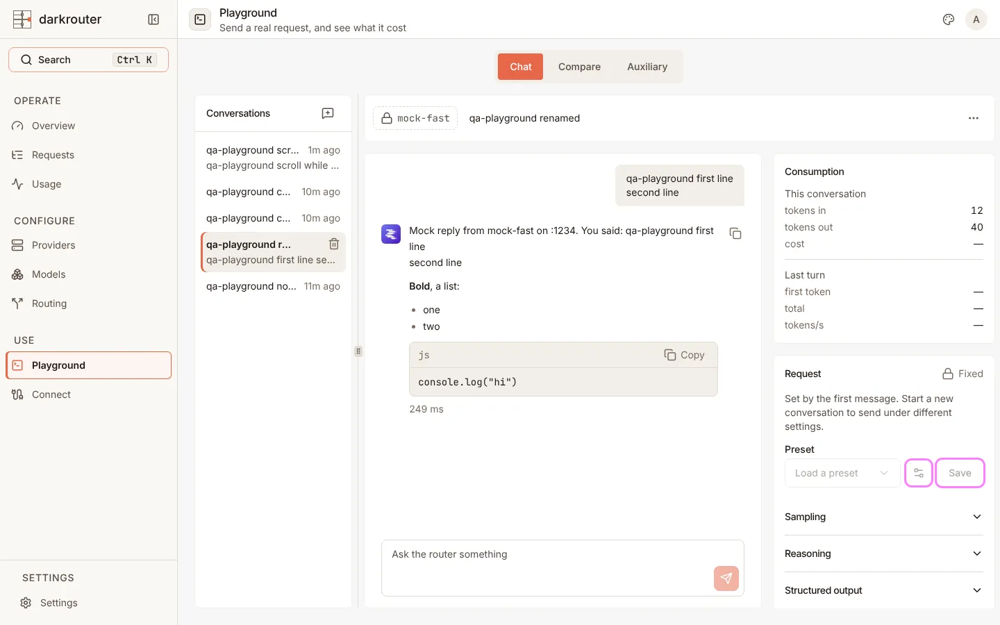

### PLAYGROUND-16: Below 1024px, Chat shows no Consumption or last-turn metrics anywhere
- Severity: Low
- Where: `web/src/features/playground/chat/chat-mode.tsx:592` (`<div className="hidden w-80 … lg:flex">` holds TokenPanel and ConfigPane)
- Steps: 1. Open Chat at 768×1024 (or 375). 2. Open a conversation that has turns.
- Expected: Conversation totals, first-token time and tokens/s are reachable at every width. The history rail, also hidden at this width, gets a "Show conversations" sheet.
- Actual: The whole right column is `display:none`, and there is no button or sheet to reach it. Only the per-turn "249 ms" route line remains. At 375 the conversation-title input is also squeezed to about 6 characters ("qa-pla").
- Evidence: `playground-16-chat-768-no-consumption.png` (no Consumption or Request cards; compare with `playground-01…` at 1440).
- Proposed fix: Add a "Details" button beside "Show conversations" that opens a right-side `Sheet` with `TokenPanel` and a read-only `ConfigPane`, mirroring the history sheet.

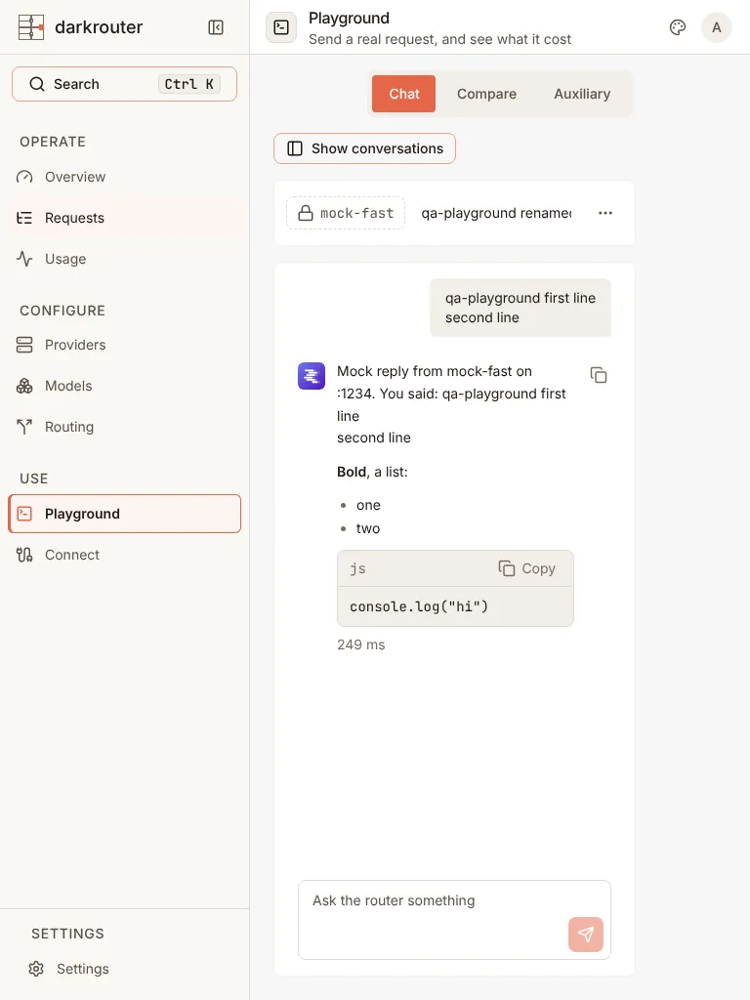

### PLAYGROUND-17: Auxiliary's tool rail is squeezed to unreadable at 375px
- Severity: Low
- Where: `web/src/features/playground/aux/aux-mode.tsx:188` (`<ResizablePanel defaultSize={20} minSize={14} …>` with no breakpoint, unlike Chat's `!hidden lg:!flex`)
- Steps: 1. Open Playground → Auxiliary at 375×812.
- Expected: The seven tool names are readable, or the rail turns into a select or sheet on narrow screens, as Chat's rail does.
- Actual: The rail is about 70px wide. The tool names read "To…", "E…", "Re…", "M…", "Im…", "Sp…", "Tr…", and the blurbs are single letters.
- Evidence: `playground-17-aux-375-rail.png`.
- Proposed fix: Below `lg`, hide the panel (`className="!hidden lg:!flex"`) and render a `Select` of `AUX_SURFACES` (label and blurb) at the top of the work island.

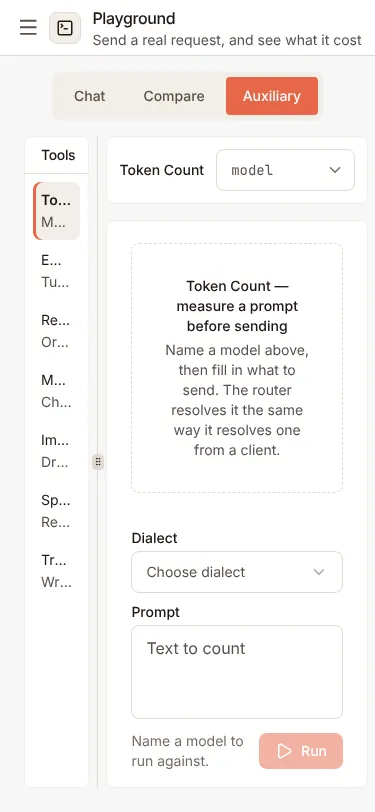

### PLAYGROUND-18: The Connect "Create" token button sits far from the field it submits
- Severity: Cosmetic
- Where: `web/src/features/connect/connect-screen.tsx:389-408` (wrapper `flex-1` + Input `max-w-96`)
- Steps: 1. Open /connect at 1440.
- Expected: The Create button sits next to the Name input.
- Actual: The input stops at 384px, but its wrapper is `flex-1`, so Create is pushed to the far right edge of the card, about 700px from the field.
- Evidence: `playground-18-create-button-detached.png`.
- Proposed fix: Move `max-w-96` from the Input to the wrapper div (`className="flex min-w-0 flex-1 max-w-96 flex-col gap-1.5"`).

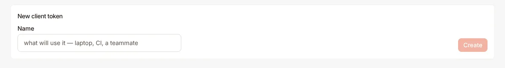

<details><summary>Tested and working — Playground & Connect</summary>

- Chat:
  - Model selection via the combobox in the New conversation / Request settings dialog. Suggestions filter as you type, and free text is accepted.
  - The "Choose a model" empty state.
  - Settings lock after the first turn (padlock in the header, "Fixed" pane, menu item disabled).
- Composer:
  - Enter sends; Shift+Enter inserts a newline (body carried `"first line\nsecond line"`).
  - Empty or whitespace-only drafts do not send (Send disabled, Enter ignored).
  - A long input (28 k chars) auto-grows to the 12-row cap.
- Streaming and non-streaming:
  - `mock-fast` streaming and non-streaming (`stream:false` in the body) both render correctly.
  - Stop works: before the first token the turn is dropped; mid-stream the partial answer is kept and saved.
- Error messages appear for `mock-error`, `mock-ratelimit`, `no-such-model` and `flaky-1` (wording and trace link aside, see 04).
- Markdown and copy:
  - Markdown renders bold, the list and a ```js code block with a language label.
  - Code-block Copy puts exactly `console.log("hi")\n` on the clipboard, with "Copied" feedback.
  - "Copy this answer" copies the raw markdown.
- Metrics and route:
  - Token metrics match the mock's usage exactly: 12 in / 40 out per turn, conversation totals 36/120 and 60/200 after 3 and 5 turns.
  - TTFT, total and tokens/s are consistent (40 tokens / 258 ms = 155.0).
  - The route line expands to `lmstudio/mock-fast · 249 ms · 12 in · 40 out · trace`, and the trace link points at the right `/requests/{id}`.
- Config pane and outgoing requests, checked with `page.on('request')`:
  - openai sent temperature, max_tokens (typing "1,000" was normalised to 1000), top_p, stop[] (blank lines dropped), response_schema, reasoning_effort, system and tools.
  - Top K and Budget were gated with reasons on openai.
  - anthropic sent top_k and reasoning_budget, gated effort and schema, and showed adapter warnings under the turn.
  - gemini gated effort.
- Presets:
  - Save from the dialog works (stored with model, dialect and blob).
  - Load restores model, temperature and system prompt.
  - Escape in the nested Save dialog closes only that dialog.
  - Manage presets deletes.
- Conversations:
  - Auto-created with the title derived from the prompt.
  - Rename via the title field (Enter commits), persisted, and reflected in the rail with a preview line.
  - Reopening from the rail restores the transcript, rehydrates the route and the Consumption totals.
  - Reload keeps the rail.
- Seeding: `?seed=<trace id>` carries model and dialect with an honest note. `?seed=<bad id>` says nothing was seeded.
- Mode tabs: they switch, the URL carries `mode`, the last mode is remembered on returning via the sidebar, and the retired mode names map correctly.
- Compare:
  - Add model up to 4/4 (button disabled with an explanation).
  - Concurrent runs with per-column latency, tokens and trace link.
  - A per-column error is shown.
  - Remove column after the run brings the count down to 3/4.
- Auxiliary:
  - Embeddings on `mock-embed`: vector preview, "View the trace" link, and the Last run readings (lmstudio, 5 tokens in).
  - Run history count badge on the rail.
- Connect:
  - The estimated base URLs (`http://localhost:8090`, `/v1`, `/v1beta`) are correct for this instance, and all three were exercised with curl against the gateway: OpenAI `/v1/chat/completions`, Anthropic `/v1/messages`, Gemini `/v1beta/models/mock-fast:generateContent` all answered from the mock.
  - Every snippet tab (Claude Code, Codex, Cursor, OpenAI SDK, Anthropic SDK) shows the right base URL per dialect and a placeholder token.
  - Each snippet's Copy puts exactly the shown text on the clipboard.
  - Setting a bare domain normalises it to https and updates every row and snippet; the "Written for: Public / This network" toggle switches the snippets; clearing the field reverts.
  - Live surfaces badges show.
- Dark mode (1440) for Chat, Compare, Auxiliary and Connect: no invisible elements or hardcoded colours found.
- At 768 and 375, Chat's "Show conversations" sheet works, and the New conversation dialog scrolls within the viewport.
- Project rule: no `text-xs`, `text-[Npx]` or pixel font sizes anywhere in `features/playground` or `features/connect`.
- No unexpected console errors. The only console/HTTP errors seen were the deliberate 4xx/5xx from the error models, plus the `?seed=doesnotexist` 404.

</details>

## Settings & accounts

_Scope: Every setting field, save/reset/restart semantics, catalog sync, accounts, change password._

### SETTINGS-01: Reverting a restart-only key still says "takes effect after a restart", and the warning stays on the page
- Severity: Medium
- Where: Settings → save toast and the "One warning" card. `/healthz` `warnings` shows the same text. Root cause in `internal/config/store.go:203-214` (`restartOnlyWarnings`) and `internal/admin/configapi.go:257-265` (`restartRequired`).
- Steps: 1. In "Metadata fetch timeout" (`catalog.sync_timeout`, a restart key), change `30s` to `31s` and Save. The "Waiting for a restart" banner appears, and `pending_restart` in `/api/config` and `/healthz` is `["catalog.sync_timeout"]`. This part is correct. 2. Type `30s` again (the value the process booted with) and Save, or press Reset and Save.
- Expected: Nothing is waiting for a restart, because the running value equals the stored value. There should be no restart toast and no restart warning.
- Actual: `pending_restart` is correctly `[]`, so the "Waiting for a restart" banner goes away. But the toast says "Settings saved. catalog.sync_timeout takes effect after a restart.", and the warning card (and `/healthz` `warnings`) shows "catalog.sync_timeout changed; takes effect on restart". The warning stays until some later save or a Reload config. Even a reset that changes nothing (stored `30s` → default `30s`) answers `restart_required: ["catalog.sync_timeout"]`. The screen ends up telling the operator to restart and not to restart at the same time.
- Evidence: `settings-01-restart-warning-after-revert.png`: the "One warning … takes effect on restart" card and the "takes effect after a restart" toast are shown, and there is no "Waiting for a restart" banner.
- Root cause: `restartOnlyWarnings(prev, next)` compares the new snapshot with the *previous* one, not the *boot* one, so any move of a restart key is reported, including a move back to the boot value. `restartRequired(written)` names every restart-only key that was *written*, whatever its value.
- Proposed fix: Base both on the boot snapshot, as `PendingRestart()` already is. In `Store.Reload`, warn only for fields where `f.value(boot) != f.value(next)`, or drop the transient warning and let the console's `pending_restart` banner be the only notice. In `commitConfig`, build `restart_required` as the intersection of `written` and `s.deps.Config.PendingRestart()` after the update.

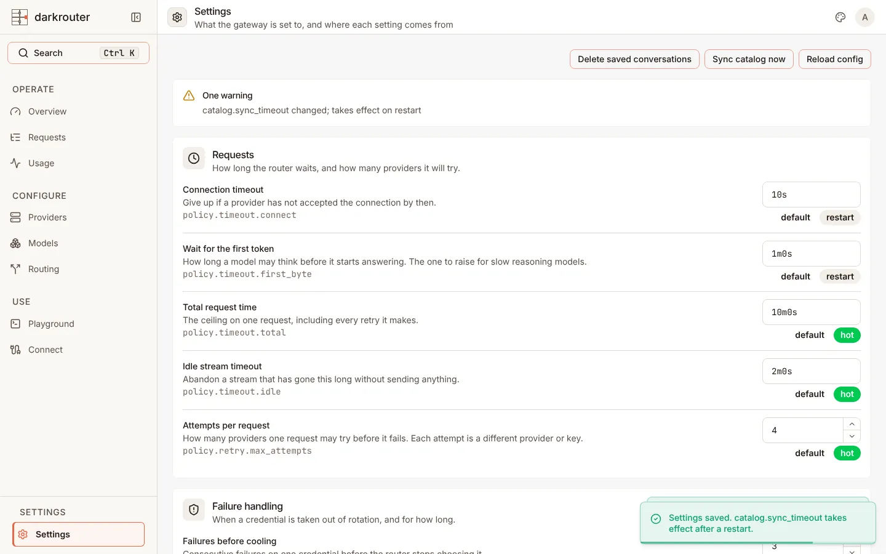

### SETTINGS-02: Unsaved setting edits are silently thrown away on navigation or reload
- Related: Same class as ROUTING-08.
- Severity: Medium
- Where: Settings screen, `web/src/features/settings/settings-screen.tsx:159-334` (`SettingsForm`). There is no navigation blocker anywhere in `web/src`; `grep useBlocker|beforeunload` finds nothing.
- Steps: 1. Change "Idle stream timeout" from `2m0s` to `3m`. The "Unsaved changes / Discard / Save" bar appears. 2. Click "Providers" in the sidebar, or press F5. 3. Come back to Settings.
- Expected: A confirm before leaving with unsaved changes, as the sticky "Unsaved changes" bar implies.
- Actual: The app navigates immediately with no prompt. Back on Settings the box shows `2m0s`, the edit is gone and the bar is gone. A reload does the same. No dialog or `beforeunload` fires.
- Evidence: `settings-02-unsaved-edit-lost.png`: after returning from Providers, the outlined Idle stream timeout row shows `2m0s` and there is no Unsaved changes bar. `settings-n-dirty.png` shows the same row a moment earlier with `3m` and the bar.
- Root cause: The draft lives in component state, and nothing guards the route or the unload while `dirty` is true.
- Proposed fix: In `SettingsForm`, use TanStack Router's `useBlocker({ shouldBlockFn: () => dirty && !save.isPending, enableBeforeUnload: () => dirty })`, and show the existing `ConfirmButton`-style dialog ("Discard unsaved changes?") when it blocks.

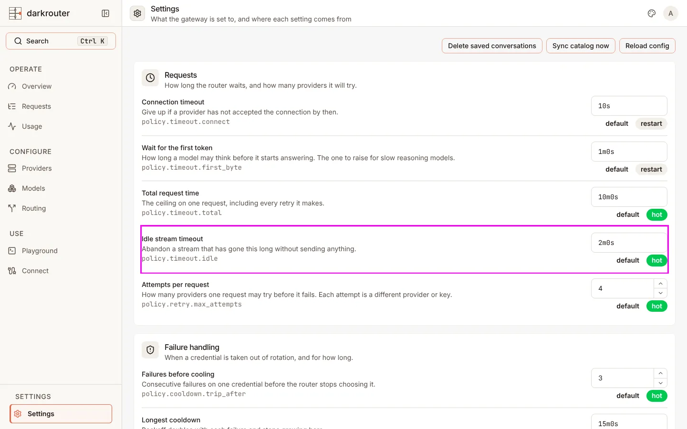

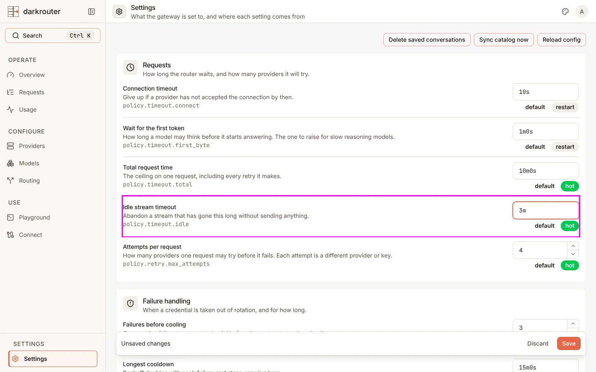

### SETTINGS-03: "Sync catalog now" reports "started", and a failed sync never shows up anywhere in the console
- Severity: Medium
- Where: Settings header button, `web/src/features/settings/settings-screen.tsx:388-394` and `112-116`; `internal/admin/healthapi.go:92-103` (`handleForceCatalogSync`).
- Steps: 1. Click "Sync catalog now" → Sync. 2. Wait for the sync to finish. In this sandbox it fails with Forbidden. 3. Reload Settings and check `/healthz` and `/api/config`.
- Expected: The operator can find out that the sync they started failed, and why. Either the request waits for the result, or the failure appears as a warning or banner.
- Actual: The toast says "Catalog sync started." and nothing else follows. `/healthz.warnings` and `/api/config.warnings` stay `[]`. The only trace is the server log: `WARN msg="catalog sync failed; serving the previous metadata" err="models.dev sync: fetch: Get \"https://models.dev/api.json\": Forbidden"`. An operator who presses the button to pick up new models cannot tell a sync that worked from one that failed.
- Evidence: `settings-03-sync-started-toast.png` shows the success-styled "Catalog sync started." toast. `settings-03-sync-failed-silently.png` shows the same screen after the sync failed, with no warning, banner or error.
- Root cause: The handler runs `SyncOnce` in a goroutine, returns `202 {triggered:true}` at once, and only `slog.Warn`s the error.
- Proposed fix: Record the last sync's outcome (time, error) on the syncer and add it to `cfg.Warnings` or a `catalog_sync` field in `/api/config` and `/healthz`. The screen can then show "Last catalog sync failed at … : <error>". A simpler fix: have `/api/catalog/sync` wait for `SyncOnce` under a timeout of `catalog.sync_timeout` plus a margin and return `{ok:false,error}`, with `syncMessage` turning that into an error toast.

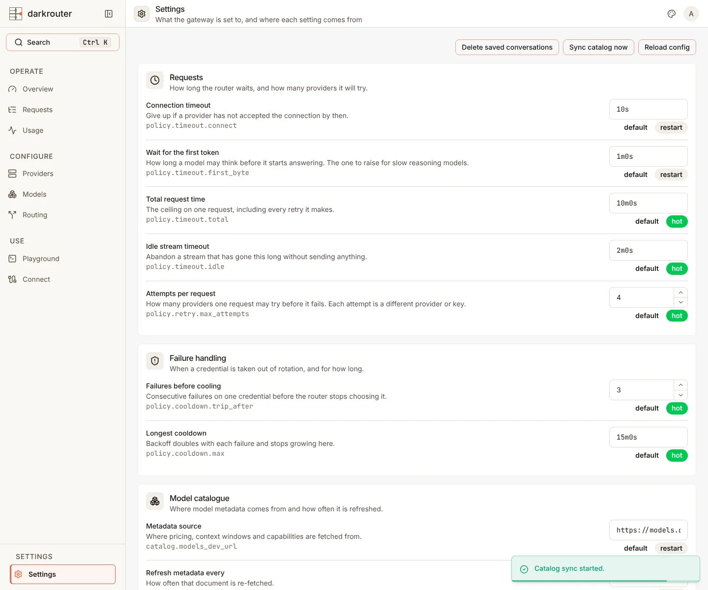

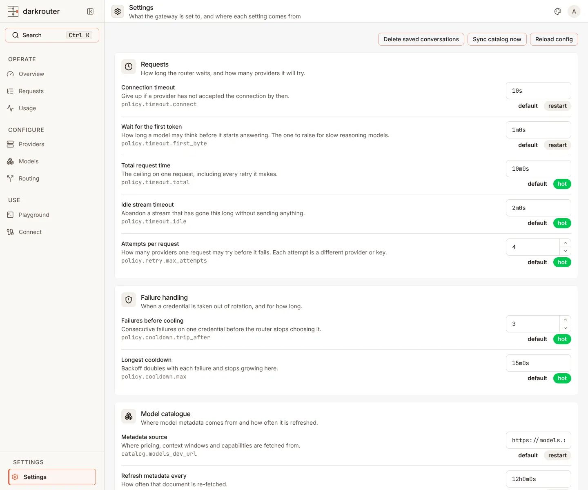

### SETTINGS-04: Add account with a 65-character username says "a username is required"
- Related: Same root cause as COORD-01 (`validateCredentials`); one fix covers both.
- Severity: Medium
- Where: Accounts card → Add an account dialog, `web/src/features/settings/accounts-card.tsx:110-115` (no `maxLength`, no length hint); `internal/admin/setupapi.go:24-28` (`validateCredentials`).
- Steps: 1. Settings → Accounts → "Add an account". 2. Username `qa-settings-` + 53 × `x` (65 characters), a valid 20-character password typed twice, role Member. 3. Click Add account.
- Expected: A message such as "A username can be at most 64 characters", ideally before submit.
- Actual: `POST /api/users` → `400 {"error":"a username is required"}`, shown only as a toast in the corner while the username box is visibly full. The dialog itself shows no error. This is the same defect the coordinator found on the claim screen, through the shared `validateCredentials`.
- Evidence: `settings-04-long-username-required.png`: the Username field is full of the long name and the toast says "a username is required".
- Root cause: `validateCredentials` returns one message for both `username == ""` and `len([]rune(username)) > maxUsernameChars`.
- Proposed fix: Split the two checks in `setupapi.go`:
  ```go
  if username == "" { return "", "a username is required", false }
  if len([]rune(username)) > maxUsernameChars { return "", fmt.Sprintf("a username can be at most %d characters", maxUsernameChars), false }
  ```
  Also add `maxLength={64}` to `#new-account-username`, and to the claim screen's username input.

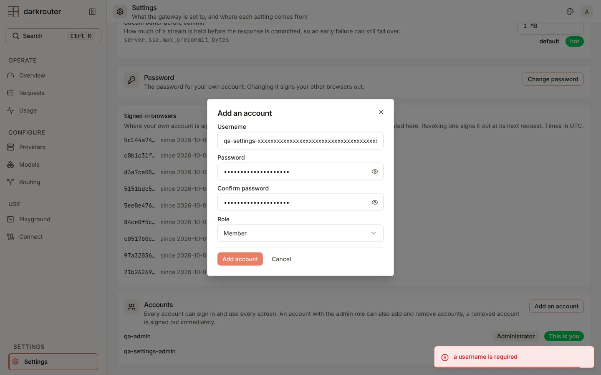

### SETTINGS-05: At 375px, setting rows never stack; the environment rows overflow the card and the page scrolls sideways
- Severity: Low
- Where: Settings at a phone width, `web/src/features/settings/setting-field.tsx:50-76`.
- Steps: 1. Open Settings at 375×812. 2. Scroll to Server → Gateway address / Console address.
- Expected: Label and value stack vertically, and everything fits inside the card.
- Actual: The `:8090`/`:8091` values and the `env DARKROUTER_PROXY_LISTEN` badges run past the card and the viewport. `main` has scrollWidth 410 against clientWidth 375, so the page scrolls horizontally and the value is clipped to `:8`. On every other row the label and description are squeezed into a column about 120px wide, one or two words per line, which makes the page several screens taller than it needs to be.
- Evidence: `settings-05-mobile-env-overflow.png`: the outlined env badge is cut off at the right edge, the value shows as `:8`, and the Public domain description wraps into a narrow column.
- Root cause: The row is `flex flex-wrap`, but the label column is `min-w-0 flex-1` with no basis, so it shrinks instead of wrapping. The value column is `shrink-0`, and its badge line `<span className="flex items-center gap-1">` cannot wrap, so the two badges plus the long env name are wider than 335px.
- Proposed fix: Give the label column a wrap threshold (`basis-64 grow`), so on narrow screens the value column moves to its own line, and let the value column wrap (`flex-wrap justify-end` on the badge `span`, plus `max-w-full` and `break-all` on the env badge).

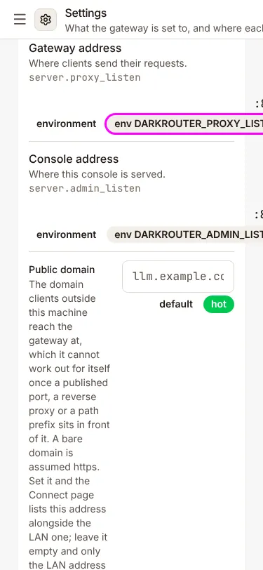

### SETTINGS-06: Field validation messages are raw Go errors
- Severity: Low
- Where: Per-row errors under each setting, `internal/store/configwrite.go:206-229` (`refusalFor` reuses the loader's warning text) and `internal/store/configload.go:108,122`.
- Steps: 1. In "Largest body recorded", type `2 TB` and Save. 2. Discard, then in "Total request time" type `30s` and Save. Also: `abc` → max_attempts, `10` (no unit) → a duration, `99999999999999999999` → max_attempts.
- Expected: Messages an operator can act on, such as "Use a size like 512 KB, 32 MB or 1 GB" or "Total request time must be at least connection timeout + wait for the first token (1m10s)".
- Actual (the error is placed on the right row, but the text is internal): `capture.max_bytes is unusable (strconv.ParseInt: parsing "2 TB": invalid syntax)`; `[policy.timeout.total policy.timeout.connect policy.timeout.first_byte] broke the timeout budget rule (policy.timeout.total (30s) must be at least connect + first_byte (1m10s))`, which prints a Go slice; `time: missing unit in duration "10"`; `strconv.Atoi: parsing "100000000000000000000": value out of range`. For `9999999999 GB` the box emits `10737418238926258000`, a number the operator never typed and which is not even the exact product, because `parseBytes` rounds past 2^53.
- Evidence: `settings-06-jargon-bytes.png` (strconv.ParseInt message under Largest body recorded); `settings-06-jargon-budget.png` (bracketed key list and "broke the timeout budget rule" under Total request time).
- Root cause: `refusalFor` returns the loader's warning (`stored <key> is unusable (<Go error>)` / `stored [k1 k2] broke the <rule> rule (...)`) with only the "stored " prefix trimmed. That text was written for a startup log, not for a person at a form.
- Proposed fix: In `refusalFor`, map parse failures by kind: int → "must be a whole number", duration → "use a duration such as 30s, 5m or 2h", bytes → "use a size such as 512 KB, 32 MB or 1 GB", and out-of-range → "is too large". Format a `RuleError` as its own `Err` text without the `[keys] broke the … rule` prefix. In `parseBytes`, return `undefined` when `n * scale > Number.MAX_SAFE_INTEGER`, so the raw text is sent and refused rather than an imprecise number.

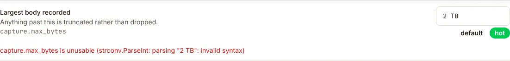

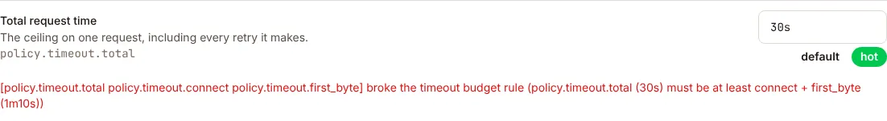

### SETTINGS-07: Public domain accepts a non-HTTP scheme (`ftp://x`), and Connect then hands it out as every client's base URL
- Related: Overlaps PLAYGROUND-12 (same setting, seen from Connect).
- Severity: Low
- Where: Server → Public domain (`server.public_url`), `internal/config/load.go:203-215`.
- Steps: 1. Type `ftp://x` in Public domain and Save. 2. Open Connect. 3. (Reverted straight afterwards.)
- Expected: Refused. The gateway only speaks HTTP(S), and the help text says "Use http:// for plain HTTP; a bare domain uses HTTPS".
- Actual: `PUT /api/config` → 200, "Settings saved". Connect lists `ftp://x`, `ftp://x/v1`, `ftp://x/v1beta` as the public base URLs, and the Claude Code snippet becomes `export ANTHROPIC_BASE_URL=ftp://x`.
- Evidence: `settings-07-ftp-public-url-saved.png` (the row saved as `ftp://x` with the "Settings saved" toast); `settings-07-ftp-on-connect.png` (Connect's Public URLs and snippet using `ftp://x`).
- Root cause: The validator checks only `u.IsAbs() && u.Host != ""` and the absence of a query or fragment, never the scheme.
- Proposed fix: In `load.go`, after parsing, add `if u.Scheme != "http" && u.Scheme != "https" { return fmt.Errorf("server.public_url must start with http:// or https://, got %q", …) }`.

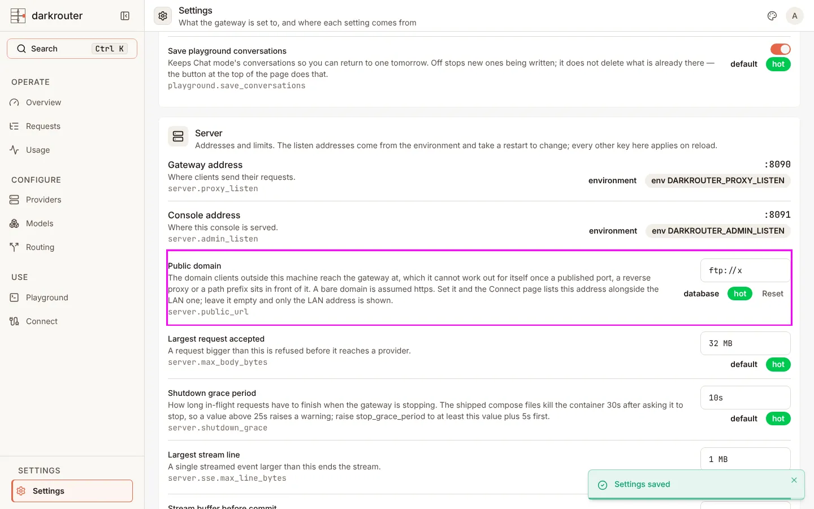

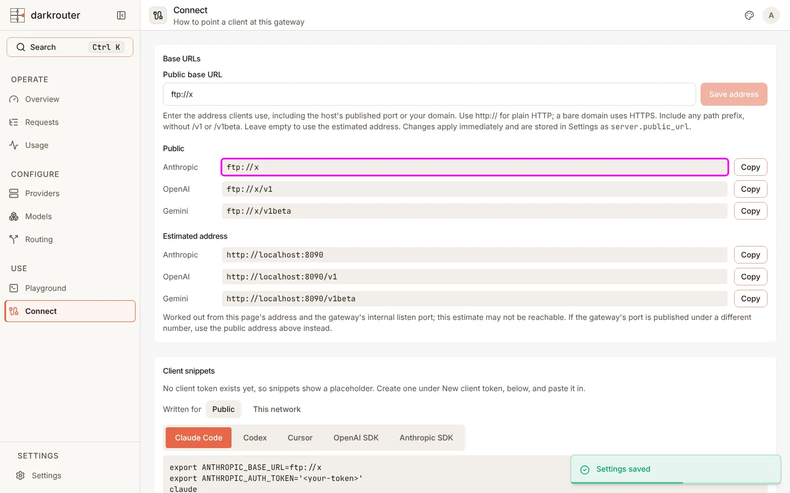

### SETTINGS-08: Setting boxes hide the value: URLs are clipped to about 16 characters, and durations show Go's `720h0m0s`
- Severity: Low
- Where: `web/src/features/settings/setting-field.tsx:267` (`w-40` on every text editor) and `:184-201` (durations seeded with the raw stored spelling; `row.display` is only rendered for non-editable rows, `:74`).
- Steps: 1. Open Settings at 1440px. 2. Look at Model catalogue → Metadata source, Free-tier catalogue source and Community price index. 3. Look at Logging → Keep request records for.
- Expected: The configured URL can be read without clicking into the box and scrolling it. Durations read as people say them, which is what `formatDuration` and its doc comment ("`720h0m0s` is thirty days, and reading that off the screen is arithmetic an operator should not have to do") exist for. Byte rows already show "32 MB" rather than 33554432.
- Actual: The 160px box shows `https://models.c`, `https://raw.git…`, so the operator cannot see which source is configured. Retention shows `720h0m0s`, and the sync intervals show `12h0m0s` and `24h0m0s`. The computed "30 days" is never rendered.
- Evidence: `settings-08-url-clipped.png` (Metadata source box clipped to `https://models.c`); `settings-08-duration-raw.png` (Keep request records for = `720h0m0s`).
- Root cause: A fixed `w-40` for every kind, and `Editor`'s default branch seeds a duration with `(v) => v` rather than a readable form.
- Proposed fix: Make `url` editors wide: `className={row.kind === "url" ? "w-full sm:w-96" : "w-40"}`, plus `title={text}`. For durations, either seed with a compact readable form that `durationNanos` round-trips (`720h` → `30d` is not Go syntax, so use `720h`/`12h`/`15m`, i.e. strip zero `0m0s` tails), or render `row.display` ("30 days") as a hint under the box, as bytes rows effectively do.

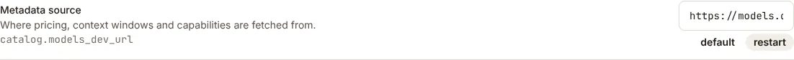

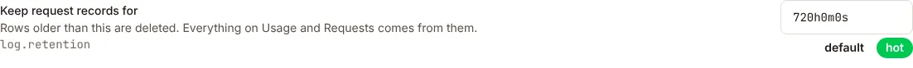

### SETTINGS-09: Off-state switches are close to invisible, especially in dark mode
- Severity: Low
- Where: Every boolean setting (Record request bodies is off by default). The style comes from darkraise-ui's `.dr-switch` (`data-[state=unchecked]:bg-input`, thumb `bg-background`); the app-level override would go in `web/src/styles/globals.css`.
- Steps: 1. Open Settings with `prefers-color-scheme: dark`. 2. Look at "Record request bodies".
- Expected: The control is distinguishable from the card. WCAG 1.4.11 asks for 3:1 for UI component boundaries.
- Actual: Dark mode: the track is rgb(48,38,33) on a card of rgb(31,23,20), about 1.2:1, and the thumb rgb(13,13,13) is darker than the track, so the switch reads as a dark smudge. Light mode: the track rgb(225,217,208) on white is about 1.4:1.
- Evidence: `settings-09-switch-off-dark.png` (the off switch at top right barely shows against the card); `settings-09-switch-off-light.png`.
- Root cause: darkraise-ui's unchecked switch uses `--input` for the track and `--background` for the thumb, with no border. darkraise-ui is pinned and must not be bumped casually (CLAUDE.md), so the fix belongs in the app theme.
- Proposed fix: In `web/src/styles/globals.css`: `.dr-switch[data-state="unchecked"] { border-color: hsl(var(--muted-foreground) / 0.6); } .dr-switch[data-state="unchecked"] .dr-switch-thumb { background: hsl(var(--muted-foreground)); }`. That keeps the token scale with no hardcoded colours.

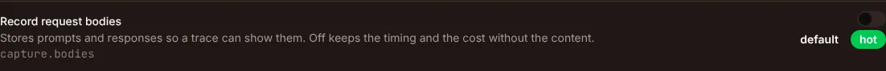

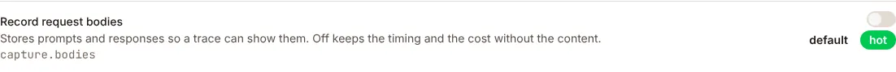

<details><summary>Tested and working — Settings & accounts</summary>

- Every setting row renders with its name, description, mono key, a source badge (`default` / `database` / `environment` + `env VAR` chip) and hot/restart badges that match `/api/config` `hot_reloadable` and `config.RestartOnly`. The environment rows (listen addresses) are read-only and have no Reset. Inspected only; never written.
- Editors by kind: int → NumberBox with steppers (non-numeric typing is dropped; `2.5` becomes `2`); bool → Switch with an aria-label; duration, url and string → text box; bytes → "32 MB" style with exact round-trip.
- Server 400s land on the right row (`#<key>-error`, linked by `aria-describedby`), with no duplicate toast. Covered: 0, -1, overflow for max_attempts; `abc`, `-5s`, `0`, `0s`, `10` for durations; `abc`, `1 TB`, `-1`, overflow for bytes; `not a url`, `http://` for public_url; the cross-key timeout budget rule. The advisory for shutdown_grace 26s appears as a warning.
- Save sends only changed keys. After a save, GET `/api/config` returns the new value with source `database`, and Reset+Save or emptying the box ("resets to default on save" badge) returns it to `default`. Keep cancels a pending reset, Discard restores the draft, and the "Unsaved changes" bar shows and hides correctly.
- A restart key save sets `pending_restart` in both `/api/config` and `/healthz`, shows the "Waiting for a restart" banner, and toasts "takes effect after a restart". Reverting clears `pending_restart` (but see SETTINGS-01).
- Concurrent edit: a background change to another key rebases into the form while keeping my edit. A change to the same key shows "Changed elsewhere to 4 min while you were editing…".
- Reload config (confirm → "Configuration reloaded."). Delete saved conversations confirm opens with focus on Cancel and closes with Escape; it was not confirmed, to protect other testers' data. Sync confirm dialog. All are alertdialogs, and they render correctly at 375px.
- Add account: client-side short-password and mismatch messages with the button disabled; duplicate username, including other case (`QA-ADMIN`, `QA-Settings-Member`) → 409 "that username is already taken"; whitespace-only → 400; a 73-byte password → 400 "at most 72 bytes"; surrounding whitespace is trimmed (`  qa-settings-ws  ` → `qa-settings-ws`); Member and Administrator roles; the list refreshes and the success toast appears.
- Accounts list: own row has the "This is you" badge and no Remove. Remove → confirm (focus on Cancel, Escape cancels) → the account is gone from the list and the API. A removed account's live session is signed out at once (`/api/auth/status` → `authenticated:false`). The last-admin guard was checked in code (`store.DeleteUser` SQL guard plus a 409); DELETE was never sent for qa-admin.
- Member view: the Accounts card is replaced by the "Managing accounts is limited to administrators" note (the expected 403 on `/api/users`).
- Change password (as qa-settings-member in fresh contexts): short new password and mismatch are blocked client-side; wrong current password shows "the current password is wrong" inside the dialog, which stays open and the user stays logged in; success closes the dialog with a toast. The account's other browser session was revoked (`authenticated:false`, redirected to login), and login with the new password succeeded.
- Light and dark mode at 1440, 768 and 375 (only the SETTINGS-05 and SETTINGS-09 problems). No `text-xs` or custom font sizes in `web/src/features/settings/*`. No console errors other than the expected 4xx responses.

## Cleanup
- Every setting I changed was reverted immediately. Final `/api/config` has no `database` rows, and `warnings` and `pending_restart` are empty in both `/api/config` and `/healthz`. I ran one Reload config to clear the stale SETTINGS-01 warning.
- Note for the coordinator: during my first validation run, `server.public_url` was found stored in the database before my `not a url` case (which was refused) and was reset by my cleanup. If another tester (e.g. Connect) had set a public URL around 04:16 UTC, it was cleared by me.
- Accounts created: qa-settings-ws, qa-settings-member, qa-settings-admin. All three are deleted, and `/api/users` now lists only qa-admin.

</details>
